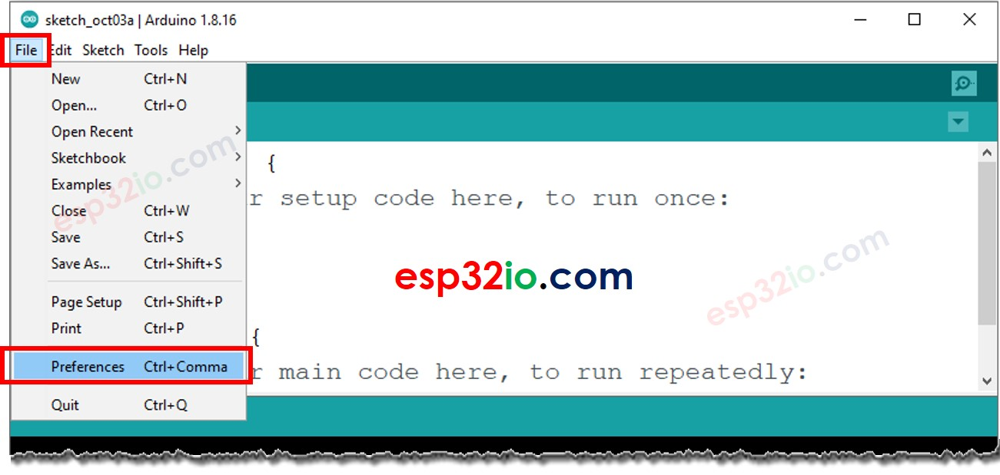
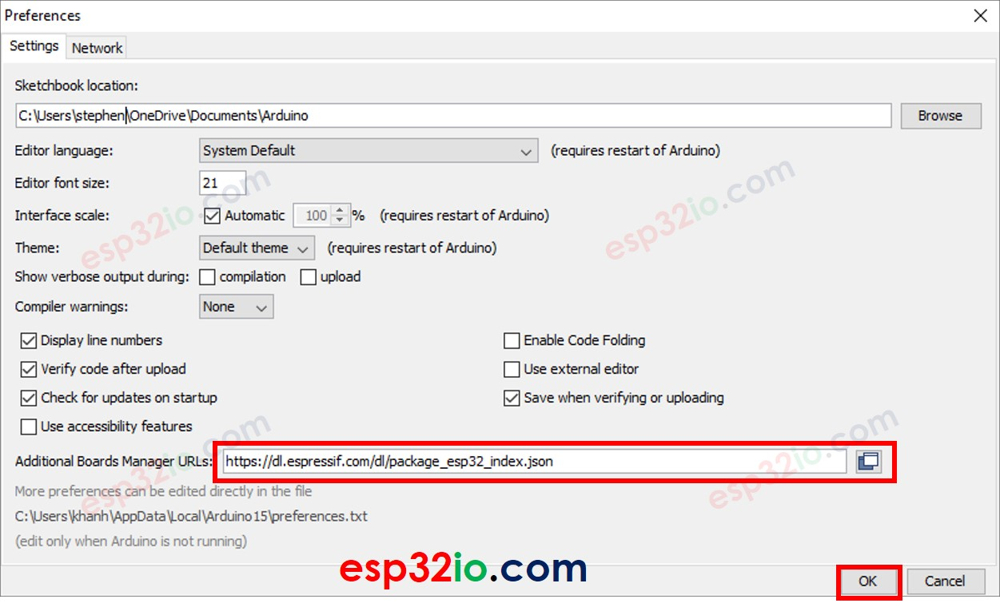
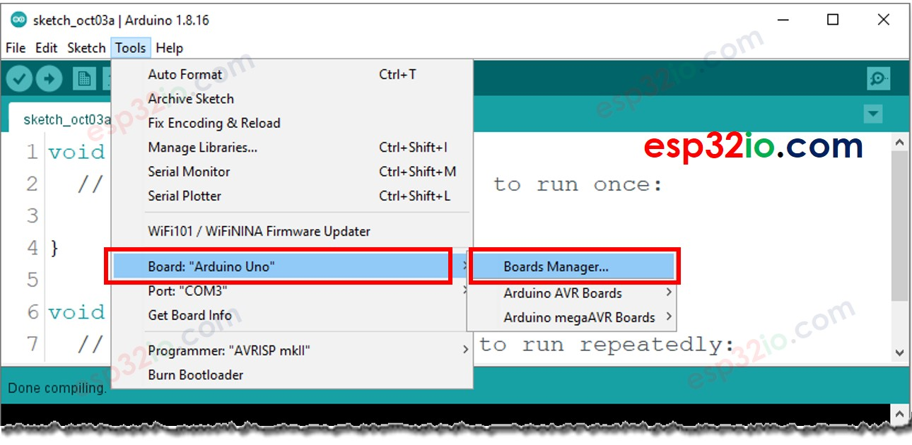
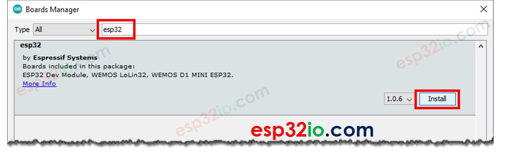

# ESP32 - Sofware Installization

To programa for ESP32 board, we need:

  * A text editor to write the code (human-readable code)
  * A compiler to compile the code (human-readable code) to the binary code (ESP#"-understandable code)
  * A programmer to upload the binary code to ESP32

It seems to be complicated => don't worry, The arduino IDE does all for you. Youy just need to:

  * install this arduino IDE
  * Write the ESP32 code (human-readable code)
  * Click a button on the Arduino IDE to compile and upload the code to ESP32 board.

Arduino IDE is available for windows, Mac OS and Linux. We need to do the following steps:

  * Download the [Arduno IDE](https://www.arduino.cc/en/software) and install it.
  * After installing Arduino IDE, we can use to program for Arduino immediately. However, in order to program ESP32, we need to do some environment configuration on Arduino IDE
  * Open Arduino IDE
  * Go to `File >> prefferences` on Arduino IDE.

  * Copy below text:

  > `https://dl.espressif.com/dl/package_esp32_index.json`

  * Paste the coppied text into the Additional Board Manager URLs field as shown in the figure below. Then, click the OK button

  > **Note that**:
  > Note: In case you use the ESP8266 and ESP32, you can separate the URLs with a comma as follows:
  > `https://dl.espressif.com/dl/package_esp32_index.json, http://arduino.esp8266.com/stable/package_esp8266com_index.json`

  * Open the Boards Manager by going to `Tools >> Board >> Boards Manager`

  * Type “esp32”, then click Install button for the “ESP32 by Espressif Systems“

