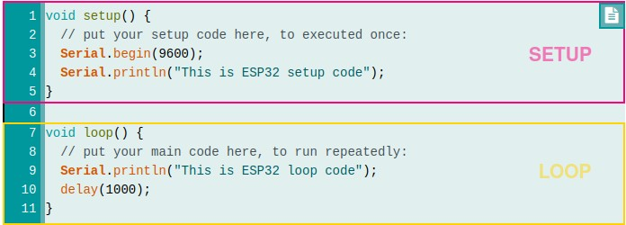
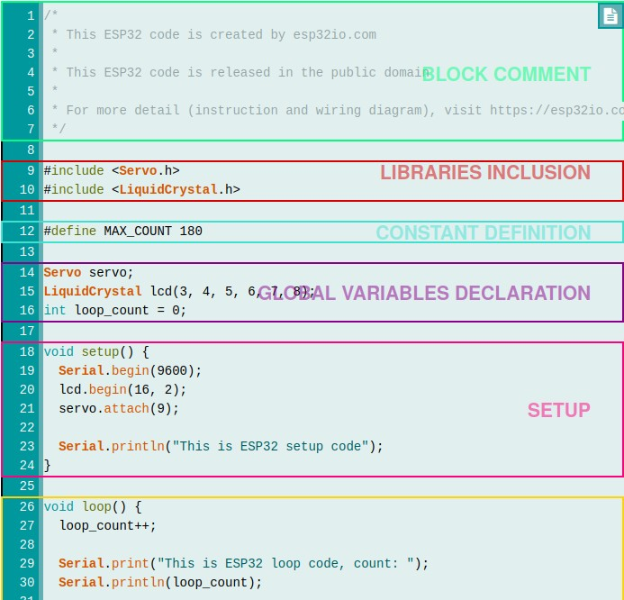

## ESP32 - Code Structure

To learn how to program for ESP32, you need to learn the structure of ESP32 code. This tutorial provides and explains the structure of ESP32 code.

## Hardware Used In This Tutorial
1	×	ESP-WROOM-32 Dev Module	
1	×	Micro USB Cable

## Basic Code Structure

ESP32 code (also called ESP32 sketch) has the same strucutre as Arduino Code. It includes two main parts: setup code and loop code.

### Setup Code

  * Setup code is code in setup() function.
  * Setup code is executed right after power-up or reset
  * Setup code is executed only one time.
  * Setup code is used to initialize variables, pin modes, start using libraries

### Loop Code

  * Loop code is code in loop() function.
  * Loop code is executed right after setup code.
  * Loop code is executed repeatedly (infinitely).
  * Loop code is used to do the main task of application

### Example



## Quick Instructions

  * If this is the first time you use ESP32, see how to setup environment for ESP32 on Arduino IDE.
  * Copy the above code and paste it to Arduino IDE.
  * Compile and upload code to ESP32 board by clicking Upload button on Arduino IDE
  * Open Serial Monitor on Arduino IDE


  * See the output on Serial Monitor

As you can see on Serial Monitor, “This is ESP32 the setup code” is printed once, but “This is ESP32 loop code” is printed many times. It means the ESP32 setup code is executed once, the ESP32 loop code is executed repeatedly. The setup code is executed first.

  > **NOTE THAT**:
  > `setup()` and `loop()` functions MUST be used in ESP32 code. If not, it generates an error.

## Other Parts

Apart from setup and loop code, an ESP32 sketch can include some of the following parts:

  * Block comment: usually used to write some information about the author, the wiring instruction, the license ... ESP32 will ignore this part.
  * Libraries inclusion: is used to include libraries into the sketch.
  * Constant definition: used to define constant
  * Global variables declaration



## Quick Instructions

  * If this is the first time you use ESP32, see how to setup environment for ESP32 on Arduino IDE.
  * Copy the next code and paste it to Arduino IDE.
  * Compile and upload code to ESP32 board by clicking Upload button on Arduino IDE
  * Open Serial Monitor on Arduino IDE

```c++
/*
 * this is the comment block
 */

#include <Servo.h>
#include <LiquidCrystal.h>

#define MAX_COUNT 180

Servo servo;
LiquidCrystal lcd(3, 4, 5, 6, 7, 8);
int loop_count = 0;

void setup() {
  Serial.begin(9600);
  lcd.begin(16, 2);
  servo.attach(9); 

  Serial.println("This is ESP32 setup code");
}

void loop() {
  loop_count++;

  Serial.print("This is ESP32 loop code, count: ");
  Serial.println(loop_count);

  lcd.print("Hello World!");
  servo.write(loop_count);

  if(loop_count >= MAX_COUNT)
    loop_count = 0;

  delay(1000);
}

```

