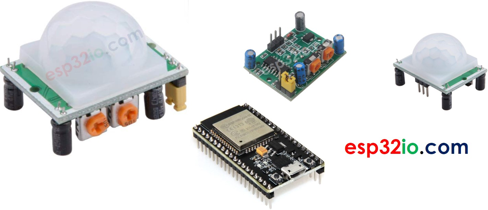

# ESP32 - Motion Sensor

This tutorial instructs you how to use ESP32 with HC-SR501 motion sensor. In detail, we will learn:

  * How an HC-SR501 motion sensor works
  * How to connect an HC-SR501 motion sensor to ESP32
  * How to read the value from an HC-SR501 motion sensor to detect the human

## Hardware Used In This Tutorial

  * 1	×	ESP-WROOM-32 Dev Module	
  * 1	×	Micro USB Cable	
  * 1	×	HC-SR501 Motion Sensor	
  * 3	×	Jumper Wires

---

## Introduction to HC-SR501 Motion Sensor



HC-SR501 PIR sensor is a sensor that can detect the movement of humans (or animals). It's widely used to detect the presence of humans in many applications (automatically turning `ON/OFF` light bulb, activating/deactivating escalator, detecting an intruder, opening/closing the door...)
HC-SR501 Motion Sensor Pinout

The HC-SR501 motion sensor has 3 pins:

  * **VCC pin**: connect this pin to VCC (5V)
  * **GND pin**: connect this pin to GND (0V)
  * **OUTPUT pin**: connect this pin to ESP32's input pin. This pin outputs the signal corresponds to the motion deltection:
    * LOW if no motion is detected
    * HIGH if motion is detected.

There are also two potentiometers and one jumper on the HC-SR501 motion sensor. These potentiometers and jupperare used to adjust the sensor's setting. The detailed instruction is described in the [Advanced Uses](https://arduinogetstarted.com/tutorials/arduino-motion-sensor#content_advanced_uses).


### How HC-SR501 Motion Sensor Works

The working principle of HC-SR501 sensor is based on the change of the infrared radiation on the moving object. To be detected by the HC-SR501 sensor, the object must meet two requirements:

  * The object is emitting the infrared way.
  * The object is moving or shaking

So:

  * If an object is emitting the infrared ray but NOT moving (e.g, a person stands still without moving), it is NOT detected by the sensor.
  * If an object is moving but NOT emitting the infrared ray (e.g, robot or vehicle), it is NOT detected by the sensor.

The animals and humans emit infrared ray naturally. Therefore, the animals and humans can be delected by the HC-SR501 sensor if they is moving. 

[See Video](https://youtu.be/up9DQxsgPhY)

The above video shows the working principle of the motion sensor. In practice, the motion sensor can works differently according to the sensor setting (described in the Advanced Uses section)

## Detecting the Presence of Human

The sensor itself does NOT directly detect the presence of humans, the sensor just detects the movement. And then the presence of humans is infered on movement detection:

  * If the movement is detected, the humans are present
  * If the movement is NOT detected, the humans are NOT present

There is an issue with this rule in pracice, the humans are present in sensor range but NOT moving. The the movement is NOT detected. The ESP32 (or MCU) deduces that human is NOT present.

However, The sensor's widely used to detect the human in many applications because this issue is NOT serious and the sensor's price is cheap.

---

## ESP32 and HC-SR501 Motion Sensor

When an ESP32's pin is configured as a digital input, It can read the state (`LOW` or `HIGH`) of anything it is connected to.

By connecting the ESP32's pin to the OUTPUT pin of the HC-SR501 sensor, we can use the ESP32 code to read the value of the OUTPUT pin, and then infer the motion.

---

## Wiring Diagram between HC-SR501 Motion Sensor and ESP32

The wiring diagram with power supply from a USB cable


The wiring diagram with power supply from 5v adapter


| Initial Setting           |                                            |
| ----------------------    | -------------------                        |
| Detection Range Adjuster  | Fully screw it in the clockwise direction. |
| Time Delay Adjuster       | Fully screw it in the anti-clockwise direction. |
| Repeat Trigger Selector   | Put jumper like the below image.           |


## How To Program Motion Sensor

Configure an ESP32's pin to the digital input mode by using `pinMode()` function

```c++
pinMode(PIN_TO_SENSOR, INPUT);
```

Read the state of sensor's OUTPUT pin by using `digitalRead()` function.

```c++
pinStateCurrent = digitalRead(PIN_TO_SENSOR);
```

Detect motion start (pin's state change from `LOW` to `HIGH`)

```c++
pinStatePrevious = pinStateCurrent; // store old state
pinStateCurrent = digitalRead(PIN_TO_SENSOR);   // read new state

if (pinStatePrevious == LOW && pinStateCurrent == HIGH) {   // pin state change: LOW -> HIGH
  Serial.println("Motion detected!");
}
```

Detect motion stop (pin's state change from `HIGH` to `LOW`)

```c++
pinStatePrevious = pinStateCurrent; // store old state
pinStateCurrent = digitalRead(PIN_TO_SENSOR);   // read new state

if (pinStatePrevious == HIGH && pinStateCurrent == LOW) {   // pin state change: HIGH -> LOW
  Serial.println("Motion stopped!");
}
```

## ESP32 Code

```c++
const int PIN_TO_SENSOR = 19; // GIOP19 pin connected to OUTPUT pin of sensor
int pinStateCurrent   = LOW;  // current state of pin
int pinStatePrevious  = LOW;  // previous state of pin

void setup() {
  Serial.begin(9600);            // initialize serial
  pinMode(PIN_TO_SENSOR, INPUT); // set ESP32 pin to input mode to read value from OUTPUT pin of sensor
}

void loop() {
  pinStatePrevious = pinStateCurrent; // store old state
  pinStateCurrent = digitalRead(PIN_TO_SENSOR);   // read new state

  if (pinStatePrevious == LOW && pinStateCurrent == HIGH) {   // pin state change: LOW -> HIGH
    Serial.println("Motion detected!");
    // TODO: turn on alarm, light or activate a device ... here
  }
  else
  if (pinStatePrevious == HIGH && pinStateCurrent == LOW) {   // pin state change: HIGH -> LOW
    Serial.println("Motion stopped!");
    // TODO: turn off alarm, light or deactivate a device ... here
  }
}
```

### Quick Instructions

  * If this is the first time you use ESP32, see how to setup environment for ESP32 on Arduino IDE.
  * Copy the above code and paste it to Arduino IDE.
  * Compile and upload code to ESP32 board by clicking Upload button on Arduino IDE
  * Open Serial Monitor on Arduino IDE
  * Move your hand in front of sensor range
  * See the output in Serial Monitor

