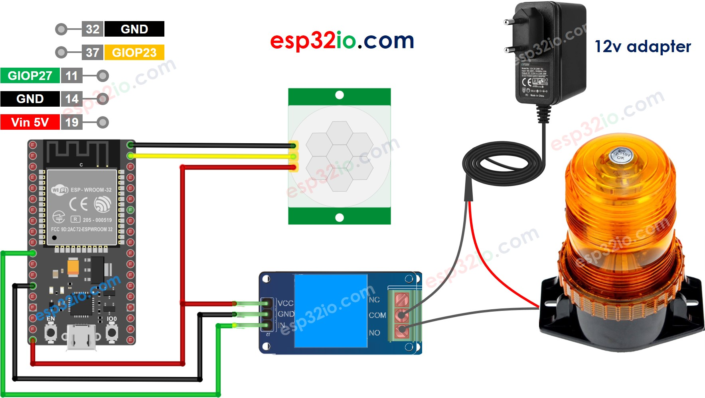
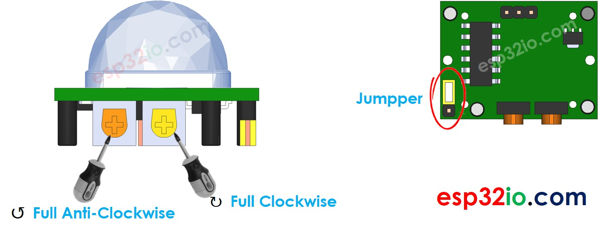

# ESP32 - Motion Sensor - Relay

This tutorial instructs you how to use ESP32 with HC-SR501 motion sensor and relay. In detail, ESP32 automatically turns on relay if the motion is detected, and turn off relay if otherwise.

We can extend this tutorial to use the motion sensor to control a led strip, siren, light bulb, or actuator... by connnecting them to the relay.


## Hardware Used In This Tutorial

  * 1	×	ESP-WROOM-32 Dev Module	
  * 1	×	Micro USB Cable	
  * 1	×	HC-SR501 Motion Sensor	
  * 1	×	Relay	
  * 1	×	Warning Light Bright Waterproof	
  * 1	×	12V Power Adapter	
  * n	×	Jumper Wires

---

## Wiring Diagram



| Initial Setting           |                                            |
| ----------------------    | -------------------                        |
| Detection Range Adjuster  | Fully screw it in the clockwise direction. |
| Time Delay Adjuster       | Fully screw it in the anti-clockwise direction. |
| Repeat Trigger Selector   | Put jumper like the below image.           |



## ESP32 Code

```c++
#define MOTION_SENSOR_PIN  23  // ESP32 pin GIOP23 connected to the OUTPUT pin of motion sensor
#define RELAY_PIN          27  // ESP32 pin GIOP27 connected to Relay's pin
int motionStateCurrent  = LOW; // current  state of motion sensor's pin
int motionStatePrevious = LOW; // previous state of motion sensor's pin

void setup() {
  Serial.begin(9600);                // initialize serial
  pinMode(MOTION_SENSOR_PIN, INPUT); // set ESP32 pin to input mode
  pinMode(RELAY_PIN, OUTPUT);        // set ESP32 pin to output mode
}

void loop() {
  motionStatePrevious = motionStateCurrent;             // store old state
  motionStateCurrent  = digitalRead(MOTION_SENSOR_PIN); // read new state

  if (motionStatePrevious == LOW && motionStateCurrent == HIGH) { // pin state change: LOW -> HIGH
    Serial.println("Motion detected!, turns relay ON");
    digitalWrite(RELAY_PIN, HIGH); // turn on
  } else if (motionStatePrevious == HIGH && motionStateCurrent == LOW) { // pin state change: HIGH -> LOW
    Serial.println("Motion stopped!, turns relay OFF");
    digitalWrite(RELAY_PIN, LOW);  // turn off
  }
}

```

### Quick Instructions

  * If this is the first time you use ESP32, see how to setup environment for ESP32 on Arduino IDE.
  * Do the wiring as above image.
  * Connect the ESP32 board to your PC via a micro USB cable
  * Open Arduino IDE on your PC.
  * Select the right ESP32 board (e.g. ESP32 Dev Module) and COM port.
  * Copy the above code and paste it to Arduino IDE.
  * Compile and upload code to ESP32 board by clicking Upload button on Arduino IDE
  * Move your hand in front of sensor
  * See the change of relay's state

