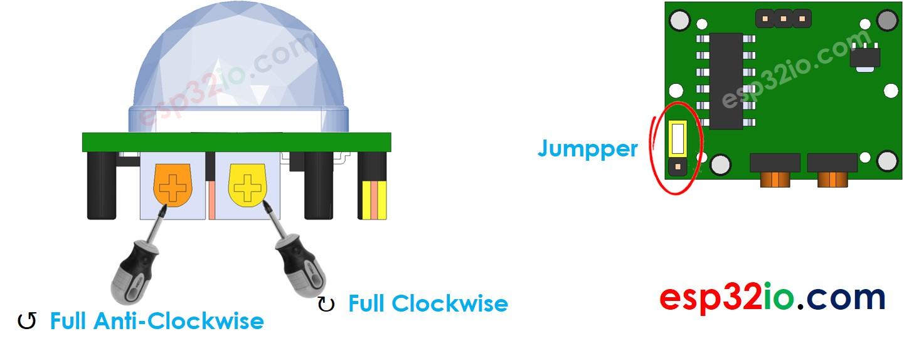

# ESP32 - Motion Sensor - Piezo Buzzer

This tutorial instructs you how to use ESP32 with HC-SR501 motion sensor and Piezo Buzzer. In detail:

  * ESP32 automatically makes sound if the motion is detected, and stops making sound if otherwise
  * ESP32 automatically makes a melody of song if the motion is detected, and stops making sound if otherwise

## Hardware Used In This Tutorial

  * 1	×	ESP-WROOM-32 Dev Module	
  * 1	×	Micro USB Cable	
  * 1	×	HC-SR501 Motion Sensor	
  * 1	×	Piezo Buzzer	
  * 1	×	Breadboard	
  * n	×	Jumper Wires

# Wiring Diagram

The wiring diagram with power supply from USB cable


The wiring diagram with power supply from 5v adapter


| Initial Setting           |                                            |
| ----------------------    | -------------------                        |
| Detection Range Adjuster  | Fully screw it in the clockwise direction. |
| Time Delay Adjuster       | Fully screw it in the anti-clockwise direction. |
| Repeat Trigger Selector   | Put jumper like the below image.           |



## ESP32 Code - Simple Sound

```c++
#define MOTION_SENSOR_PIN  32  // ESP32 pin GIOP32 connected to the OUTPUT pin of motion sensor
#define BUZZER_PIN         17  // ESP32 pin GIOP17 connected to Buzzer's pin
int motionStateCurrent  = LOW; // current  state of motion sensor's pin
int motionStatePrevious = LOW; // previous state of motion sensor's pin

void setup() {
  Serial.begin(9600);                // initialize serial
  pinMode(MOTION_SENSOR_PIN, INPUT); // set ESP32 pin to input mode
  pinMode(BUZZER_PIN, OUTPUT);          // set ESP32 pin to output mode
}

void loop() {
  motionStatePrevious = motionStateCurrent;            // store old state
  motionStateCurrent  = digitalRead(MOTION_SENSOR_PIN); // read new state

  if (motionStatePrevious == LOW && motionStateCurrent == HIGH) { // pin state change: LOW -> HIGH
    Serial.println("Motion detected!, making sound");
    digitalWrite(BUZZER_PIN, HIGH); // turn on
  } else if (motionStatePrevious == HIGH && motionStateCurrent == LOW) { // pin state change: HIGH -> LOW
    Serial.println("Motion stopped!, stops making sound");
    digitalWrite(BUZZER_PIN, LOW);  // turn off
  }
}

```

### Quick Instructions

  * If this is the first time you use ESP32, see how to setup environment for ESP32 on Arduino IDE.
  * Do the wiring as above image.
  * Connect the ESP32 board to your PC via a micro USB cable
  * Open Arduino IDE on your PC.
  * Select the right ESP32 board (e.g. ESP32 Dev Module) and COM port.
  * Copy the above code and paste it to Arduino IDE.
  * Compile and upload code to ESP32 board by clicking Upload button on Arduino IDE
  * Move your hand in front of sensor
  * Listen to piezo buzzer's sound

---

## ESP32 Code - Melody

```c++
#include "pitches.h"

#define MOTION_SENSOR_PIN  32  // ESP32 pin GIOP32 connected to the OUTPUT pin of motion sensor
#define BUZZER_PIN         17  // ESP32 pin GIOP17 connected to Buzzer's pin

// notes in the melody:
int melody[] = {
  NOTE_E5, NOTE_E5, NOTE_E5,
  NOTE_E5, NOTE_E5, NOTE_E5,
  NOTE_E5, NOTE_G5, NOTE_C5, NOTE_D5,
  NOTE_E5,
  NOTE_F5, NOTE_F5, NOTE_F5, NOTE_F5,
  NOTE_F5, NOTE_E5, NOTE_E5, NOTE_E5, NOTE_E5,
  NOTE_E5, NOTE_D5, NOTE_D5, NOTE_E5,
  NOTE_D5, NOTE_G5
};

// note durations: 4 = quarter note, 8 = eighth note, etc, also called tempo:
int noteDurations[] = {
  8, 8, 4,
  8, 8, 4,
  8, 8, 8, 8,
  2,
  8, 8, 8, 8,
  8, 8, 8, 16, 16,
  8, 8, 8, 8,
  4, 4
};

void setup() {
  Serial.begin(9600);                // initialize serial
  pinMode(MOTION_SENSOR_PIN, INPUT); // set ESP32 pin to input mode
}

void loop() {
  int motionState = digitalRead(MOTION_SENSOR_PIN); // read new state

  if (motionState == HIGH) {
    Serial.println("The motion is detected");
    buzzer();
  }
}

void buzzer() {
  // iterate over the notes of the melody:
  int size = sizeof(noteDurations) / sizeof(int);

  for (int thisNote = 0; thisNote < size; thisNote++) {
    // to calculate the note duration, take one second divided by the note type.
    //e.g. quarter note = 1000 / 4, eighth note = 1000/8, etc.
    int noteDuration = 1000 / noteDurations[thisNote];
    tone(BUZZER_PIN, melody[thisNote], noteDuration);

    // to distinguish the notes, set a minimum time between them.
    // the note's duration + 30% seems to work well:
    int pauseBetweenNotes = noteDuration * 1.30;
    delay(pauseBetweenNotes);
    // stop the tone playing:
    noTone(BUZZER_PIN);
  }
}

```


