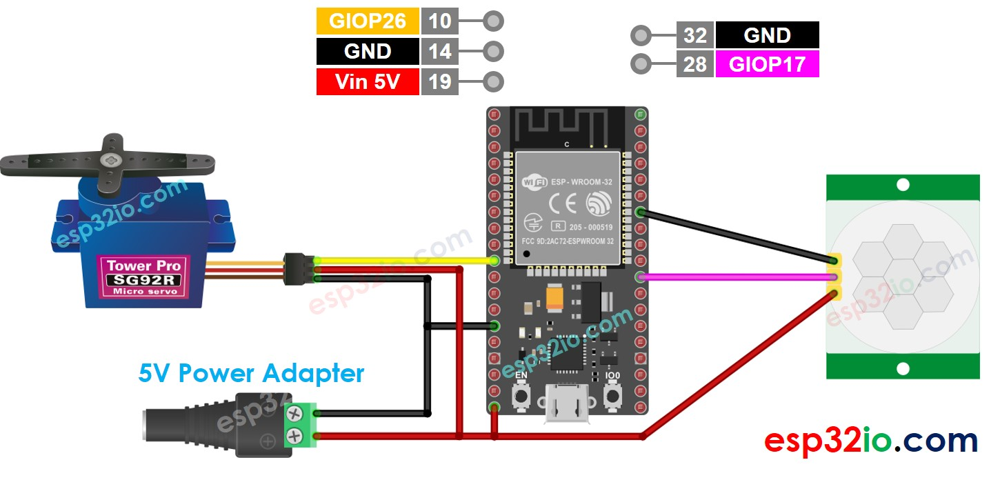

# ESP32 - Motion Sensor - Servo Motor

This tutorial instructs you how to use ESP32 with HC-SR501 motion sensor and Servo Motor. In detail:

  * ESP32 automatically rotates servo motor to 90 degree If the motion is detected,
  * ESP32 automatically rotates servo motor to back to 0 degree. degree If the motion is NOT detected.

## Hardware Used In This Tutorial

  * 1	×	ESP-WROOM-32 Dev Module	
  * 1	×	Micro USB Cable	
  * 1	×	HC-SR501 Motion Sensor	
  * 1	×	Servo Motor	
  * n	×	Jumper Wires

---

## Wiring Diagram



| Initial Setting           |                                            |
| ----------------------    | -------------------                        |
| Detection Range Adjuster  | Fully screw it in the clockwise direction. |
| Time Delay Adjuster       | Fully screw it in the anti-clockwise direction. |
| Repeat Trigger Selector   | Put jumper like the below image.           |


## ESP32 Code - Motion Sensor Controls Servo Motor

```c++
#include <Servo.h>

#define MOTION_SENSOR_PIN  17 // ESP32 pin GIOP17 connected to motion sensor's pin
#define SERVO_PIN          26 // ESP32 pin GIOP26 connected to servo motor's pin

Servo servo; // create servo object to control a servo

// The below are variables, which can be changed
int angle = 0;          // the current angle of servo motor
int lastMotionState;    // the previous state of motion sensor
int currentMotionState; // the current state of motion sensor

void setup() {
  Serial.begin(9600);                // initialize serial
  pinMode(MOTION_SENSOR_PIN, INPUT); // set ESP32 pin to input mode
  servo.attach(SERVO_PIN);           // attaches the servo on pin 9 to the servo object

  servo.write(angle);
  currentMotionState = digitalRead(MOTION_SENSOR_PIN);
}

void loop() {
  lastMotionState    = currentMotionState;             // save the last state
  currentMotionState = digitalRead(MOTION_SENSOR_PIN); // read new state

  if (currentMotionState == LOW && lastMotionState == HIGH) { // pin state change: LOW -> HIGH
    Serial.println("Motion detected!, rotating servo motor to 90°");
    servo.write(90);
  } else if (currentMotionState == HIGH && lastMotionState == LOW) { // pin state change: HIGH -> LOW
    Serial.println("Motion stopped!, rotating servo motor to 0°");
    servo.write(0);
  }
}

```

### Quick Instructions

  * If this is the first time you use ESP32, see how to setup environment for ESP32 on Arduino IDE.
  * Do the wiring as above image.
  * Connect the ESP32 board to your PC via a micro USB cable
  * Open Arduino IDE on your PC.
  * Select the right ESP32 board (e.g. ESP32 Dev Module) and COM port.
  * Copy the above code and paste it to Arduino IDE.
  * Compile and upload code to ESP32 board by clicking Upload button on Arduino IDE
  * Move your hand in front of sensor
  * See the change of servo motor


