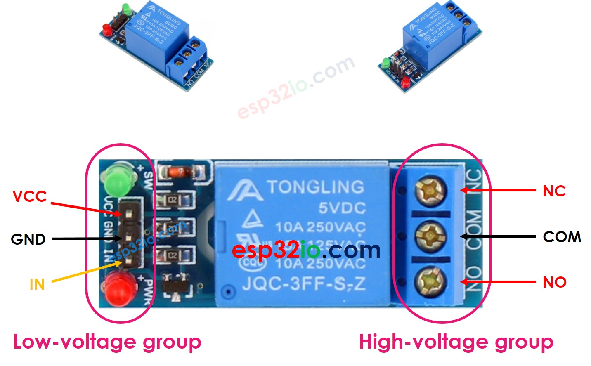
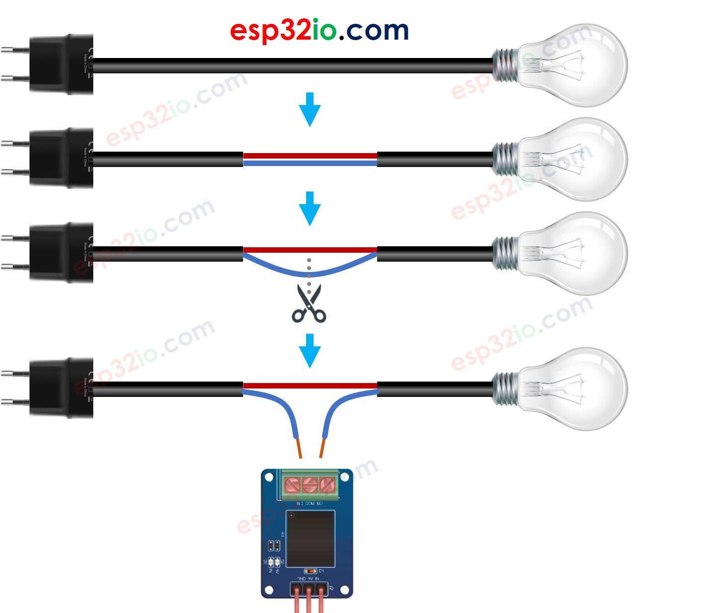
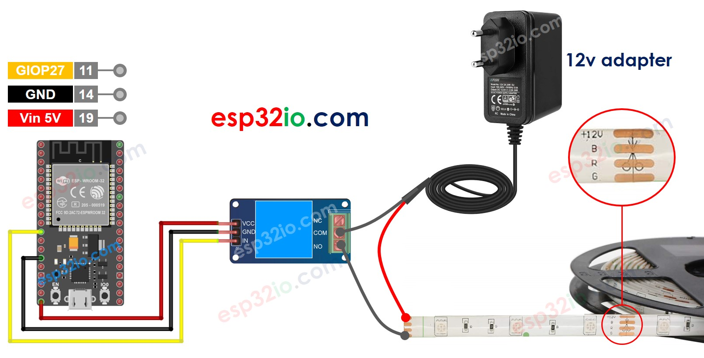

# ESP32 - Relay

You can connect an LED directly to ESP32 but you cannot connect a high voltage devices (such as an electric lamp, pump, electromagnetic lock, linear actuator, or even a big machine...) directly to ESP32. We need a relay in between ESP32 and the high voltage devices. Without relay, the high voltage will destroy ESP32.

  * **The common between controlling a LED and an electric lamp**: ESP32 code programs the ESP32's output pin to `HIGH/LOW` to turn THEM `on/off` .
  * The difference between controlling a LED and an electric lamp:
    * Controlling LED: LED can works with 3.3v or lower ⇒ can connect LED directly to ESP32's pin.
    * Controlling the electric lamp: the electric lamp works with high voltage (e.g. 12V)⇒ CANNOT connect the electric lamp directly to ESP32's pin. It needs to use a relay between ESP32's pin and the electric lamp. If not, ESP32 will be burned.

## Hardware Used In This Tutorial

  * 1	×	ESP-WROOM-32 Dev Module	
  * 1	×	Micro USB Cable	
  * 1	×	Relay	
  * 1	×	LED Strip	
  * 1	×	12V Power Adapter	
  * 1	×	Breadboard	
  * n	×	Jumper Wires

---

## Introduction to Relay

The relay is a programmable switch that can be used to control `ON/OFF` electrical devices. The relay can be programmatically controlled by ESP32 ⇒ ESP32 can control on/off the high voltage devices by using a relay.

  > **WARNING**
  > Safety first! Safety first!
  >   * Please be careful when working with high voltage. Seriously, it may shock you or even take your life. If you’re NOT 100% sure what you are doing, do yourself a favor and don’t touch anything. Ask someone who knows!
  >   * Some relays can work with both DC and AC voltage, we extremely recommend you NOT to use AC voltage. Use a DC device (≤24V) only.

## Relay Pinout



The relay pins can be categorized two groups: low voltage and high voltage.

  * **The low voltage pins**: are interfaced to ESP32, including three pins:
    * *GND pin*: connect this pin to GND (0V)
    * *VCC pin*: connect this pin to VCC (5V)
    * *IN pin*: receives the control signal from ESP32
  * **The high voltage pins**: are interfaced to high-voltage device, including three pins (usually in screw terminal):
    * *NO pin*: Normally Open pin
    * *NC pin*: Normally Closed pin
    * *COM pin*: the common pin

Normally, we do NOT use all high voltage pins. We usually use only two, depending on the operation mode we choose:

  * Normally open mode: Use only COM pin and NO pin
  * Normally closed mode: Use only COM pin and NC pin

  > **Note**
  >
  > The pin order of the relay can be different between manufacturers. Please check the labels printed on the relay carefully!

## How to Connect the high-voltage Device to Relay



---

## How Relay Works

The relay has two operation modes:

  * Normally open mode
  * Normally closed mode.

Two modes works oppositely.

The *“normally”* means **“if the IN pin is connected to LOW (0V)”**.


### Normally Open Mode

Connect the high-voltage device to the COM pin and NO pin. Just like a switch:

  * If the IN pin is connected to **LOW** (0V), the switch is open. The device is **OFF** (or deactivated).
  * If the IN pin is connected to **HIGH** (5V or 3.3V), the switch is closed. The device is **ON** (or activated).
 
### Normally Closed Mode

Connect the the high-voltage device to the COM pin and NC pin. Just like a switch:

  * If the IN pin is connected to **LOW** (0V) ⇒ The switch is closed ⇒ The device is **ON** (or activated).
  * If the IN pin is connected to **HIGH** (5V or 3.3V) ⇒ The switch is open ⇒ The device is **OFF** (or deactivated).

  > Which mode should we use?
  > ⇒ It depends on application.

### Normally Open Mode vs Normally Closed Mode

The relay is just like a switch. The below table shows the difference between two modes.

|                      | Pins used      | IN pin | Relay state | Device state |
|----------------------|----------------|--------|-------------|--------------|
| Normally Open Mode   | COM and NO pin | LOW    | ⇒ open      | ⇒  OFF       |
| Normally Closed Mode | COM and NC pin | LOW    | ⇒ closed    | ⇒  ON        |
| Normally Open Mode   | COM and NO pin | HIGH   | ⇒ closed    | ⇒  ON        |
| Normally Closed Mode | COM and NC pin | HIGH   | ⇒ open      | ⇒  OFF       |

---

## ESP32 - Relay

A high-voltage device can be controlled by ESP32 via a relay.

Controlling a relay is a piece of cake. We just need:

  * Connect an ESP32's pin to the IN pin of the relay
  * Control the relay by programming the ESP32's pin to **LOW** or **HIGH**

## Wiring Diagram



### The wiring table between relay module and ESP32

| Relay Module | ESP32      |
|--------------|------------|
| GND          | →  GND     |
| VCC          | → Vin (5V) |
| IN           | → GIOP27   |

---

## How To Program Relay using ESP32

Configure an ESP32's pin to the digital output mode by using pinMode() function. For example, pin GIOP27:

```c++
pinMode(27, OUTPUT);
```

Program the output pin to LOW (0V) by using digitalWrite() function:

```c++
digitalWrite(27, LOW); // GIOP27
```

Program the output pin to HIGH (3.3V) by using digitalWrite() function:

```c++
digitalWrite(27, HIGH); // GIOP27
```

## ESP32 Code

```c++
#define RELAY_PIN 27 // ESP32 pin GIOP27 connected to the IN pin of relay

// the code in setup function runs only one time when ESP32 starts
void setup() {
  // initialize digital pin as an output.
  pinMode(RELAY_PIN, OUTPUT);
}

// the code in loop function is executed repeatedly infinitely
void loop() {
  digitalWrite(RELAY_PIN, HIGH);
  delay(1000);
  digitalWrite(RELAY_PIN, LOW);
  delay(1000);
}

```

### Quick Instructions

  * If this is the first time you use ESP32, see how to setup environment for ESP32 on Arduino IDE.
  * Copy the above code and paste it to Arduino IDE.
  * Compile and upload code to ESP32 board by clicking Upload button on Arduino IDE.
  * See LED strip state: blinking.
