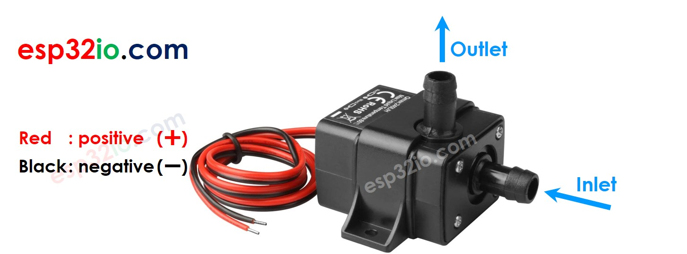
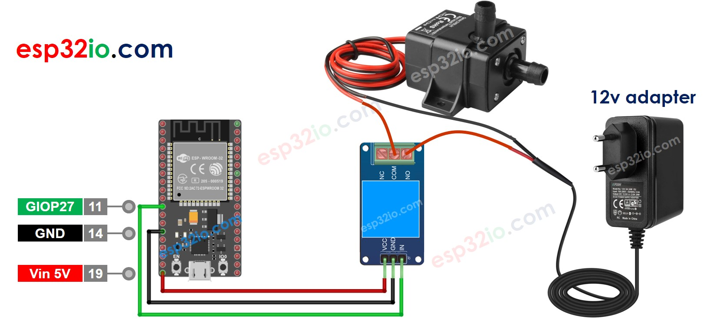

# ESP32 - Control Pump

This tutorial instructs you how to use ESP32 to control a pump. You can extend this tutorial to build the DIY aquarium, cocktail machine, coffee machine, or irrigation system...

## Hardware Used In This Tutorial

  * 1	×	ESP-WROOM-32 Dev Module	
  * 1	×	Micro USB Cable	
  * 1	×	Relay	
  * 1	×	12V Pump	
  * 1	×	Vinyl Tube	
  * 1	×	12V Power Adapter	
  * n	×	Jumper Wires

---

## Introduction to 12V Pump

### Pump Pinout



A 12V Pump has two wires:

  * Negative (-) wire (black): connect this wire to the negative wire of 12V DC power supply
  * Positive (+) wire (red): connect this wire to the Positive wire of 12V DC power supply

## How to Control Pump using ESP32

If we connect a 12V power supply to a pump, the pump will work. We can programmatically control a pump by using ESP32. To do so, we need a relay in between the pump ESP32 board. We have a specific tutorial about relay, which contains detailed information and step-by-step instructions about hardware pinout, working principle, wiring connection to ESP32, ESP32 code... Learn about relay in the ESP32 - Relay tutorial

## Wiring Diagram between ESP32, Relay and Pump



## ESP32 - Pump Code

The below code periodically turns the pump ON/OFF in every 4 seconds.

```c++
#define RELAY_PIN 27 // ESP32 pin GIOP27, which connects to the IN pin of relay

// the code in setup function runs only one time when ESP32 starts
void setup() {
  // initialize digital pin GIOP27 as an output.
  pinMode(RELAY_PIN, OUTPUT);
}

// the code in loop function is executed repeatedly infinitely
void loop() {
  digitalWrite(RELAY_PIN, HIGH); // turn on pump 4 seconds
  delay(4000);
  digitalWrite(RELAY_PIN, LOW);  // turn off pump 4 seconds
  delay(4000);
}

```

### Quick Instructions

  * If this is the first time you use ESP32, see how to setup environment for ESP32 on Arduino IDE.
  * Do the wiring as above image.
  * Connect the ESP32 board to your PC via a micro USB cable
  * Open Arduino IDE on your PC.
  * Select the right ESP32 board (e.g. ESP32 Dev Module) and COM port.
  * Copy the above code and paste it to Arduino IDE.
  * Compile and upload code to ESP32 board by clicking Upload button on Arduino IDE
  * See the pump's state

