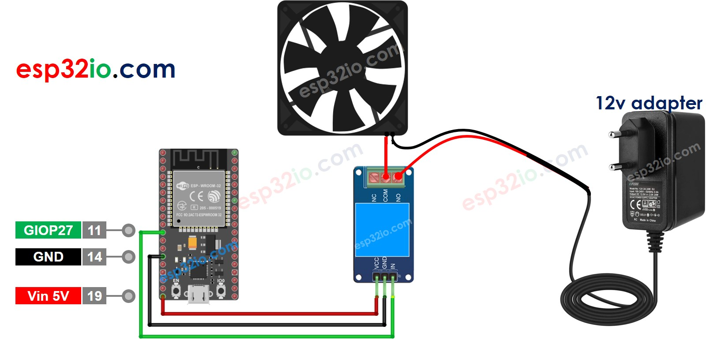

# ESP32 - Control Fan

This tutorial instructs you how to use ESP32 to control a fan.


## Hardware Used In This Tutorial

  * 1	×	ESP-WROOM-32 Dev Module	
  * 1	×	Micro USB Cable	
  * 1	×	Relay	
  * 1	×	12V Cooling Fan	
  * 1	×	12V Power Adapter	
  * n	×	Jumper Wires

## How to Control Fan

  * If we connect a 12V power supply to a 12V fan, the fan spins at full speed.
  * If we connect a 12V PWM signal to a 12V fan, the fan spins at a speed in proportion to the PWM's duty cycle.

This tutorial instructs you how to use ESP32 to turn `on/off` a fan. Controlling the speed of a fan will be presented in another tutorial.

Because the fan uses the high voltage, we cannot connect it directly to ESP32, we need to connect fan to ESP32 indirectly via a relay. We have specific tutorials about relay (pinout, how it works, how to program ...), learn about relay in the ESP32 - Relay tutorial

## Wiring Diagram



## ESP32 Code

The below code periodically turns the fan ON/OFF in every 10 seconds.

```c++
#define RELAY_PIN  27  // ESP32 pin GIOP27, which connects to the IN pin of relay

// the code in setup function runs only one time when ESP32 starts
void setup() {
  // initialize digital pin A5 as an output.
  pinMode(RELAY_PIN, OUTPUT);
}

// the code in loop function is executed repeatedly infinitely
void loop() {
  digitalWrite(RELAY_PIN, HIGH); // turn on fan 10 seconds
  delay(10000);
  digitalWrite(RELAY_PIN, LOW);  // turn off fan 10 seconds
  delay(10000);
}

```

### Quick Instructions

  * If this is the first time you use ESP32, see how to setup environment for ESP32 on Arduino IDE.
  * Do the wiring as above image.
  * Connect the ESP32 board to your PC via a micro USB cable
  * Open Arduino IDE on your PC.
  * Select the right ESP32 board (e.g. ESP32 Dev Module) and COM port.
  * Copy the above code and paste it to Arduino IDE.
  * Compile and upload code to ESP32 board by clicking Upload button on Arduino IDE
  * See the fan's state


