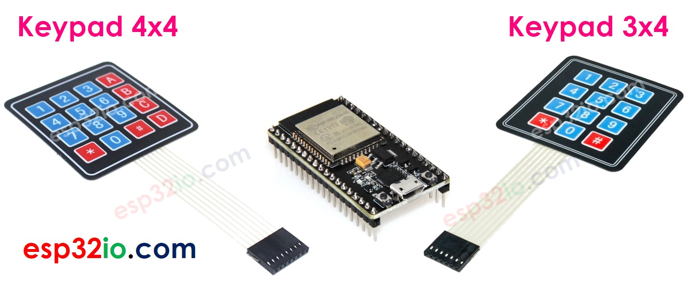
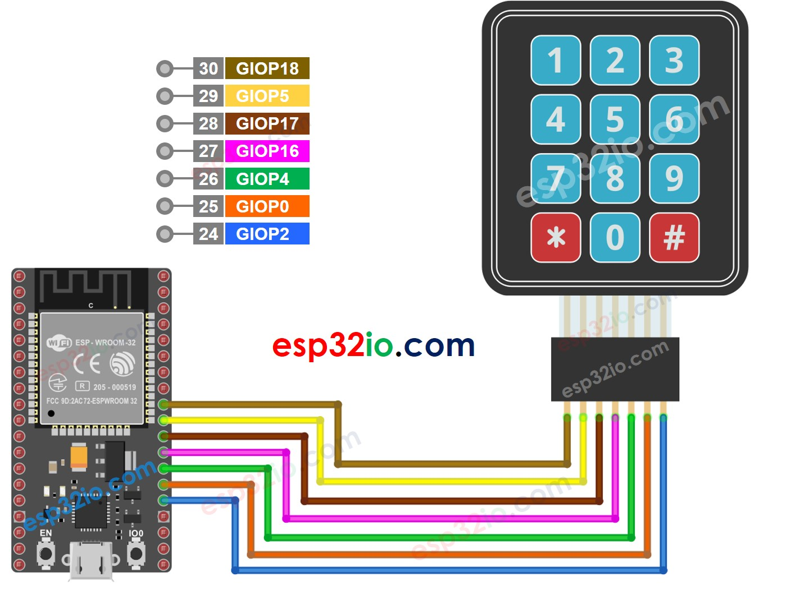
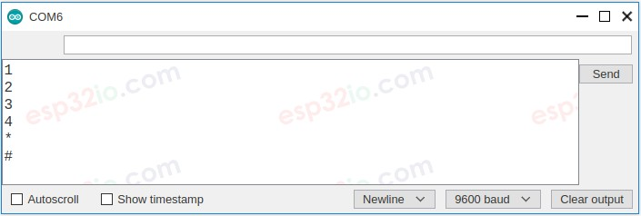
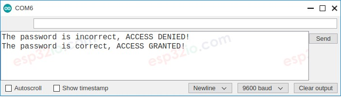

# ESP32 - Keypad

This tutorial instructs you how to use ESP32 with keypad. In detail, we will learn:

  * How to use keypad 3x4 with ESP32
  * How to use keypad 4x4 with ESP32
  * How to use the password inputted from keypad

## Introduction to Keypad



The keypad is composed of a group of buttons arranged in the matrix (rows and columns). A button represents for a key. There are many types of keypad. The keypad 3x4 (12 keys) and keypad 4x4 (16 keys) is two most common-used on DIY projects.

## Keypad Pinout

Keypad pins are categorized into two groups: row and column.

  * The keypad 3x4 has 7 pins:
    * R1, R2, R3, R4: row-pins
    * C1, C2, C3: column-pins
  * The keypad 4x4 has 8 pins:
    * R1, R2, R3, R4: row-pins
    * C1, C2, C3, C4: column-pins

## How Keypad Works

The process of detecting the key pressing is called scanning keypad.

It is called “scanning” because it checks one key by one key.

Row-pins are connected to Arduino's output pins

Column pins are connected to Arduino's input pins (INPUT_PULLUP, in this state, the value of the input pin is HIGH if the key is not pressed).

[See Video](https://youtu.be/5beUZDBY8N0)

For each row:

  * Sets all row-pins is HIGH.
  * Sets only the current row-pin to LOW.
  * Reads the state of each column.
    * If a column-pin is HIGH ⇒ key at (row, column) is NOT pressed.
    * If a column-pin is LOW ⇒ key at (row, column) is pressed.
  * Repeats the above process for the next row-pins.

---

  > **Note**
  >
  > The above is one of the methods to scan keypad. We can invert all HIGH to LOW and all LOW to HIGH to scan keypad.
  >
  > Why does keypad is arranged and connected as a matrix? This makes the scanning process complicated. Why do not use each key as an independent button, then the state of the key is simply determined by reading the state of a button?

⇒ As we know, an independent button requires one Arduino's pin and GND. Let's take keypad 4x4 as an example. If we each key as an independent button, it requires 16 Arduino pin for 16 keys plus GND pin. If we arranged a connected key in matrix form, we just need to use 8 Arduino's pin, so we can save Arduino's pin. In short, the answer is: to save the Arduino pins.

## Wiring Diagram between Keypad and ESP32

ESP32 - Keypad 3x4 wiring diagram



ESP32 - Keypad 4x4 wiring diagram

## ESP32 Code

### Keypad 3x4

```c++
#include <Keypad.h>

#define ROW_NUM     4 // four rows
#define COLUMN_NUM  3 // three columns

char keys[ROW_NUM][COLUMN_NUM] = {
  {'1', '2', '3'},
  {'4', '5', '6'},
  {'7', '8', '9'},
  {'*', '0', '#'}
};

byte pin_rows[ROW_NUM] = {18, 5, 17, 16}; // GIOP18, GIOP5, GIOP17, GIOP16 connect to the row pins
byte pin_column[COLUMN_NUM] = {4, 0, 2};  // GIOP4, GIOP0, GIOP2 connect to the column pins

Keypad keypad = Keypad( makeKeymap(keys), pin_rows, pin_column, ROW_NUM, COLUMN_NUM );

void setup() {
  Serial.begin(9600);
}

void loop() {
  char key = keypad.getKey();

  if (key) {
    Serial.println(key);
  }
}

```

### Keypad 4x4

```c++
#include <Keypad.h>

#define ROW_NUM     4 // four rows
#define COLUMN_NUM  4 // four columns

char keys[ROW_NUM][COLUMN_NUM] = {
  {'1', '2', '3', 'A'},
  {'4', '5', '6', 'B'},
  {'7', '8', '9', 'C'},
  {'*', '0', '#', 'D'}
};

byte pin_rows[ROW_NUM]      = {19, 18, 5, 17}; // GIOP19, GIOP18, GIOP5, GIOP17 connect to the row pins
byte pin_column[COLUMN_NUM] = {16, 4, 0, 2};   // GIOP16, GIOP4, GIOP0, GIOP2 connect to the column pins

Keypad keypad = Keypad( makeKeymap(keys), pin_rows, pin_column, ROW_NUM, COLUMN_NUM );

void setup() {
  Serial.begin(9600);
}

void loop() {
  char key = keypad.getKey();

  if (key) {
    Serial.println(key);
  }
}

```

### Quick Instructions

If this is the first time you use ESP32, see how to setup environment for ESP32 on Arduino IDE.

  * On Arduino IDE, Navigate to Tools Manage Libraries
  * Type keypad on the search box, then look for the keypad library by Mark Stanley, Alexander Brevig
  * Click Install button to install keypad library.
  * Copy the above code and paste it to Arduino IDE.
  * Compile and upload code to ESP32 board by clicking Upload button on Arduino IDE
  * Open Serial Monitor on Arduino IDE
  * Press some keys on keypad
  * See the result in Serial Monitor



---

## Keypad and Password

The keypad is widely used to authenticate someone by password. In this tutorials, a valid password is pre-defined in the code. When an user inputs the password from keypad, it is compared with the pre-defined password:

  * If matched, the access is granted.
  * If not, the access is defined.

To use password with keypad, we specify two special keys:

  * A key to start inputting the password. For example, key "*"
  * A key to finish inputting the password. For example, key "#"

The password inputed from an user will be stored in a string, called the inputted password string. When a key is pressed:

  * If an inputted key is "*", clear the inputted password string to start new password
  * If an inputted key is NOT "*" or "#", add the key to the inputted password string.
  * If an inputted key is "#", compare the inputted password string with the pre-defined password.

## Keypad - Password Code

```c++
#include <Keypad.h>

#define ROW_NUM     4 // four rows
#define COLUMN_NUM  3 // three columns

char keys[ROW_NUM][COLUMN_NUM] = {
  {'1', '2', '3'},
  {'4', '5', '6'},
  {'7', '8', '9'},
  {'*', '0', '#'}
};

byte pin_rows[ROW_NUM] = {18, 5, 17, 16}; // GIOP18, GIOP5, GIOP17, GIOP16 connect to the row pins
byte pin_column[COLUMN_NUM] = {4, 0, 2};  // GIOP4, GIOP0, GIOP2 connect to the column pins

Keypad keypad = Keypad( makeKeymap(keys), pin_rows, pin_column, ROW_NUM, COLUMN_NUM );

const String password = "7890"; // change your password here
String input_password;

void setup() {
  Serial.begin(9600);
  input_password.reserve(32); // maximum input characters is 33, change if needed
}

void loop() {
  char key = keypad.getKey();

  if (key) {
    Serial.println(key);

    if (key == '*') {
      input_password = ""; // clear input password
    } else if (key == '#') {
      if (password == input_password) {
        Serial.println("The password is correct, ACCESS GRANTED!");
        // DO YOUR WORK HERE

      } else {
        Serial.println("The password is incorrect, ACCESS DENIED!");
      }

      input_password = ""; // clear input password
    } else {
      input_password += key; // append new character to input password string
    }
  }
}

```

### Quick Instructions

  * If this is the first time you use ESP32, see how to setup environment for ESP32 on Arduino IDE.
  * Run above code
  * Open Serial Monitor on Arduino IDE
  * Press "123456" keys and press "#"
  * Press "7890" keys and press "#"
  * See the result on Serial Monitor. It looks like the below:


