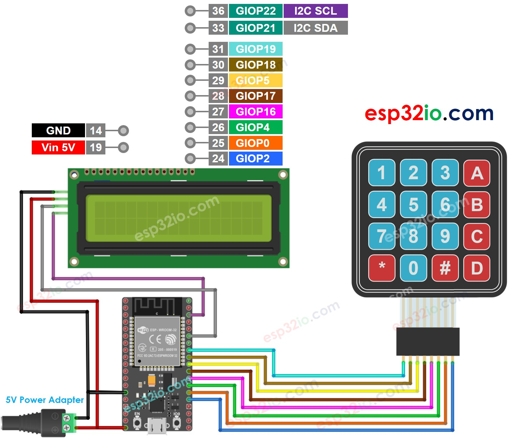

# ESP32 - Keypad - LCD

This tutorial instructs you how to use ESP32 with the keypad and LCD display. In detail, We will learn how to display the pressed key on LCD.

## Hardware Used In This Tutorial

  * 1	×	ESP-WROOM-32 Dev Module	
  * 1	×	Micro USB Cable	
  * 1	×	LCD I2C	
  * 1	×	Keypad 4x4	
  * 1	×	Breadboard	
  * 4	×	Jumper Wires

---

## Wiring Diagram



## ESP32 Code

```c++
#include <Keypad.h>
#include <LiquidCrystal_I2C.h>

#define ROW_NUM     4 // four rows
#define COLUMN_NUM  4 // four columns

char keys[ROW_NUM][COLUMN_NUM] = {
  {'1','2','3', 'A'},
  {'4','5','6', 'B'},
  {'7','8','9', 'C'},
  {'*','0','#', 'D'}
};

byte pin_rows[ROW_NUM]      = {19, 18, 5, 17}; // GIOP19, GIOP18, GIOP5, GIOP17 connect to the row pins
byte pin_column[COLUMN_NUM] = {16, 4, 0, 2};   // GIOP16, GIOP4, GIOP0, GIOP2 connect to the column pins

Keypad keypad = Keypad(makeKeymap(keys), pin_rows, pin_column, ROW_NUM, COLUMN_NUM );
LiquidCrystal_I2C lcd(0x27, 16, 2); // I2C address 0x27, 16 column and 2 rows

int cursorColumn = 0;

void setup(){
  lcd.init(); // initialize the lcd
  lcd.backlight();
}

void loop(){
  char key = keypad.getKey();

  if (key) {
    lcd.setCursor(cursorColumn, 0); // move cursor to   (cursorColumn, 0)
    lcd.print(key);                 // print key at (cursorColumn, 0)

    cursorColumn++;                 // move cursor to next position
    if(cursorColumn == 16) {        // if reaching limit, clear LCD
      lcd.clear();
      cursorColumn = 0;
    }
  }
}

```

### Quick Instructions

  * If this is the first time you use ESP32, see how to setup environment for ESP32 on Arduino IDE.
  * Do the wiring as above image.
  * Connect the ESP32 board to your PC via a micro USB cable
  * Open Arduino IDE on your PC.
  * Select the right ESP32 board (e.g. ESP32 Dev Module) and COM port.
  * On Arduino IDE, Navigate to Tools Manage Libraries
  * Type “keypad” on the search box, then look for the keypad library by Mark Stanley, Alexander Brevig
  * Click Install button to install keypad library
  * Type `“LiquidCrystal I2C”` on the search box, then look for the `LiquidCrystal_I2C` library by Frank de Brabander
  * Click Install button to install `LiquidCrystal_I2C` library.
  * Press some keys on keypad
  * See the result in LCD

f the LCD does not display anything, see [Troubleshooting on LCD I2C](https://esp32io.com/tutorials/esp32-lcd#content_troubleshooting_on_lcd_i2c)

