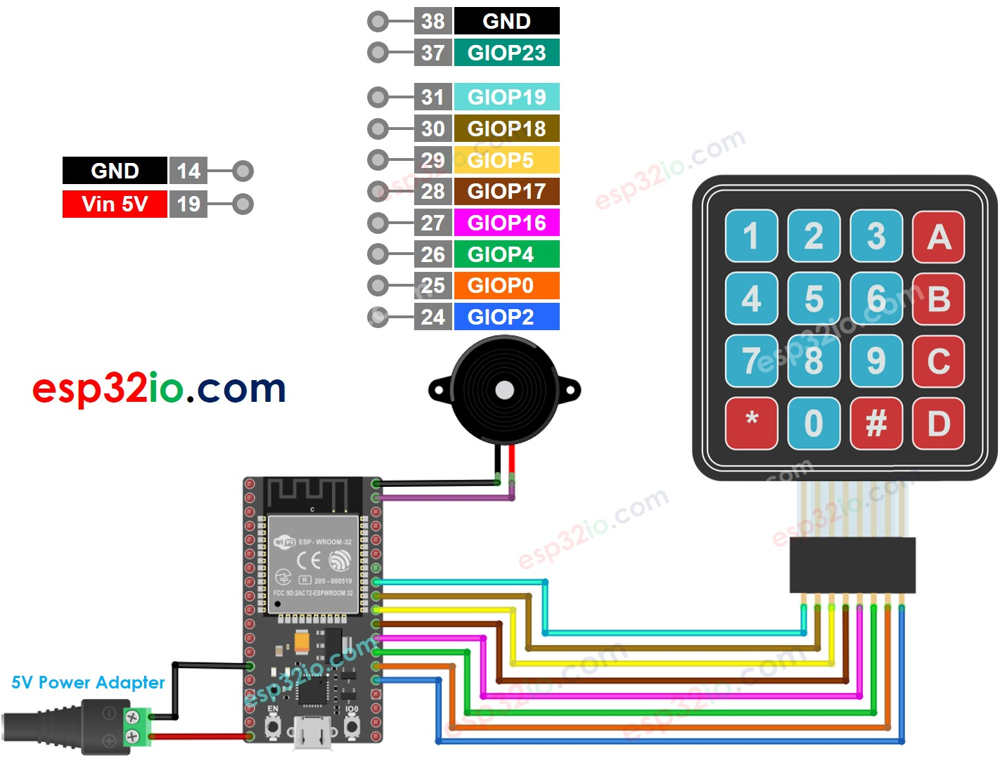

# ESP32 - Keypad - Beep

This tutorial instructs you how to use generate a beep each time a key on keypad is pressed using ESP32, keypad and piezo buzzer.

## Hardware Used In This Tutorial

  * 1	×	ESP-WROOM-32 Dev Module	
  * 1	×	Micro USB Cable	
  * 1	×	Keypad	
  * 1	×	Piezo Buzzer	
  * 1	×	Breadboard	
  * n	×	Jumper Wires

---

## Wiring Diagram



## ESP32 Code

```c++
#include <Keypad.h>
#include <ezBuzzer.h>

#define BUZZER_PIN  23 // ESP32 pin GIOP23 connected to the buzzer's pin
#define ROW_NUM     4  // four rows
#define COLUMN_NUM  4  // four columns

char keys[ROW_NUM][COLUMN_NUM] = {
  {'1', '2', '3', 'A'},
  {'4', '5', '6', 'B'},
  {'7', '8', '9', 'C'},
  {'*', '0', '#', 'D'}
};

byte pin_rows[ROW_NUM] = {19, 18, 5, 17};    // GIOP19, GIOP18, GIOP5, GIOP17 connect to the row pins
byte pin_column[COLUMN_NUM] = {16, 4, 0, 2}; // GIOP16, GIOP4, GIOP0, GIOP2 connect to the column pins

Keypad keypad = Keypad(makeKeymap(keys), pin_rows, pin_column, ROW_NUM, COLUMN_NUM );
ezBuzzer buzzer(BUZZER_PIN); // create ezBuzzer object that attach to a pin;

void setup() {
  Serial.begin(9600);
}

void loop() {
  buzzer.loop(); // MUST call the buzzer.loop() function in loop()
  char key = keypad.getKey();

  if (key) {
    Serial.print(key); // prints key to serial monitor
    buzzer.beep(100);  // generates a 100ms beep
  }
}

```

### Quick Instructions

  * If this is the first time you use ESP32, see how to setup environment for ESP32 on Arduino IDE.
  * Do the wiring as above image.
  * Connect the ESP32 board to your PC via a micro USB cable
  * Open Arduino IDE on your PC.
  * Select the right ESP32 board (e.g. ESP32 Dev Module) and COM port.
  * On Arduino IDE, Navigate to Tools Manage Libraries
  * Type “keypad” on the search box, then look for the keypad library by Mark Stanley, Alexander Brevig
  * Click Install button to install keypad library.
  * Type “ezBuzzer” on the search box, then look for the buzzer library by ESP32GetStarted
  * Click Install button to install ezBuzzer library.
  * Copy the above code and paste it to Arduino IDE.
  * Compile and upload code to ESP32 board by clicking Upload button on Arduino IDE
  * Press several keys on the keypad
  * Listen to the beep and see the result in Serial Monitor

