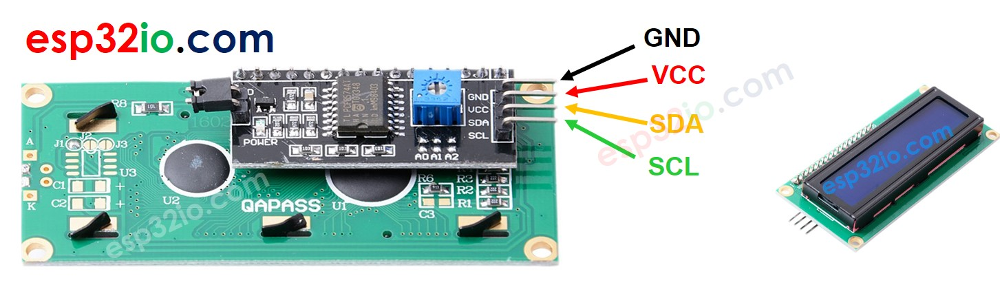
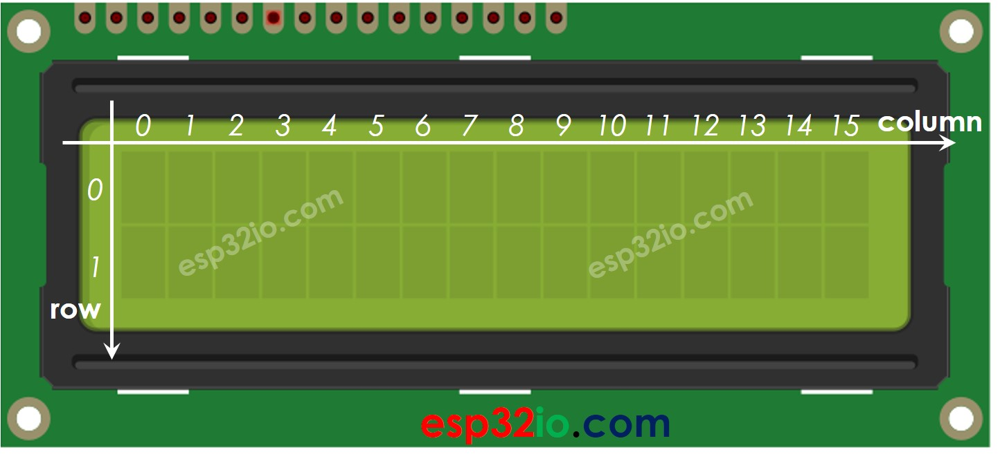
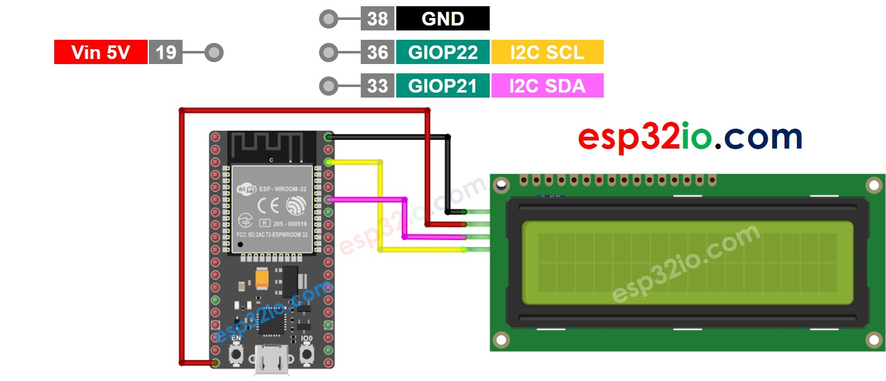
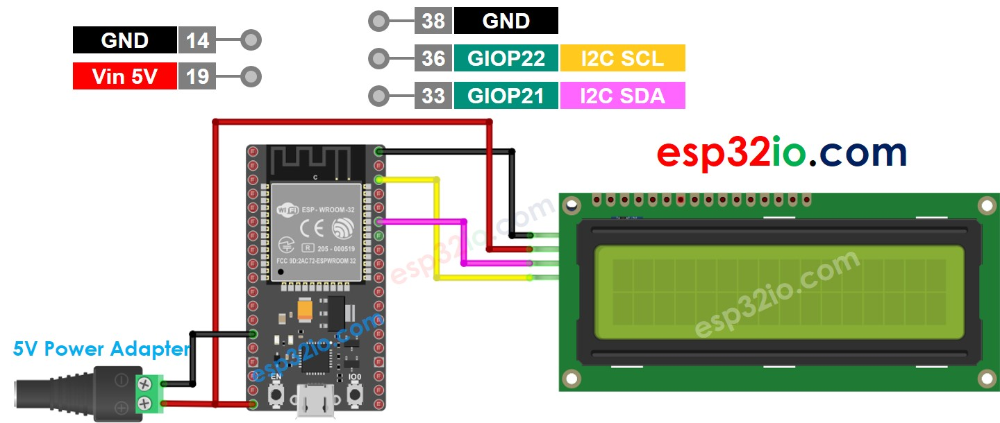

# ESP32 - LCD

This tutorial instructs you how to use ESP32 with LCD I2C. In detail, we will learn:

  * How to display text on LCD I2C using ESP32 board.
  * How to display special characters on the LCD I2C using ESP32 board.

## Hardware Used In This Tutorial

  * 1	×	ESP-WROOM-32 Dev Module	
  * 1	×	Micro USB Cable	
  * 1	×	LCD I2C	
  * n	×	Jumper Wires

---

## Introduction to LCD I2C 16x2

### LCD I2C Pinout

LCD I2C has 4 pins:

  * **VCC pin**: the power supply for the LCD, needs to be connected to VCC (5V).
  * **GND pin**: connect this pin to GND (0V).
  * **SCL pin**: I2C clock signal pin
  * **SDA pin**: I2C data signal pin



### LCD 16x2 Coordinates

LCD I2C 16x2 has 2 rows and 16 columns indexed from 0.



---

## Wiring Diagram between LCD I2C and ESP32

The wiring diagram with power supply from USB cable



The wiring diagram with power supply from 5v adapter



---

## How To Program LCD I2C using ESP32

Include the LiquidCrystal_I2C library:

```c++
#include <LiquidCrystal_I2C.h>
```
    
Declare a LiquidCrystal_I2C object:

```c++
LiquidCrystal_I2C lcd_i2c(0x27, 16, 2); // I2C address 0x27, 16 column and 2 rows
```
Initialize the LCD.

```c++
lcd_i2c.init();
lcd_i2c.backlight();
```

Move cursor to the desired position (column_index, row_index)

```c++
lcd_i2c.setCursor(column_index, row_index);
```

Print a message to the LCD.

```
lcd_i2c.print("Hello ESP32!");
```

## ESP32 Code

```c++
#include <LiquidCrystal_I2C.h>

LiquidCrystal_I2C lcd(0x27, 16, 2); // I2C address 0x27, 16 column and 2 rows

void setup() {
  lcd_i2c.init(); // initialize the lcd
  lcd_i2c.backlight();

  lcd_i2c.setCursor(0, 0);      // move cursor to   (0, 0)
  lcd_i2c.print("Hello");       // print message at (0, 0)
  lcd_i2c.setCursor(2, 1);      // move cursor to   (2, 1)
  lcd_i2c.print("esp32io.com"); // print message at (2, 1)
}

void loop() {
}

```

### Quick Instructions

  * If this is the first time you use ESP32, see how to setup environment for ESP32 on Arduino IDE.
  * On Arduino IDE, Navigate to Tools Manage Libraries
  * Type *“LiquidCrystal I2C”* on the search box, then look for the `LiquidCrystal_I2C` library by Frank de Brabander
  * Click Install button to install `LiquidCrystal_I2C` library.
  * Copy the above code and paste it to Arduino IDE.
  * Compile and upload code to ESP32 board by clicking Upload button on Arduino IDE
  * See the result on LCD
  * Try modifying text and position