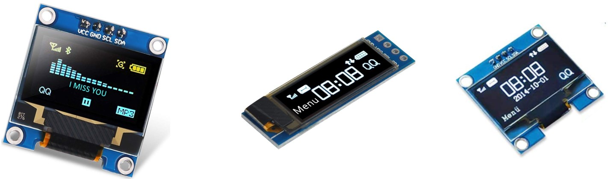
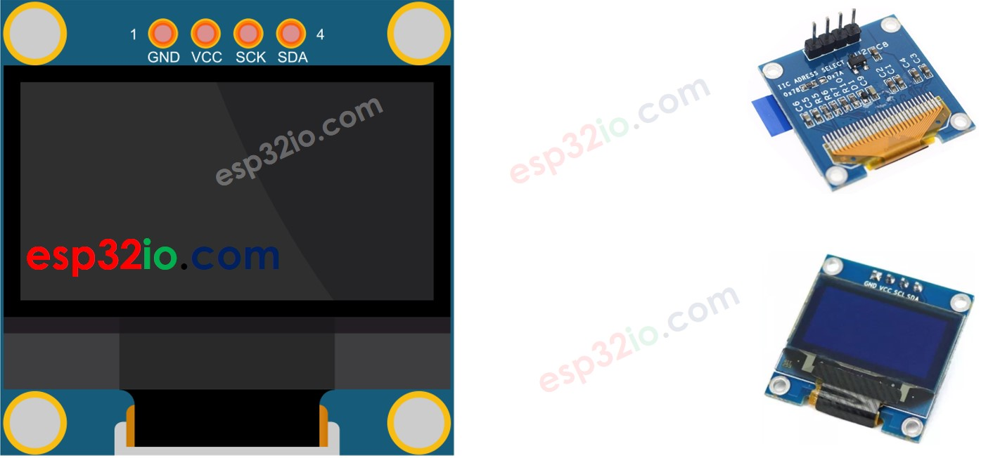
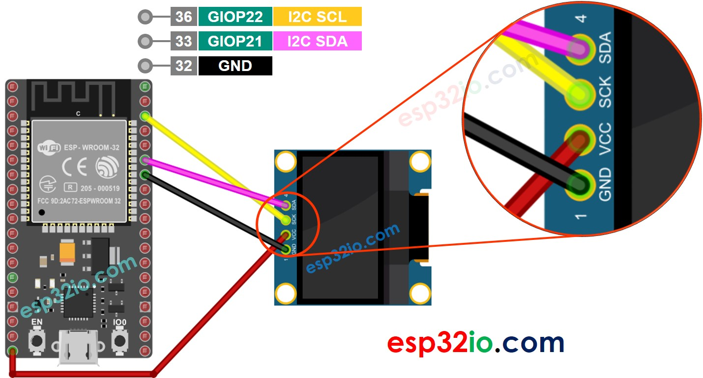
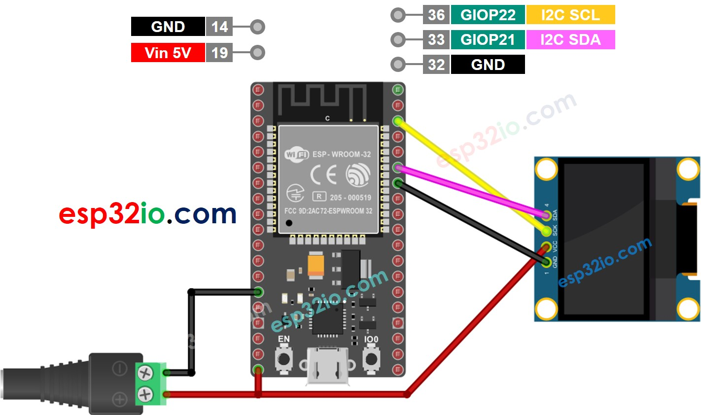
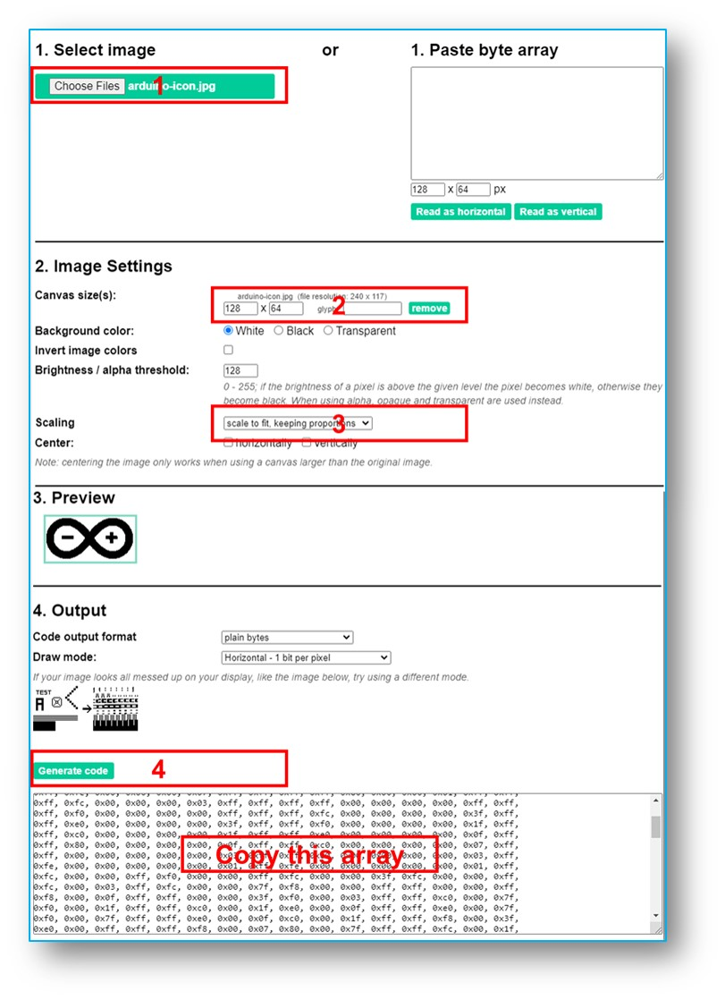

# ESP32 - OLED

This tutorial instructs you how to use ESP32 to display data on OLED. In detail, we will learn how to print characters and number, draw line and shape, and print image on OLED display.

## Hardware Used In This Tutorial

  * 1	×	ESP-WROOM-32 Dev Module	
  * 1	×	Micro USB Cable	
  * 1	×	SSD1306 I2C OLED Display 128x64	
  * 4	×	Jumper Wires

---

## Introduction to OLED Display

There are several different kinds of OLED display that can work with ESP32. They are different from each other in communication interface ( I2C, SPI), colors (white, blue, dual color...), and sizes (128x64, 128×32...)



This tutorial uses an SSD1306 128x64 I2C OLED Display

## I2C OLED Display Pinout

I2C OLED Display includes 4 pins:

  * **GND pin**: should be connected to the ground of ESP32
  * **VCC pin**: should be connected to the 5 volts pin of ESP32.
  * **SCL pin**: is a I2C clock pin.
  * **SDA pin**: is a I2C data pin.



---

## Wiring Diagram

The wiring diagram with power supply from USB cable



The wiring diagram with power supply from 5v adapter



## How To Use OLED with ESP32

### Install SSD1306 OLED library

  * On Arduino IDE, Navigate to Tools Manage Libraries
  * Type SSD1306 on the search box, then look for the SSD1306 library by Adafruit
  * Install the library by clicking on Install button.
  * A windows appears to ask you to install dependencies for the library
  * Install all dependencies for the library by clicking on Install All button.

---

## ESP32 Code - Display Text on OLED

The below ESP32 code display a text on OLED


```c++
#include <Wire.h>
#include <Adafruit_GFX.h>
#include <Adafruit_SSD1306.h>

#define SCREEN_WIDTH 128 // OLED width,  in pixels
#define SCREEN_HEIGHT 64 // OLED height, in pixels

// create an OLED display object connected to I2C
Adafruit_SSD1306 oled(SCREEN_WIDTH, SCREEN_HEIGHT, &Wire, -1);

void setup() {
  Serial.begin(9600);

  // initialize OLED display with I2C address 0x3C
  if (!oled.begin(SSD1306_SWITCHCAPVCC, 0x3C)) {
    Serial.println(F("failed to start SSD1306 OLED"));
    while (1);
  }

  delay(2000);         // wait two seconds for initializing
  oled.clearDisplay(); // clear display

  oled.setTextSize(1);         // set text size
  oled.setTextColor(WHITE);    // set text color
  oled.setCursor(0, 10);       // set position to display
  oled.println("esp32io.com"); // set text
  oled.display();              // display on OLED
}

void loop() {
}

```

We can do more by using the following functions:

  * `oled.clearDisplay()`: this function is used to clear the display
  * `oled.setTextSize(n)`: this function is used to set the font size, supports sizes from 1 to 8
  * `oled.setTextColor(WHITE)`: this function is used to set the text color
  * `oled.setCursor(x,y)`: this function is used to set the coordinates to start displaying text
  * `oled.drawPixel(x,y, color)`: this function is used to plot a pixel in the x,y coordinates
  * `oled.setTextColor(BLACK, WHITE)`: this function is used to set the text color and background color, respectively
  * `oled.println("message")`: this function is used to print a string
  * `oled.println(number)`: this function is used to print a number
  * `oled.println(number, HEX)`: this function is used to print a number in hex format
  * `oled.display()`: this function is used to apply the changes
  * `oled.startscrollright(start, stop)`: this function is used to scroll text from the left to the right
  * `oled.startscrollleft(start, stop)`: this function is used to scroll text from the right to the left
  * `oled.startscrolldiagright(start, stop)`: this function is used to scroll text from left bottom corner to right upper corner
  * `oled.startscrolldiagleft(start, stop)`: this function is used to scroll text from right bottom corner to left upper corner
  * `oled.stopscroll()`: this function is used to stop scrolling

---

## ESP32 Code - Drawing Shapes on OLED

The below code show how to draw several shapes on OLED

```c++
#include <Wire.h>
#include <Adafruit_GFX.h>
#include <Adafruit_SSD1306.h>

#define SCREEN_WIDTH 128 // OLED width,  in pixels
#define SCREEN_HEIGHT 64 // OLED height, in pixels

// create an OLED display object connected to I2C
Adafruit_SSD1306 oled(SCREEN_WIDTH, SCREEN_HEIGHT, &Wire, -1);

void setup() {
  Serial.begin(9600);

  // initialize OLED display with I2C address 0x3C
  if (!oled.begin(SSD1306_SWITCHCAPVCC, 0x3C)) {
    Serial.println(F("failed to start SSD1306 OLED"));
    while (1);
  }

  delay(2000); // wait two seconds for initializing
  oled.setCursor(0, 0);
}

void loop() {
  // draw a circle
  oled.clearDisplay();
  oled.drawCircle(20, 35, 20, WHITE);
  oled.display();
  delay(1000);

  // fill a circle
  oled.clearDisplay();
  oled.fillCircle(20, 35, 20, WHITE);
  oled.display();
  delay(1000);

  // draw a triangle
  oled.clearDisplay();
  oled.drawTriangle(30, 15, 0, 60, 60, 60, WHITE);
  oled.display();
  delay(1000);

  // fill a triangle
  oled.clearDisplay();
  oled.fillTriangle(30, 15, 0, 60, 60, 60, WHITE);
  oled.display();
  delay(1000);

  // draw a rectangle
  oled.clearDisplay();
  oled.drawRect(0, 15, 60, 40, WHITE);
  oled.display();
  delay(1000);

  // fill a rectangle
  oled.clearDisplay();
  oled.fillRect(0, 15, 60, 40, WHITE);
  oled.display();
  delay(1000);

  // draw a round rectangle
  oled.clearDisplay();
  oled.drawRoundRect(0, 15, 60, 40, 8, WHITE);
  oled.display();
  delay(1000);

  // fill a round rectangle
  oled.clearDisplay();
  oled.fillRoundRect(0, 15, 60, 40, 8, WHITE);
  oled.display();
  delay(1000);
}

```

## ESP32 Code – Display Image on OLED

To display an image on OLED, it needs to convert the image to the bitmap array. There is a [online tool](https://javl.github.io/image2cpp/) to convert the image to bitmap array. The below image show how to do it. I converted the ESP32 icon to bitmap array.



After converting, copy the array code and update it in the arduino_icon array in the following code:

```c++
#include <Wire.h>
#include <Adafruit_GFX.h>
#include <Adafruit_SSD1306.h>

#define SCREEN_WIDTH 128 // OLED width,  in pixels
#define SCREEN_HEIGHT 64 // OLED height, in pixels

// create an OLED display object connected to I2C
Adafruit_SSD1306 oled(SCREEN_WIDTH, SCREEN_HEIGHT, &Wire, -1);

// bitmap of arduino-icon image
const unsigned char arduino_icon [] PROGMEM = {
  // 'arduino-icon', 128x64px
  0xff, 0xff, 0xff, 0xff, 0xff, 0xff, 0xff, 0xff, 0xff, 0xff, 0xff, 0xff, 0xff, 0xff, 0xff, 0xff,
  0xff, 0xff, 0xff, 0xff, 0xff, 0xff, 0xff, 0xff, 0xff, 0xff, 0xff, 0xff, 0xff, 0xff, 0xff, 0xff,
  0xff, 0xff, 0xfe, 0x00, 0x07, 0xff, 0xff, 0xff, 0xff, 0xff, 0xff, 0x80, 0x01, 0xff, 0xff, 0xff,
  0xff, 0xff, 0xe0, 0x00, 0x00, 0xff, 0xff, 0xff, 0xff, 0xff, 0xfc, 0x00, 0x00, 0x3f, 0xff, 0xff,
  0xff, 0xff, 0x80, 0x00, 0x00, 0x1f, 0xff, 0xff, 0xff, 0xff, 0xe0, 0x00, 0x00, 0x07, 0xff, 0xff,
  0xff, 0xfe, 0x00, 0x00, 0x00, 0x07, 0xff, 0xff, 0xff, 0xff, 0x80, 0x00, 0x00, 0x01, 0xff, 0xff,
  0xff, 0xfc, 0x00, 0x00, 0x00, 0x03, 0xff, 0xff, 0xff, 0xff, 0x00, 0x00, 0x00, 0x00, 0xff, 0xff,
  0xff, 0xf0, 0x00, 0x00, 0x00, 0x00, 0xff, 0xff, 0xff, 0xfc, 0x00, 0x00, 0x00, 0x00, 0x3f, 0xff,
  0xff, 0xe0, 0x00, 0x00, 0x00, 0x00, 0x3f, 0xff, 0xff, 0xf0, 0x00, 0x00, 0x00, 0x00, 0x1f, 0xff,
  0xff, 0xc0, 0x00, 0x00, 0x00, 0x00, 0x1f, 0xff, 0xff, 0xe0, 0x00, 0x00, 0x00, 0x00, 0x0f, 0xff,
  0xff, 0x80, 0x00, 0x00, 0x00, 0x00, 0x0f, 0xff, 0xff, 0xc0, 0x00, 0x00, 0x00, 0x00, 0x07, 0xff,
  0xff, 0x00, 0x00, 0x00, 0x00, 0x00, 0x03, 0xff, 0xff, 0x80, 0x00, 0x00, 0x00, 0x00, 0x03, 0xff,
  0xfe, 0x00, 0x00, 0x00, 0x00, 0x00, 0x01, 0xff, 0xfe, 0x00, 0x00, 0x00, 0x00, 0x00, 0x01, 0xff,
  0xfc, 0x00, 0x00, 0xff, 0xf0, 0x00, 0x00, 0xff, 0xfc, 0x00, 0x00, 0x3f, 0xfc, 0x00, 0x00, 0xff,
  0xfc, 0x00, 0x03, 0xff, 0xfc, 0x00, 0x00, 0x7f, 0xf8, 0x00, 0x00, 0xff, 0xff, 0x00, 0x00, 0xff,
  0xf8, 0x00, 0x0f, 0xff, 0xff, 0x00, 0x00, 0x3f, 0xf0, 0x00, 0x03, 0xff, 0xff, 0xc0, 0x00, 0x7f,
  0xf0, 0x00, 0x1f, 0xff, 0xff, 0xc0, 0x00, 0x1f, 0xe0, 0x00, 0x0f, 0xff, 0xff, 0xe0, 0x00, 0x7f,
  0xf0, 0x00, 0x7f, 0xff, 0xff, 0xe0, 0x00, 0x0f, 0xc0, 0x00, 0x1f, 0xff, 0xff, 0xf8, 0x00, 0x3f,
  0xe0, 0x00, 0xff, 0xff, 0xff, 0xf8, 0x00, 0x07, 0x80, 0x00, 0x7f, 0xff, 0xff, 0xfc, 0x00, 0x1f,
  0xe0, 0x00, 0xff, 0xff, 0xff, 0xfc, 0x00, 0x03, 0x80, 0x00, 0xff, 0xff, 0xff, 0xfc, 0x00, 0x1f,
  0xc0, 0x01, 0xff, 0xff, 0xff, 0xfe, 0x00, 0x03, 0x00, 0x01, 0xff, 0xff, 0xff, 0xfe, 0x00, 0x1f,
  0xc0, 0x03, 0xff, 0xff, 0xff, 0xff, 0x00, 0x00, 0x00, 0x03, 0xff, 0xff, 0xff, 0xff, 0x00, 0x0f,
  0xc0, 0x03, 0xff, 0xff, 0xff, 0xff, 0x80, 0x00, 0x00, 0x07, 0xff, 0xf0, 0x7f, 0xff, 0x00, 0x0f,
  0xc0, 0x07, 0xff, 0xff, 0xff, 0xff, 0xc0, 0x00, 0x00, 0x0f, 0xff, 0xf0, 0x7f, 0xff, 0x80, 0x0f,
  0x80, 0x07, 0xff, 0xff, 0xff, 0xff, 0xe0, 0x00, 0x00, 0x1f, 0xff, 0xf0, 0x7f, 0xff, 0x80, 0x07,
  0x80, 0x0f, 0xff, 0xff, 0xff, 0xff, 0xf0, 0x00, 0x00, 0x3f, 0xff, 0xf0, 0x7f, 0xff, 0xc0, 0x07,
  0x80, 0x0f, 0xff, 0xff, 0xff, 0xff, 0xf8, 0x00, 0x00, 0x7f, 0xff, 0xf0, 0x7f, 0xff, 0xc0, 0x07,
  0x80, 0x0f, 0xfe, 0x00, 0x00, 0xff, 0xfc, 0x00, 0x00, 0xff, 0xfc, 0x00, 0x03, 0xff, 0xc0, 0x07,
  0x80, 0x0f, 0xfe, 0x00, 0x00, 0xff, 0xfe, 0x00, 0x01, 0xff, 0xfc, 0x00, 0x01, 0xff, 0xc0, 0x07,
  0x80, 0x0f, 0xfe, 0x00, 0x00, 0xff, 0xff, 0x00, 0x03, 0xff, 0xfc, 0x00, 0x01, 0xff, 0xc0, 0x07,
  0x80, 0x0f, 0xfe, 0x00, 0x00, 0xff, 0xff, 0x00, 0x03, 0xff, 0xfc, 0x00, 0x01, 0xff, 0xc0, 0x07,
  0x80, 0x0f, 0xfe, 0x00, 0x00, 0xff, 0xff, 0x00, 0x03, 0xff, 0xfc, 0x00, 0x01, 0xff, 0xc0, 0x07,
  0x80, 0x0f, 0xff, 0xff, 0xff, 0xff, 0xfe, 0x00, 0x01, 0xff, 0xff, 0xe0, 0x7f, 0xff, 0xc0, 0x07,
  0x80, 0x0f, 0xff, 0xff, 0xff, 0xff, 0xfc, 0x00, 0x00, 0xff, 0xff, 0xf0, 0x7f, 0xff, 0xc0, 0x07,
  0x80, 0x0f, 0xff, 0xff, 0xff, 0xff, 0xfc, 0x00, 0x00, 0xff, 0xff, 0xf0, 0x7f, 0xff, 0xc0, 0x07,
  0x80, 0x0f, 0xff, 0xff, 0xff, 0xff, 0xf8, 0x00, 0x00, 0x7f, 0xff, 0xf0, 0x7f, 0xff, 0xc0, 0x07,
  0x80, 0x0f, 0xff, 0xff, 0xff, 0xff, 0xf0, 0x00, 0x00, 0x3f, 0xff, 0xf0, 0x7f, 0xff, 0x80, 0x07,
  0x80, 0x07, 0xff, 0xff, 0xff, 0xff, 0xe0, 0x00, 0x00, 0x1f, 0xff, 0xf0, 0x7f, 0xff, 0x80, 0x07,
  0xc0, 0x07, 0xff, 0xff, 0xff, 0xff, 0xc0, 0x00, 0x00, 0x0f, 0xff, 0xff, 0xff, 0xff, 0x80, 0x0f,
  0xc0, 0x03, 0xff, 0xff, 0xff, 0xff, 0x80, 0x00, 0x00, 0x07, 0xff, 0xff, 0xff, 0xff, 0x00, 0x0f,
  0xc0, 0x03, 0xff, 0xff, 0xff, 0xff, 0x00, 0x00, 0x00, 0x03, 0xff, 0xff, 0xff, 0xff, 0x00, 0x0f,
  0xe0, 0x01, 0xff, 0xff, 0xff, 0xfe, 0x00, 0x03, 0x00, 0x01, 0xff, 0xff, 0xff, 0xfe, 0x00, 0x1f,
  0xe0, 0x00, 0xff, 0xff, 0xff, 0xfc, 0x00, 0x07, 0x80, 0x00, 0xff, 0xff, 0xff, 0xfc, 0x00, 0x1f,
  0xe0, 0x00, 0x7f, 0xff, 0xff, 0xf0, 0x00, 0x0f, 0xc0, 0x00, 0x3f, 0xff, 0xff, 0xf8, 0x00, 0x3f,
  0xf0, 0x00, 0x3f, 0xff, 0xff, 0xe0, 0x00, 0x1f, 0xe0, 0x00, 0x1f, 0xff, 0xff, 0xf0, 0x00, 0x3f,
  0xf8, 0x00, 0x1f, 0xff, 0xff, 0x80, 0x00, 0x3f, 0xe0, 0x00, 0x07, 0xff, 0xff, 0xe0, 0x00, 0x7f,
  0xf8, 0x00, 0x0f, 0xff, 0xff, 0x00, 0x00, 0x7f, 0xf8, 0x00, 0x03, 0xff, 0xff, 0xc0, 0x00, 0x7f,
  0xfc, 0x00, 0x03, 0xff, 0xf8, 0x00, 0x00, 0xff, 0xfc, 0x00, 0x00, 0xff, 0xff, 0x00, 0x00, 0xff,
  0xfe, 0x00, 0x00, 0x7f, 0xe0, 0x00, 0x01, 0xff, 0xfe, 0x00, 0x00, 0x1f, 0xf8, 0x00, 0x01, 0xff,
  0xfe, 0x00, 0x00, 0x00, 0x00, 0x00, 0x03, 0xff, 0xff, 0x00, 0x00, 0x00, 0x00, 0x00, 0x03, 0xff,
  0xff, 0x00, 0x00, 0x00, 0x00, 0x00, 0x07, 0xff, 0xff, 0x80, 0x00, 0x00, 0x00, 0x00, 0x03, 0xff,
  0xff, 0x80, 0x00, 0x00, 0x00, 0x00, 0x0f, 0xff, 0xff, 0xc0, 0x00, 0x00, 0x00, 0x00, 0x07, 0xff,
  0xff, 0xc0, 0x00, 0x00, 0x00, 0x00, 0x1f, 0xff, 0xff, 0xe0, 0x00, 0x00, 0x00, 0x00, 0x0f, 0xff,
  0xff, 0xe0, 0x00, 0x00, 0x00, 0x00, 0x7f, 0xff, 0xff, 0xf8, 0x00, 0x00, 0x00, 0x00, 0x3f, 0xff,
  0xff, 0xf8, 0x00, 0x00, 0x00, 0x01, 0xff, 0xff, 0xff, 0xfe, 0x00, 0x00, 0x00, 0x00, 0x7f, 0xff,
  0xff, 0xfc, 0x00, 0x00, 0x00, 0x03, 0xff, 0xff, 0xff, 0xff, 0x00, 0x00, 0x00, 0x00, 0xff, 0xff,
  0xff, 0xff, 0x00, 0x00, 0x00, 0x0f, 0xff, 0xff, 0xff, 0xff, 0xc0, 0x00, 0x00, 0x03, 0xff, 0xff,
  0xff, 0xff, 0xc0, 0x00, 0x00, 0x3f, 0xff, 0xff, 0xff, 0xff, 0xf0, 0x00, 0x00, 0x0f, 0xff, 0xff,
  0xff, 0xff, 0xf0, 0x00, 0x01, 0xff, 0xff, 0xff, 0xff, 0xff, 0xfe, 0x00, 0x00, 0x3f, 0xff, 0xff,
  0xff, 0xff, 0xff, 0x00, 0x0f, 0xff, 0xff, 0xff, 0xff, 0xff, 0xff, 0xc0, 0x03, 0xff, 0xff, 0xff,
  0xff, 0xff, 0xff, 0xff, 0xff, 0xff, 0xff, 0xff, 0xff, 0xff, 0xff, 0xff, 0xff, 0xff, 0xff, 0xff,
  0xff, 0xff, 0xff, 0xff, 0xff, 0xff, 0xff, 0xff, 0xff, 0xff, 0xff, 0xff, 0xff, 0xff, 0xff, 0xff,
  0xff, 0xff, 0xff, 0xff, 0xff, 0xff, 0xff, 0xff, 0xff, 0xff, 0xff, 0xff, 0xff, 0xff, 0xff, 0xff,
  0xff, 0xff, 0xff, 0xff, 0xff, 0xff, 0xff, 0xff, 0xff, 0xff, 0xff, 0xff, 0xff, 0xff, 0xff, 0xff
};

void setup() {
  Serial.begin(9600);

  // initialize OLED display with I2C address 0x3C
  if (!oled.begin(SSD1306_SWITCHCAPVCC, 0x3C)) {
    Serial.println(F("failed to start SSD1306 OLED"));
    while (1);
  }

  delay(2000); // wait two seconds for initializing
  oled.setCursor(0, 0);
}

void loop() {
  oled.clearDisplay();

  // display bitmap
  oled.drawBitmap(0, 0, arduino_icon, 128, 64, WHITE);
  oled.display();
  delay(1000);

  // invert display
  oled.invertDisplay(1);
  delay(1000);
}

```

## OLED Troubleshooting

See [OLED Troubleshooting](https://arduinogetstarted.com/tutorials/arduino-oled#content_oled_troubleshooting)

