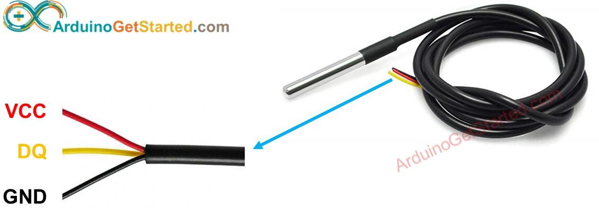
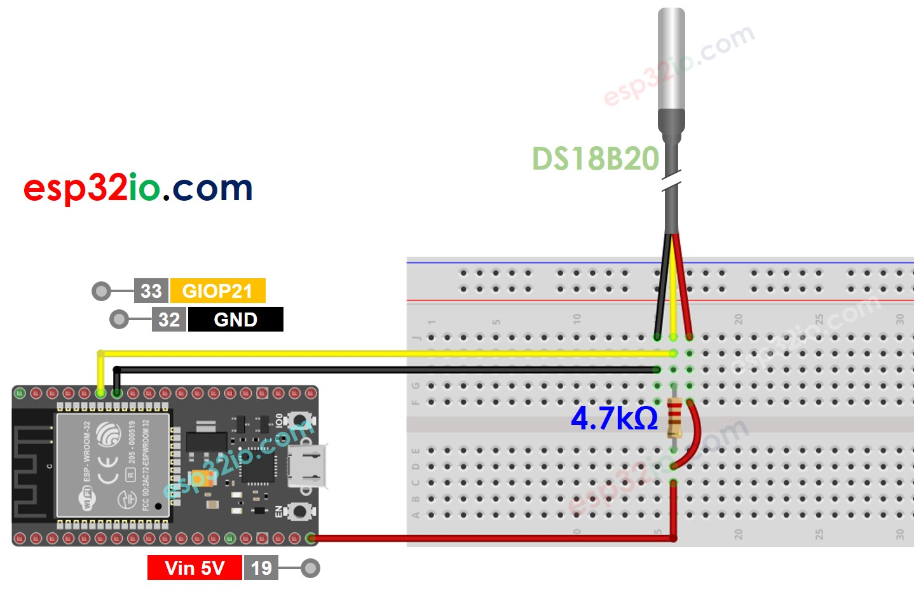
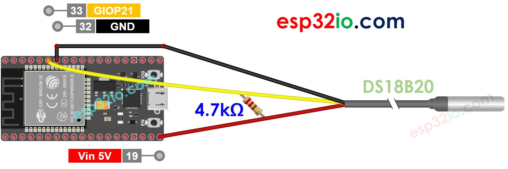
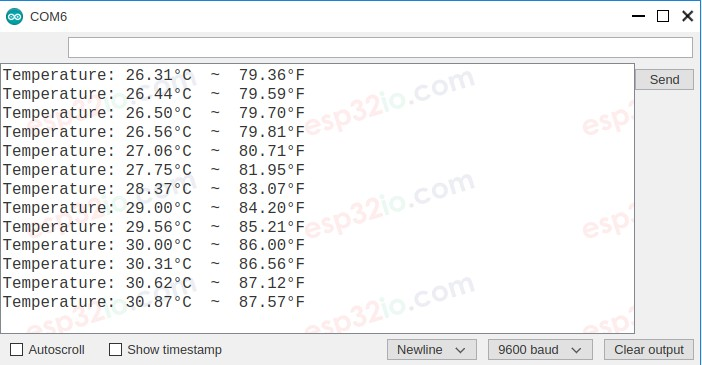

# ESP32 - Temperature Sensor

This tutorial instructs you how to use ESP32 to read the temperature from DS18B20 temperature sensor and print it to Serial Monitor.

## Hardware Used In This Tutorial

  * 1	×	ESP-WROOM-32 Dev Module	
  * 1	×	Micro USB Cable	
  * 1	×	Temperature Sensor DS18B20	
  * 1	×	4.7 kΩ resistor	
  * 1	×	Breadboard	
  * n	×	Jumper Wires

---

## Introduction to One Wire Temperature Sensor - DS18B20


### DS18B20 Temperature Sensor Pinout

DS18B20 temperature sensor has three pins:

  * GND pin: connect this pin to GND (0V)
  * VCC pin: connect this pin to VCC (5V or 3.3V)
  * DQ pin: is 1-Wire Data Bus. It should be connected to a digital pin on ESP32.

The DS18B20 sensor has two forms:

  * TO-92 package (looks similar to a transistor)
  * Waterproof probe. We use this form in this tutorial.



## Wiring Diagram between DS18B20 Temperature Sensor and ESP32

  * With breadboard



  * Without breadboard



## ESP32 Code

```c++
#include <OneWire.h>
#include <DallasTemperature.h>

#define SENSOR_PIN  21 // ESP32 pin GIOP21 connected to DS18B20 sensor's DQ pin

OneWire oneWire(SENSOR_PIN);
DallasTemperature DS18B20(&oneWire);

float tempC; // temperature in Celsius
float tempF; // temperature in Fahrenheit

void setup() {
  Serial.begin(9600); // initialize serial
  DS18B20.begin();    // initialize the DS18B20 sensor
}

void loop() {
  DS18B20.requestTemperatures();       // send the command to get temperatures
  tempC = DS18B20.getTempCByIndex(0);  // read temperature in °C
  tempF = tempC * 9 / 5 + 32; // convert °C to °F

  Serial.print("Temperature: ");
  Serial.print(tempC);    // print the temperature in °C
  Serial.print("°C");
  Serial.print("  ~  ");  // separator between °C and °F
  Serial.print(tempF);    // print the temperature in °F
  Serial.println("°F");

  delay(500);
}

```

### Quick Instructions

  * If this is the first time you use ESP32, see how to setup environment for ESP32 on Arduino IDE.
  * Do the wiring as above image.
  * Connect the ESP32 board to your PC via a micro USB cable
  * Open Arduino IDE on your PC.
  * Select the right ESP32 board (e.g. ESP32 Dev Module) and COM port.
  * On Arduino IDE, Navigate to Tools Manage Libraries
  * Type “OneWire” on the search box, then look for the OneWire library by Paul Stoffregen
  * Click Install button to install OneWire library.
  * Type “Dallas” on the search box, then look for the DallasTemperature library by Miles Burton.
  * Click Install button to install DallasTemperature library.
  * Copy the above code and paste it to Arduino IDE.
  * Compile and upload code to ESP32 board by clicking Upload button on Arduino IDE
  * Make the sensor hotter or colder by gripping the DS18B20 temerature sensor on your hand, or embedding it on hot and cold water.
  * See the result on Serial Monitor. It looks like the below:.



