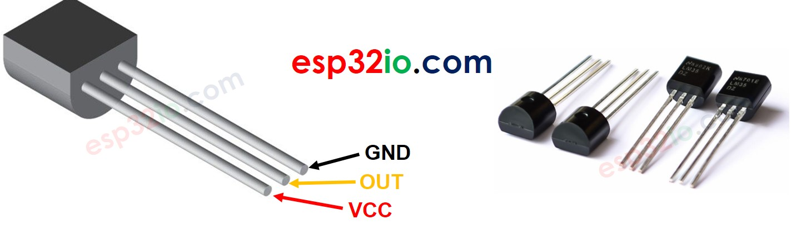
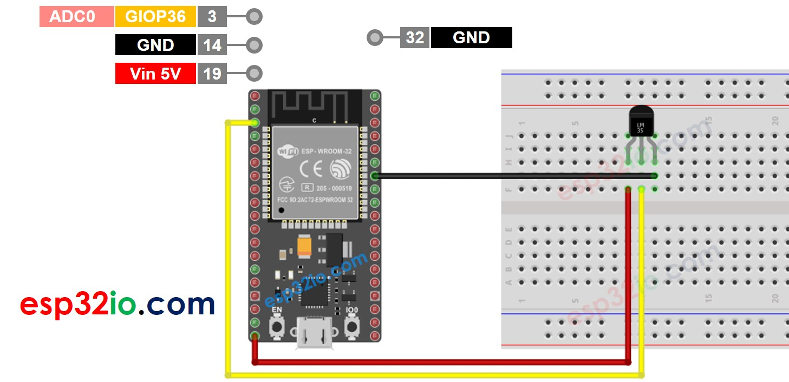
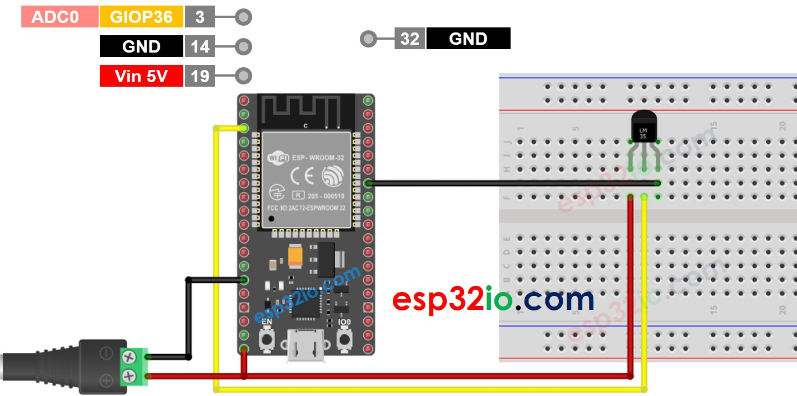
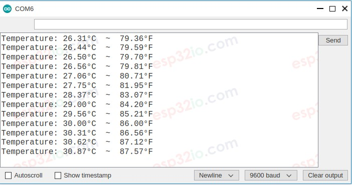

# ESP32 - LM35 Temperature Sensor

This tutorial instructs you how to use ESP32 to read temperature value from LM35 temperature sensor, and print it to Serial Monitor.

## Hardware Used In This Tutorial

  * 1	×	ESP-WROOM-32 Dev Module	
  * 1	×	Micro USB Cable	
  * 1	×	LM35 Temperature Sensor

---

## Introduction to LM35 Temperature Sensor

### LM35 Temperature Sensor Pinout

LM35 temperature sensor has three pins:

  * **VCC pin**: connect this pin to VCC (5V)
  * **GND pin**: connect this pin to GND (0V)
  * **OUT pin**: This pin outputs voltage in proportion to the temperature value.



## How LM35 Temperature Sensor Works

The LM35 sensor outputs the voltage in linearly proportion to the Celsius temperature. The output scale factor of the LM35 is 10 mV/°C. By measuring the voltage on the LM32's OUT pin, we can calculate the temperature value.

---

## Wiring Diagram between LM35 Temperature Sensor and ESP32

The wiring diagram with power supply from USB cable



The wiring diagram with power supply from 5v adapter



## ESP32 Code

```c++
#define ADC_VREF_mV    3300.0 // in millivolt
#define ADC_RESOLUTION 4096.0
#define PIN_LM35       36 // ESP32 pin GIOP36 (ADC0) connected to LM35

void setup() {
  Serial.begin(9600);
}

void loop() {
  // read the ADC value from the temperature sensor
  int adcVal = analogRead(PIN_LM35);
  // convert the ADC value to voltage in millivolt
  float milliVolt = adcVal * (ADC_VREF_mV / ADC_RESOLUTION);
  // convert the voltage to the temperature in °C
  float tempC = milliVolt / 10;
  // convert the °C to °F
  float tempF = tempC * 9 / 5 + 32;

  // print the temperature in the Serial Monitor:
  Serial.print("Temperature: ");
  Serial.print(tempC);   // print the temperature in °C
  Serial.print("°C");
  Serial.print("  ~  "); // separator between °C and °F
  Serial.print(tempF);   // print the temperature in °F
  Serial.println("°F");

  delay(500);
}

```

### Quick Instructions

  * If this is the first time you use ESP32, see how to setup environment for ESP32 on Arduino IDE.
  * Copy the above code and paste it to Arduino IDE.
  * Compile and upload code to ESP32 board by clicking Upload button on Arduino IDE
  * Make the sensor colder or hotter. For example, putting the sensor near an ice cup
  * See the result on Serial Monitor. It looks like the below:



