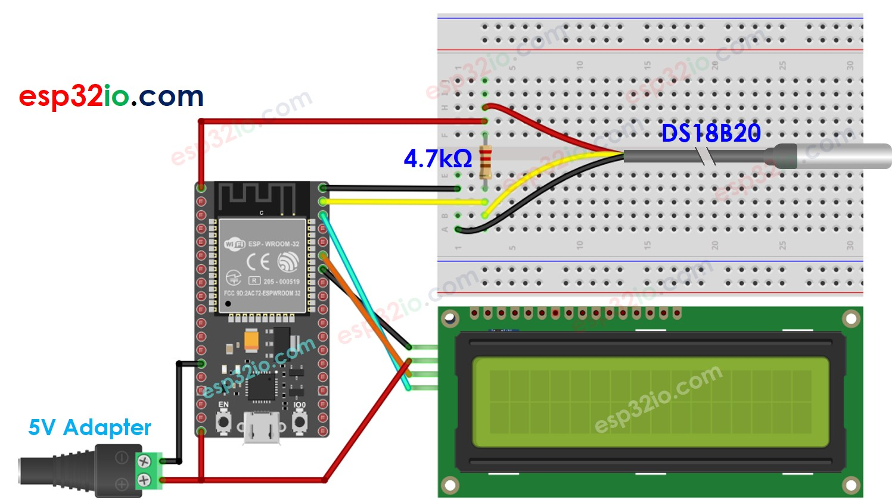

# ESP32 - Temperature Sensor - LCD

This tutorial instructs you how to use ESP32 to read the temperature from DS18B20 temperature sensor and display it on LCD I2C 16x2.


## Hardware Used In This Tutorial

  * 1	×	ESP-WROOM-32 Dev Module	
  * 1	×	Micro USB Cable	
  * 1	×	LCD I2C	
  * 1	×	Temperature Sensor DS18B20	
  * 1	×	4.7 kΩ resistor	
  * 1	×	Breadboard	
  * n	×	Jumper Wires

## Wiring Diagram



## ESP32 Code

```c++
#include <OneWire.h>
#include <DallasTemperature.h>
#include <LiquidCrystal_I2C.h>

#define SENSOR_PIN 23 // ESP32 pin GIOP23 connected to DS18B20 sensor's DQ pin

OneWire oneWire(SENSOR_PIN);
DallasTemperature DS18B20(&oneWire);
LiquidCrystal_I2C lcd(0x3F, 16, 2);  // I2C address 0x27, 16 column and 2 rows

float tempC; // temperature in Celsius
float tempF; // temperature in Fahrenheit

void setup() {
  DS18B20.begin();    // initialize the sensor
  lcd.init();         // initialize the lcd
  lcd.backlight();    // open the backlight
}

void loop() {
  DS18B20.requestTemperatures();       // send the command to get temperatures
  tempC = DS18B20.getTempCByIndex(0);  // read temperature in Celsius
  tempF = tempC * 9 / 5 + 32; // convert Celsius to Fahrenheit

  lcd.clear();
  lcd.setCursor(0, 0);  // display position
  lcd.print(tempC);     // display the temperature in Celsius
  lcd.print((char)223); // display ° character
  lcd.print("C");
  lcd.setCursor(0, 1);  // display position
  lcd.print(tempF);     // display the temperature in Fahrenheit
  lcd.print((char)223); // display ° character
  lcd.print("F");

  delay(500);
}

```

### Quick Instructions

  * If this is the first time you use ESP32, see how to setup environment for ESP32 on Arduino IDE.
  * Do the wiring as above image.
  * Connect the ESP32 board to your PC via a micro USB cable
  * Open Arduino IDE on your PC.
  * Select the right ESP32 board (e.g. ESP32 Dev Module) and COM port.
  * On Arduino IDE, Navigate to Tools Manage Libraries
  * Type “OneWire” on the search box, then look for the OneWire library by Paul Stoffregen
  * Click Install button to install OneWire library.
  * Type “Dallas” on the search box, then look for the DallasTemperature library by Miles Burton.
  * Click Install button to install DallasTemperature library.
  * Type “LiquidCrystal I2C” on the search box, then look for the LiquidCrystal_I2C library by Frank de Brabander
  * Click Install button to install LiquidCrystal_I2C library.
  * Copy the above code and paste it to Arduino IDE.
  * Compile and upload code to ESP32 board by clicking Upload button on Arduino IDE
  * ake the sensor hotter or colder by gripping the DS18B20 temerature sensor on your hand, or embedding it on hot and cold water.
  * See the result in LCD

If the LCD displays nothing, see [Troubleshooting on LCD I2C](https://arduinogetstarted.com/tutorials/arduino-lcd-i2c#content_troubleshooting_on_lcd_i2c)