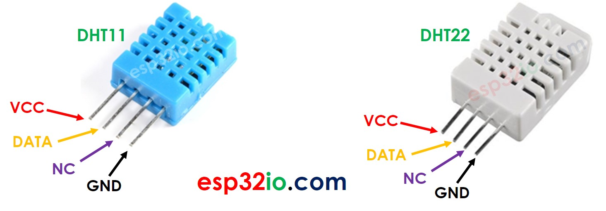
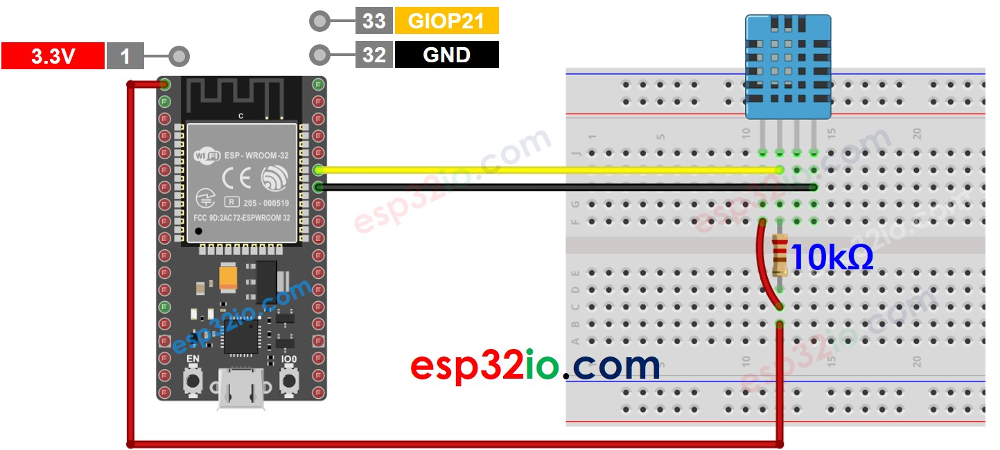
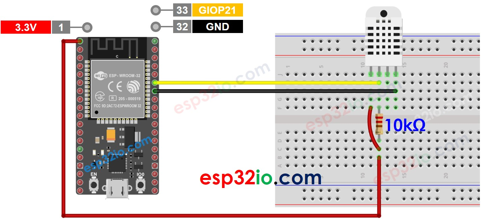
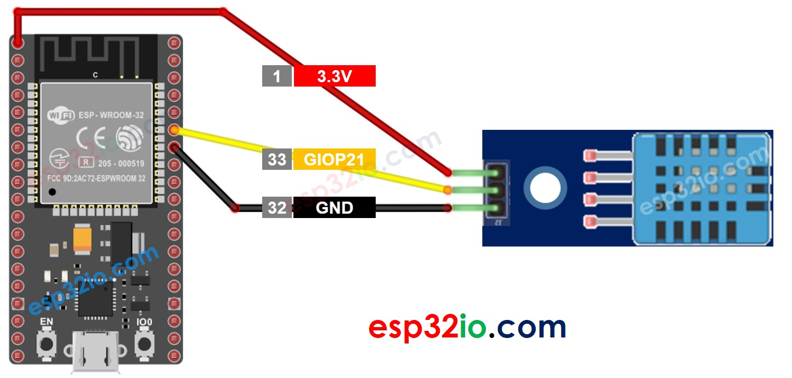
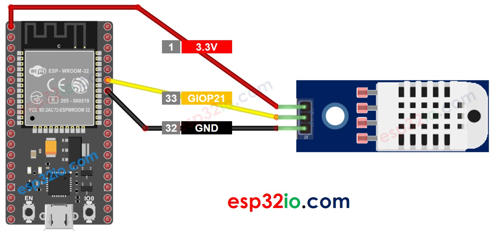
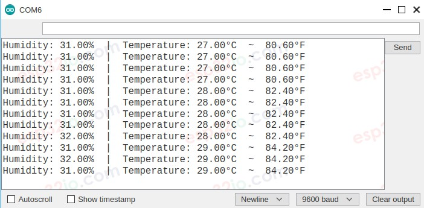

# ESP32 - Temperature Humidity Sensor

This tutorial instructs you how to use ESP32 to read temperature and humidity value from DHT11 or DHT22 sensors, and print it to Serial Monitor.


## Hardware Used In This Tutorial

  * 1	×	ESP-WROOM-32 Dev Module	
  * 1	×	Micro USB Cable	
  * 1	×	Temperature and Humidity Sensor DHT11	
  * 1	×	(Optional) Temperature and Humidity Sensor DHT22	
  * 1	×	10 kΩ resistor	
  * 1	×	Breadboard	
  * n	×	Jumper Wires

---

## Introduction to DHT11 and DHT22 Temperature and Humidity Sensor

In short, the DHT22 sensor is a more accurate, larger range but more expensive than DHT11. Let's see the common and differences between them

### The commons

  * The same pinout
  * The same wiring to ESP32
  * The similar ESP32 code

### The differences

The below table show the detaied differences between DHT11 and DHT22:

|                           | DHT22                           | DHT11                      |
|---------------------------|---------------------------------|----------------------------|
| The price                 | low cost                        | ultra low cost             |
| The humidity range        |  0% to 100%                     |  20% to 80%                |
| The humidity accuracy     |  ± 2% to 5%                     |  5%                        |
| The temperature range     |  -40°C to 80°C                  |  0°C to 50°C               |
| The temperature accuracy  |  ± 0.5°C                        |  ± 2°C                     |
| The reading rate          |  0.5Hz (one time per 2 seconds) |  1Hz (one time per second) |
| Dimension                 |  15.1mm x 25mm x 7.7mm          |  15.5mm x 12mm x 5.5mm     |

### DHT11 and DHT22 Pinout

DHT11 and DHT22 sensor includes 4 pins:

  * **GND pin**: connect this pin to GND (0V)
  * **VCC pin**: connect this pin to VCC (3.3V)
  * **DATA pin**: the pin is used to communicate between the sensor and ESP32
  * **NC pin**: Not connected



The pins order on the module's can be different between manufacturers. Please check the pin labels printed on the module carefully.

## Wiring Diagram between DHT11/DHT22 and ESP32

Wiring to ESP32 is the same for both sensors. In orginal form, A resistor from 5K to 10K Ohms is required to keep the data line high and in order to enable the communication between the sensor and the ESP32.

### ESP32 - DHT11 Sensor Wiring



### ESP32 - DHT22 Sensor Wiring



## ESP32 - DHT11 Module Wiring

Most of DHT22 sensor modules have a built-in resistor, so you don't need to add it. it saves us some wiring or soldering works.



## ESP32 - DHT22 Module Wiring

Most of DHT22 sensor modules have a built-in resistor, so you don't need to add it. it saves us some wiring or soldering works.



## ESP32 Code - DHT11

```c++
#include <DHT.h>
#define DHT_SENSOR_PIN  21 // ESP32 pin GIOP21 connected to DHT11 sensor
#define DHT_SENSOR_TYPE DHT11

DHT dht_sensor(DHT_SENSOR_PIN, DHT_SENSOR_TYPE);

void setup() {
  Serial.begin(9600);
  dht_sensor.begin(); // initialize the DHT sensor
}

void loop() {
  // read humidity
  float humi  = dht_sensor.readHumidity();
  // read temperature in Celsius
  float tempC = dht_sensor.readTemperature();
  // read temperature in Fahrenheit
  float tempF = dht_sensor.readTemperature(true);

  // check whether the reading is successful or not
  if ( isnan(tempC) || isnan(tempF) || isnan(humi)) {
    Serial.println("Failed to read from DHT sensor!");
  } else {
    Serial.print("Humidity: ");
    Serial.print(humi);
    Serial.print("%");

    Serial.print("  |  ");

    Serial.print("Temperature: ");
    Serial.print(tempC);
    Serial.print("°C  ~  ");
    Serial.print(tempF);
    Serial.println("°F");
  }

  // wait a 2 seconds between readings
  delay(2000);
}

```

## ESP32 Code - DHT22

```c++
#include <DHT.h>
#define DHT_SENSOR_PIN  21 // ESP32 pin GIOP21 connected to DHT22 sensor
#define DHT_SENSOR_TYPE DHT22

DHT dht_sensor(DHT_SENSOR_PIN, DHT_SENSOR_TYPE);

void setup() {
  Serial.begin(9600);
  dht_sensor.begin(); // initialize the DHT sensor
}

void loop() {
  // read humidity
  float humi  = dht_sensor.readHumidity();
  // read temperature in Celsius
  float tempC = dht_sensor.readTemperature();
  // read temperature in Fahrenheit
  float tempF = dht_sensor.readTemperature(true);

  // check whether the reading is successful or not
  if ( isnan(tempC) || isnan(tempF) || isnan(humi)) {
    Serial.println("Failed to read from DHT sensor!");
  } else {
    Serial.print("Humidity: ");
    Serial.print(humi);
    Serial.print("%");

    Serial.print("  |  ");

    Serial.print("Temperature: ");
    Serial.print(tempC);
    Serial.print("°C  ~  ");
    Serial.print(tempF);
    Serial.println("°F");
  }

  // wait a 2 seconds between readings
  delay(2000);
}

```

**Two above codes have only one line different.**

### Quick Instructions

  * If this is the first time you use ESP32, see how to setup environment for ESP32 on Arduino IDE.
  * Do the wiring as above image.
  * Connect the ESP32 board to your PC via a micro USB cable
  * Open Arduino IDE on your PC.
  * Select the right ESP32 board (e.g. ESP32 Dev Module) and COM port.
  * On Arduino IDE, Navigate to Tools Manage Libraries
  * Type “DHT” on the search box, then look for the DHT sensor library by Adafruit
  * Install the library by clicking on Install button.
  * A windows appears to ask you to install dependencies for the library
  * Install all dependencies for the library by clicking on Install All button.
  * Copy one of the above code and open with Arduino IDE
  * Compile and upload code to ESP32 board by clicking Upload button on Arduino IDE
  * Make the sensor colder or hotter. For example, putting the sensor near a hot cup of coffee
  * See the result on Serial Monitor. It looks like the below:.


