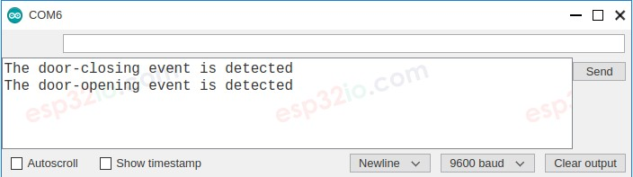

# ESP32 - Door Sensor

The door sensor (also known as entry sensor, contact sensor, or window sensor) is widely used in many kinds of application, especially for security. It is used to detect/monitor entrances (such as door, window ...). This tutorial instructs you how to use ESP32 with the door sensor.

## Hardware Used In This Tutorial

  * 1	×	ESP-WROOM-32 Dev Module	
  * 1	×	Micro USB Cable	
  * 1	×	Door Sensor

---

## Introduction to Door Sensor

The door sensor has two components:

  * One magnet
  * One reed switch, which has two wires


Just like the switch/button, we do NOT need to differentiate the two wires of the reed switch.

---

## How Door Sensor Works

The magnet and the reed switch are installed on the door/windows as follows:

  * The magnet is the movable part. It should be attached to the door/window
  * The reed switch is the fixed part. It should be attached to the door frame

The two components are in contact when the door is closed.

  * The reed switch circuit is closed when it is near to the magnet
  * The reed switch circuit is open when it is far from the magnet


  > **NOTE**
  > 
  > Just like a button, we MUST use the pull-up or pull-down resistor on the ESP32 pin, which connects to the reed switch.

If we connect reed switch as follows: one wire to GND, the other to ESP32's input pin with a pull-up resistor:

  * The ESP32's input pin is LOW when the magnet is near to the reed switch
  * The ESP32's input pin is HIGH when the magnet is far from the reed switch

So:

  * If the ESP32's input pin is LOW, the door is closed
  * If the ESP32's input pin is HIGH, the door is opened
  * If the ESP32's input pin changes from LOW to HIGH, the door is opening
  * If the ESP32's input pin changes from HIGH to LOW, the door is closing

## Wiring Diagram between Door Sensor and ESP32


---

## How To Program Door Sensor

Initializes the ESP32 pin to the digital input mode by using pinMode() function. For example, pin GIOP19

```c++
pinMode(19, INPUT_PULLUP);
```

Reads the state of the ESP32 pin by using digitalRead() function.

```c++
int doorState  = digitalRead(19);
```

## ESP32 Code - Check Door Open and Close State

```c++
#define DOOR_SENSOR_PIN  19  // ESP32 pin GIOP19 connected to door sensor's pin

int doorState;

void setup() {
  Serial.begin(9600);                     // initialize serial
  pinMode(DOOR_SENSOR_PIN, INPUT_PULLUP); // set ESP32 pin to input pull-up mode
}

void loop() {
  doorState = digitalRead(DOOR_SENSOR_PIN); // read state

  if (doorState == HIGH) {
    Serial.println("The door is open");
  } else {
    Serial.println("The door is closed");
  }
}

```

### Quick Instructions

  * If this is the first time you use ESP32, see how to setup environment for ESP32 on Arduino IDE.
  * Copy the above code and paste it to Arduino IDE.
  * Compile and upload code to ESP32 board by clicking Upload button on Arduino IDE
  * Move the magnet close to the reed switch and them move it far from the reed switch.
  * See the result on Serial Monitor. It looks like the below:


---

## ESP32 Code - Detect Door-opening and Door-closing Events

```c++
#define DOOR_SENSOR_PIN  19  // ESP32 pin GIOP19 connected to door sensor's pin

int currentDoorState; // current state of door sensor
int lastDoorState;    // previous state of door sensor

void setup() {
  Serial.begin(9600);                     // initialize serial
  pinMode(DOOR_SENSOR_PIN, INPUT_PULLUP); // set ESP32 pin to input pull-up mode

  currentDoorState = digitalRead(DOOR_SENSOR_PIN); // read state
}

void loop() {
  lastDoorState = currentDoorState;              // save the last state
  currentDoorState  = digitalRead(DOOR_SENSOR_PIN); // read new state

  if (lastDoorState == LOW && currentDoorState == HIGH) { // state change: LOW -> HIGH
    Serial.println("The door-opening event is detected");
    // TODO: turn on alarm, light or send notification ...
  }
  else
  if (lastDoorState == HIGH && currentDoorState == LOW) { // state change: HIGH -> LOW
    Serial.println("The door-closing event is detected");
    // TODO: turn off alarm, light or send notification ...
  }
}

```

### Quick Instructions

  * Copy the above code and paste it to Arduino IDE.
  * Compile and upload code to ESP32 board by clicking Upload button on Arduino IDE
  * Move the magnet close to the reed switch and them move it far from the reed switch.
  * See the result on Serial Monitor. It looks like the below:.



