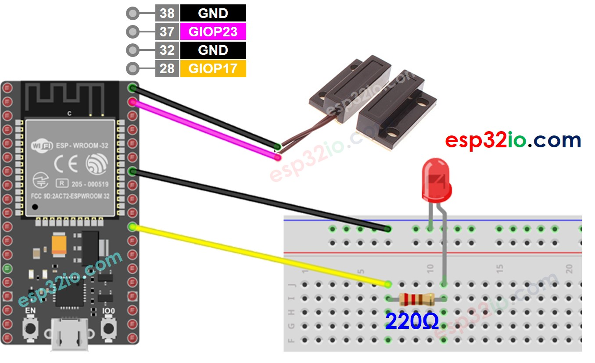

# ESP32 - Door Sensor - LED

This tutorial instructs you how to use ESP32 with door sensor and LED. In detail:

  * ESP32 automatically turns on LED if the door is opened.
  * ESP32 automatically turns off LED if the door is closed.

## Hardware Used In This Tutorial

  * 1	×	ESP-WROOM-32 Dev Module	
  * 1	×	Micro USB Cable	
  * 1	×	Door Sensor	
  * 1	×	LED	
  * 1	×	220 ohm resistor	
  * 1	×	Breadboard	
  * 4	×	Jumper Wires

---

## Wiring Diagram



## ESP32 Code

```c++
#define DOOR_SENSOR_PIN  23  // ESP32 pin GIOP23 connected to the OUTPUT pin of door sensor
#define LED_PIN          17  // ESP32 pin GIOP17 connected to LED's pin

int doorState;

void setup() {
  Serial.begin(9600);                     // initialize serial
  pinMode(DOOR_SENSOR_PIN, INPUT_PULLUP); // set ESP32 pin to input pull-up mode
  pinMode(LED_PIN, OUTPUT);               // set ESP32 pin to output mode
}

void loop() {
  doorState = digitalRead(DOOR_SENSOR_PIN); // read state

  if (doorState == HIGH) {
    Serial.println("The door is open, turns on LED");
    digitalWrite(LED_PIN, HIGH); // turn on LED
  } else {
    Serial.println("The door is closed, turns off LED");
    digitalWrite(LED_PIN, LOW);  // turn off LED
  }
}

```

### Quick Instructions

  * If this is the first time you use ESP32, see how to setup environment for ESP32 on Arduino IDE.
  * Do the wiring as above image.
  * Connect the ESP32 board to your PC via a micro USB cable
  * Open Arduino IDE on your PC.
  * Select the right ESP32 board (e.g. ESP32 Dev Module) and COM port.
  * Copy the above code and paste it to Arduino IDE.
  * Compile and upload code to ESP32 board by clicking Upload button on Arduino IDE
  * Move the magnet close to the reed switch and them move it far from the reed switch.
  * See the change of LED's state
