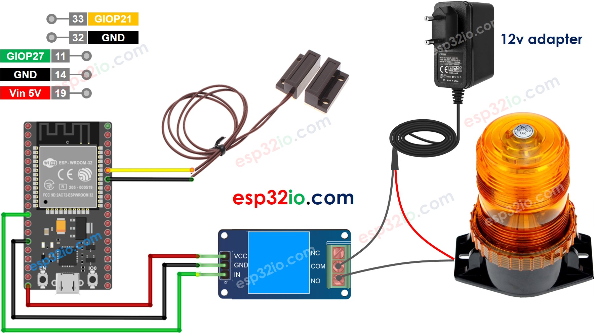

# ESP32 - Door Sensor - Relay

This tutorial instructs you how to use ESP32 with door sensor and relay. In detail, ESP32 automatically turn relay on if the door is open and turn relay off if the door is closed.

We can extend this tutorial to use the door sensor to control a led strip, siren, light bulb, or actuator... by connnecting them to the relay.

## Hardware Used In This Tutorial

 * 1	×	ESP-WROOM-32 Dev Module	
 * 1	×	Micro USB Cable	
 * 1	×	Door Sensor	
 * 1	×	Relay	
 * 1	×	Warning Light Bright Waterproof	
 * 1	×	12V Power Adapter	
 * n	×	Jumper Wires

---

## Wiring Diagram



## ESP32 Code

```c++
#define DOOR_SENSOR_PIN  21 // ESP32 pin GIOP21 connected to door sensor's pin
#define RELAY_PIN        27 // ESP32 pin GIOP27 connects to the IN pin of relay

int doorState;

void setup() {
  Serial.begin(9600);                     // initialize serial
  pinMode(DOOR_SENSOR_PIN, INPUT_PULLUP); // set ESP32 pin to input pull-up mode
  pinMode(RELAY_PIN, OUTPUT);             // set ESP32 pin to output mode
}

void loop() {
  doorState = digitalRead(DOOR_SENSOR_PIN); // read state

  if (doorState == HIGH) {
    Serial.println("The door is open!, turns the relay ON");
    digitalWrite(RELAY_PIN, HIGH); // turn on relay
  } else {
    Serial.println("The door is closed, turns the relay OFF");
    digitalWrite(RELAY_PIN, LOW);  // turn off relay
  }
}

```

### Quick Instructions

  * If this is the first time you use ESP32, see how to setup environment for ESP32 on Arduino IDE.
  * Do the wiring as above image.
  * Connect the ESP32 board to your PC via a micro USB cable
  * Open Arduino IDE on your PC.
  * Select the right ESP32 board (e.g. ESP32 Dev Module) and COM port.
  * Copy the above code and paste it to Arduino IDE.
  * Compile and upload code to ESP32 board by clicking Upload button on Arduino IDE
  * Move the magnet close to the reed switch and them move it far from the reed switch.
  * See the change of relay's state