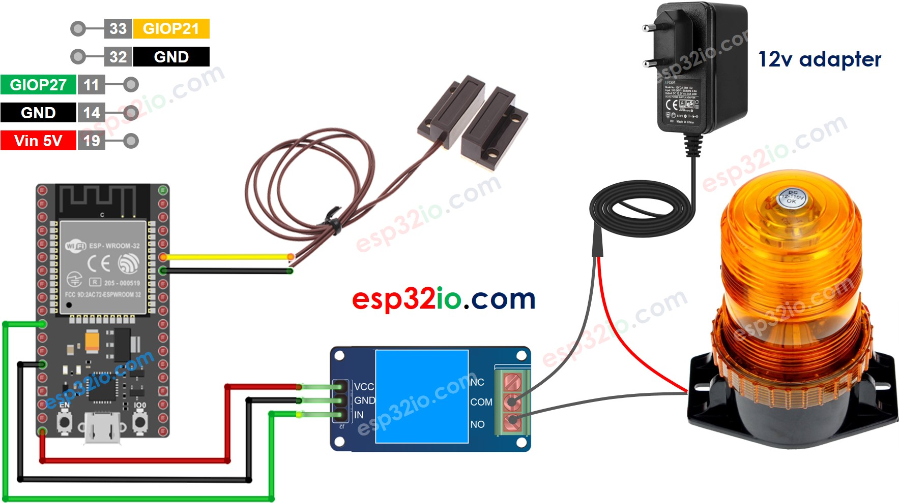

# ESP32 - Door Sensor Toggle Relay

This tutorial instructs you how to use ESP32 to toggle the relay's state each time door is closed.

We can extend this tutorial to use the door sensor to control a led strip, siren, light bulb, or actuator... by connnecting them to the relay.

## Hardware Used In This Tutorial

  * 1	×	ESP-WROOM-32 Dev Module	
  * 1	×	Micro USB Cable	
  * 1	×	Door Sensor	
  * 1	×	Relay	
  * 1	×	Warning Light Bright Waterproof	
  * 1	×	12V Power Adapter	
  * n	×	Jumper Wires

---

## Wiring Diagram



## ESP32 Code - Door Sensor Toggles Relay

```c++
#define DOOR_SENSOR_PIN  21 // ESP32 pin GIOP21 connected to door sensor's pin
#define RELAY_PIN        27 // ESP32 pin GIOP27 connects to the IN pin of relay

// The below are variables, which can be changed
int relayState = LOW; // the current state of relay
int lastDoorState;    // the previous state of door sensor
int currentDoorState; // the current state of door sensor

void setup() {
  Serial.begin(9600);                     // initialize serial
  pinMode(DOOR_SENSOR_PIN, INPUT_PULLUP); // set ESP32 pin to input pull-up mode
  pinMode(RELAY_PIN, OUTPUT);             // set ESP32 pin to output mode

  currentDoorState = digitalRead(DOOR_SENSOR_PIN);
}

void loop() {
  lastDoorState    = currentDoorState;             // save the last state
  currentDoorState = digitalRead(DOOR_SENSOR_PIN); // read new state

  if (lastDoorState == HIGH && currentDoorState == LOW) { // state change: HIGH -> LOW
    Serial.println("The door-closing event is detected, toggles state of relay");

    // toggle state of relay
    relayState = !relayState;

    // control relay arccoding to the toggled state
    digitalWrite(RELAY_PIN, relayState);
  }
}

```

### Quick Instructions

  * If this is the first time you use ESP32, see how to setup environment for ESP32 on Arduino IDE.
  * Do the wiring as above image.
  * Connect the ESP32 board to your PC via a micro USB cable
  * Open Arduino IDE on your PC.
  * Select the right ESP32 board (e.g. ESP32 Dev Module) and COM port.
  * Copy the above code and paste it to Arduino IDE.
  * Compile and upload code to ESP32 board by clicking Upload button on Arduino IDE
  * Move the magnet close to the reed switch and them move it far from the reed switch. Repeat this several times
  * See the change of relay's state


