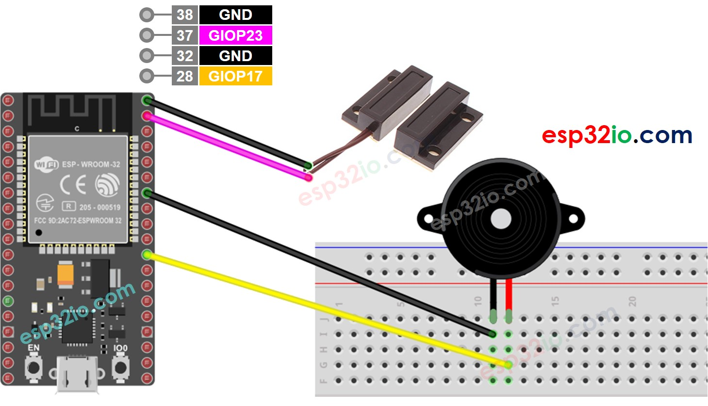

# ESP32 - Door Sensor - Piezo Buzzer

This tutorial instructs you how to use ESP32 with door sensor and Piezo Buzzer. In detail:

    ESP32 automatically makes sound if the door is opened and stops making sound if the door is closed.
    ESP32 automatically Make melody if the door is opened.

## Hardware Used In This Tutorial

  * 1	×	ESP-WROOM-32 Dev Module	
  * 1	×	Micro USB Cable	
  * 1	×	Door Sensor	
  * 1	×	Piezo Buzzer	
  * 1	×	Breadboard	
  * n	×	Jumper Wires

---

## Wiring Diagram



## ESP32 Code - Simple Sound

```c++
#define DOOR_SENSOR_PIN  23  // ESP32 pin GIOP23 connected to door sensor's pin
#define BUZZER_PIN       17  // ESP32 pin GIOP17 connected to Buzzer's pin

int doorState;

void setup() {
  Serial.begin(9600);                     // initialize serial
  pinMode(DOOR_SENSOR_PIN, INPUT_PULLUP); // set ESP32 pin to input pull-up mode
  pinMode(BUZZER_PIN, OUTPUT);            // set ESP32 pin to output mode
}

void loop() {
  doorState = digitalRead(DOOR_SENSOR_PIN); // read state

  if (doorState == HIGH) {
    Serial.println("The door is open, turns on Piezo Buzzer");;
    digitalWrite(BUZZER_PIN, HIGH); // turn on Piezo Buzzer
  } else {
    Serial.println("The door is closed, turns off Piezo Buzzer");
    digitalWrite(BUZZER_PIN, LOW);  // turn off Piezo Buzzer
  }
}

```

### Quick Instructions

  * If this is the first time you use ESP32, see how to setup environment for ESP32 on Arduino IDE.
  * Do the wiring as above image.
  * Connect the ESP32 board to your PC via a micro USB cable
  * Open Arduino IDE on your PC.
  * Select the right ESP32 board (e.g. ESP32 Dev Module) and COM port.
  * Copy the above code and paste it to Arduino IDE.
  * Compile and upload code to ESP32 board by clicking Upload button on Arduino IDE
  * Move the magnet close to the reed switch and them move it far from the reed switch.
  * Listen to piezo buzzer's sound

---

## ESP32 Code - Melody

```c++
#include "pitches.h"

#define DOOR_SENSOR_PIN  23  // ESP32 pin GIOP23 connected to door sensor's pin
#define BUZZER_PIN       17  // ESP32 pin GIOP17 connected to Buzzer's pin

int doorState;

// notes in the melody:
int melody[] = {
  NOTE_E5, NOTE_E5, NOTE_E5,
  NOTE_E5, NOTE_E5, NOTE_E5,
  NOTE_E5, NOTE_G5, NOTE_C5, NOTE_D5,
  NOTE_E5,
  NOTE_F5, NOTE_F5, NOTE_F5, NOTE_F5,
  NOTE_F5, NOTE_E5, NOTE_E5, NOTE_E5, NOTE_E5,
  NOTE_E5, NOTE_D5, NOTE_D5, NOTE_E5,
  NOTE_D5, NOTE_G5
};

// note durations: 4 = quarter note, 8 = eighth note, etc, also called tempo:
int noteDurations[] = {
  8, 8, 4,
  8, 8, 4,
  8, 8, 8, 8,
  2,
  8, 8, 8, 8,
  8, 8, 8, 16, 16,
  8, 8, 8, 8,
  4, 4
};

void setup() {
  Serial.begin(9600);                     // initialize serial
  pinMode(DOOR_SENSOR_PIN, INPUT_PULLUP); // set ESP32 pin to input pull-up mode
}

void loop() {
  doorState = digitalRead(DOOR_SENSOR_PIN); // read state

  if (doorState == HIGH) {
    Serial.println("The door is open, playing the melody");
    playMelody();
  }
}

void playMelody() {
  // iterate over the notes of the melody:
  int size = sizeof(noteDurations) / sizeof(int);

  for (int thisNote = 0; thisNote < size; thisNote++) {
    // to calculate the note duration, take one second divided by the note type.
    //e.g. quarter note = 1000 / 4, eighth note = 1000/8, etc.
    int noteDuration = 1000 / noteDurations[thisNote];
    tone(BUZZER_PIN, melody[thisNote], noteDuration);

    // to distinguish the notes, set a minimum time between them.
    // the note's duration + 30% seems to work well:
    int pauseBetweenNotes = noteDuration * 1.30;
    delay(pauseBetweenNotes);
    // stop the tone playing:
    noTone(BUZZER_PIN);
  }
}

```

### Quick Instructions

  * If this is the first time you use ESP32, see how to setup environment for ESP32 on Arduino IDE.
  * Copy the above code and paste it to Arduino IDE.
  * Create the `pitches.h` file On Arduino IDE
  * Either click on the button just below the serial monitor icon and choose "New Tab", or use Ctrl+Shift+N.
  * Give file's name "pitches.h" and click "OK" button
  * Copy the below code and paste it to that file.
  * Compile and upload code to ESP32 board by clicking Upload button on Arduino IDE
  * Door the door sensor
  * Listen to piezo buzzer's melody


