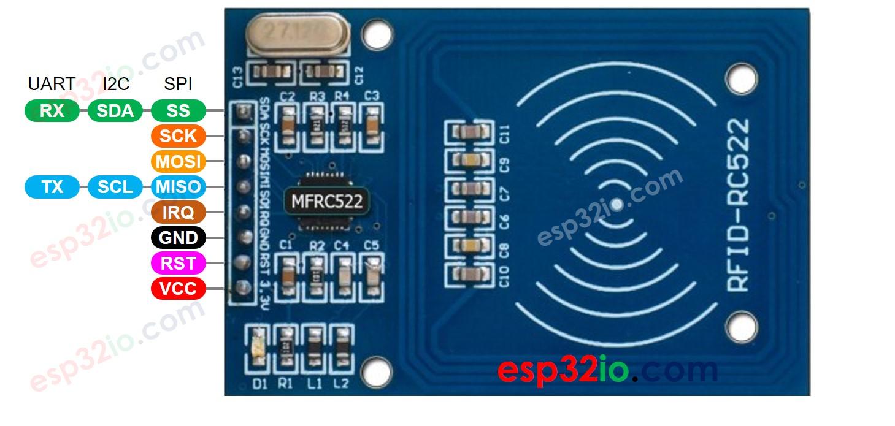
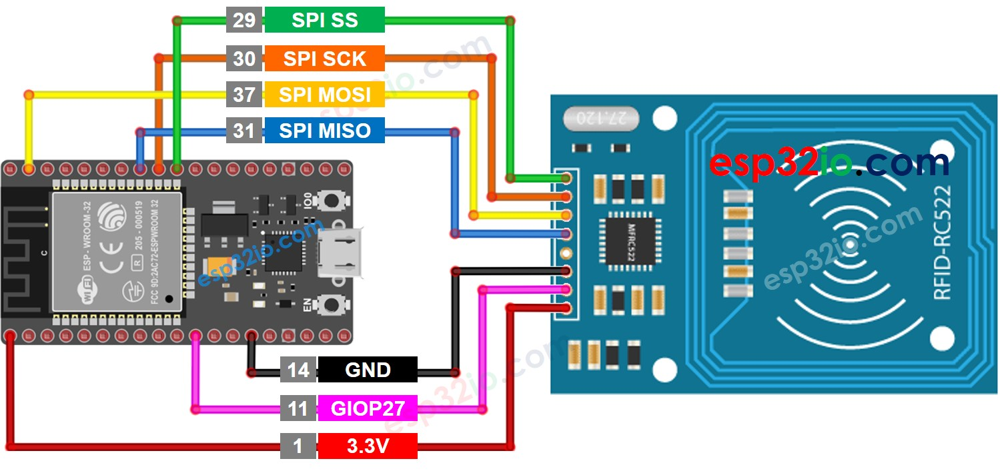
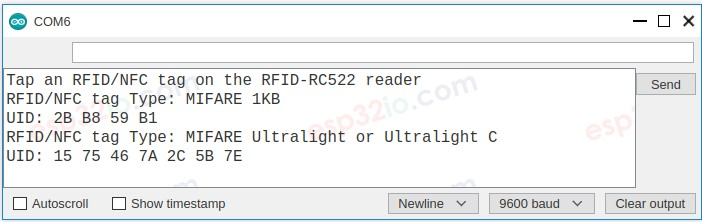

# ESP32 - RFID/NFC

This tutorial instructs you how to use ESP32 withRC522 RFID/NFC reader to read the information from RFID/NFC tag.

## Hardware Used In This Tutorial

  * 1	×	ESP-WROOM-32 Dev Module	
  * 1	×	Micro USB Cable	
  * 1	×	RFID/NFC RC522 Kit (reader + tags)	
  * 7	×	Jumper Wires

---

## Introduction to RFID-RC522 Module

## Pinout



The RFID-RC522 module has 8 pins, some pins are shared among three communication interfaces: SPI, I2C, UART. At a time, only one communication mode can be used. The pin are:

  * **GND pin**: connect this pin to **GND** (0V)
  * **VCC pin**: connect this pin to **VCC** (3.3)
  * **RST pin**: is a pin for reset and power-down. When this pin goes low, hard power-down is enabled. On the rising edge, the module is reset.
  * **IRQ pin**: is an interrupt pin that can alert the ESP32 when RFID tag comes into its detection range.
  * **MISO/SCL/TX pin**: works as:
    * MISO pin if SPI interface is enabled
    * SCL pin if I2C interface is enabled
    * TX pin if UART interface is enabled.
  * **MOSI pin**: works as MOSI if SPI interface is enabled.
  * **SCK pin**: works as SCK if SPI interface is enabled
  * **SS/SDA/RX pin**: works as:
    * SS pin if SPI interface is enabled
    * SDA pin when I2C interface is enabled
    * RX pin when UART interface is enabled.


  > **Note**
  >   * The RFID-RC522 module works with 3.3V. Do not connect the RFID-RC522 module's VCC pin to 5V. 5V can burn the RFID-RC522 module.
  >   * This tutorial uses SPI interface for communication between ESP32 and RFID-RC522 module.

---

## Wiring Diagram



## The wiring table between RFID/NFC RC522 Module and ESP32

|  RFID/NFC RC522 Module |       ESP32     |
|:----------------------:|:---------------:|
| SS pin                 |    → (29) GIOP5 |
| SCK pin                |   → (30) GIOP18 |
| MOSI pin               |  → (37) GIOP23  |
| MISO pin               |  → (31) GIOP19  |
| IRQ pin(not connected) |                 |
| GND pin                |   → GND         |
| RST pin                |   → (11) GIOP27 |
| VCC pin                |   → 3.3V        |

## ESP32 RFID/NFC Code

```c++
#include <SPI.h>
#include <MFRC522.h>

#define SS_PIN  5  // ESP32 pin GIOP5 
#define RST_PIN 27 // ESP32 pin GIOP27 

MFRC522 rfid(SS_PIN, RST_PIN);

void setup() {
  Serial.begin(9600);
  SPI.begin(); // init SPI bus
  rfid.PCD_Init(); // init MFRC522

  Serial.println("Tap an RFID/NFC tag on the RFID-RC522 reader");
}

void loop() {
  if (rfid.PICC_IsNewCardPresent()) { // new tag is available
    if (rfid.PICC_ReadCardSerial()) { // NUID has been readed
      MFRC522::PICC_Type piccType = rfid.PICC_GetType(rfid.uid.sak);
      Serial.print("RFID/NFC Tag Type: ");
      Serial.println(rfid.PICC_GetTypeName(piccType));

      // print UID in Serial Monitor in the hex format
      Serial.print("UID:");
      for (int i = 0; i < rfid.uid.size; i++) {
        Serial.print(rfid.uid.uidByte[i] < 0x10 ? " 0" : " ");
        Serial.print(rfid.uid.uidByte[i], HEX);
      }
      Serial.println();

      rfid.PICC_HaltA(); // halt PICC
      rfid.PCD_StopCrypto1(); // stop encryption on PCD
    }
  }
}

``` 

### Quick Instructions

  * If this is the first time you use ESP32, see how to setup environment for ESP32 on Arduino IDE.
  * On Arduino IDE, Navigate to Tools Manage Libraries
  * Type “MFRC522” on the search box, then look for the library by GithubCommunity
  * Install the library by clicking on Install button.
  * Copy the above code and paste it to Arduino IDE.
  * Compile and upload code to ESP32 board by clicking Upload button on Arduino IDE
  * Open Serial Monitor on Arduino IDE
  * Tap several RFID/NFC tags on RFID-RC522 module
  * See the UID printed on Serial Monitor




