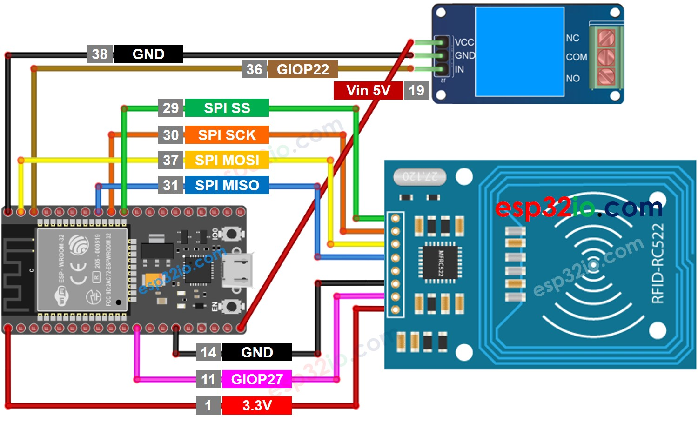
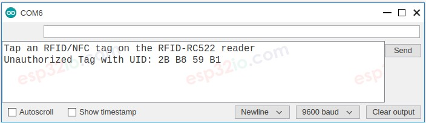
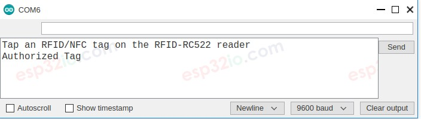
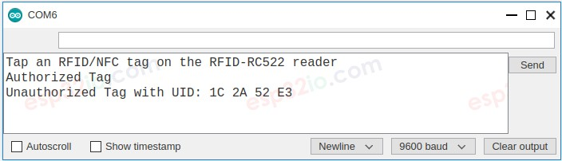
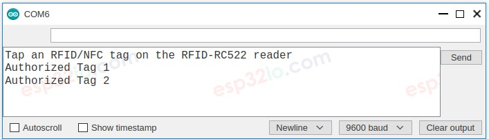

# ESP32 - RFID/NFC - Relay

This tutorial instructs you how to use ESP32, RFID/NFC and relay. In detail, we will learn how to activate a relay when an anthorized RFID/NFC tag is tapped on RFID reader.

This tutorial can be extended by connecting the relay to an electromagnetic lock, actuator...

## Hardware Used In This Tutorial

  * 1	×	ESP-WROOM-32 Dev Module	
  * 1	×	Micro USB Cable	
  * 1	×	RFID/NFC RC522 Kit (reader + tags)	
  * 1	×	Relay	
  * 10	×	Jumper Wires

---

## How RC522 Module Works

  * Several authorized UIDs of RFID/NFC tags are predefined in ESP32 code
  * When an RFID/NFC tag is tapped on a RFID/NFC reader
  * ESP32 read the UID from the RFID/NFC reader
  * ESP32 looks for the read UID in the predefined UIDs list
  * If the predefined UIDs list contains the read UID, ESP32 activates the relay.

---

## Wiring Diagram




## ESP32 Code - Single RFID/NFC Tag

```c++
#include <SPI.h>
#include <MFRC522.h>

#define SS_PIN    5  // ESP32 pin GIOP5 
#define RST_PIN   27 // ESP32 pin GIOP27 
#define RELAY_PIN 22 // ESP32 pin GIOP22 connects to relay

MFRC522 rfid(SS_PIN, RST_PIN);

byte authorizedUID[4] = {0xFF, 0xFF, 0xFF, 0xFF};

void setup() {
  Serial.begin(9600);
  SPI.begin(); // init SPI bus
  rfid.PCD_Init(); // init MFRC522
  pinMode(RELAY_PIN, OUTPUT); // initialize pin as an output.
  digitalWrite(RELAY_PIN, LOW); // deactivate the relay

  Serial.println("Tap an RFID/NFC tag on the RFID-RC522 reader");
}

void loop() {
  if (rfid.PICC_IsNewCardPresent()) { // new tag is available
    if (rfid.PICC_ReadCardSerial()) { // NUID has been readed
      MFRC522::PICC_Type piccType = rfid.PICC_GetType(rfid.uid.sak);

      if (rfid.uid.uidByte[0] == authorizedUID[0] &&
          rfid.uid.uidByte[1] == authorizedUID[1] &&
          rfid.uid.uidByte[2] == authorizedUID[2] &&
          rfid.uid.uidByte[3] == authorizedUID[3] ) {
        Serial.println("Authorized Tag");
        digitalWrite(RELAY_PIN, HIGH); // activate the relay for 2 seconds
        delay(2000);
        digitalWrite(RELAY_PIN, LOW);  // deactivate the relay
      }
      else
      {
        Serial.print("Unauthorized Tag with UID:");
        for (int i = 0; i < rfid.uid.size; i++) {
          Serial.print(rfid.uid.uidByte[i] < 0x10 ? " 0" : " ");
          Serial.print(rfid.uid.uidByte[i], HEX);
        }
        Serial.println();
      }

      rfid.PICC_HaltA(); // halt PICC
      rfid.PCD_StopCrypto1(); // stop encryption on PCD
    }
  }
}

```

### Quick Instructions

  * If this is the first time you use ESP32, see how to setup environment for ESP32 on Arduino IDE.
  * On Arduino IDE, Navigate to Tools Manage Libraries
  * Type “MFRC522” on the search box, then look for the library by GithubCommunity
  * Install the library by clicking on Install button.
  * Find out the tag's UID by doing the following steps:
    * Copy the above code and paste it to Arduino IDE.
    * Compile and upload code to ESP32 board by clicking Upload button on Arduino IDE
    * Open Serial Monitor on Arduino IDE
    * Tap an RFID/NFC tag that you want to give authorization on RFID-RC522 reader
    * Write down the UID printed on Serial Monitor



  * Update the UID in the line 18 of the above code. For example, change `byte authorizedUID[4] = {0xFF, 0xFF, 0xFF, 0xFF}; TO byte authorizedUID[4] = {0x2B, 0xB8, 0x59, 0xB1};`
  * Upload the code to ESP32 again
  * Tap the authorized RFID/NFC tag on RFID-RC522 module
  * See the result on Serial Monitor



  * Tap an unauthorized RFID/NFC tag on RFID-RC522 module
  * See the result on Serial Monitor



---

## ESP32 Code - Multiple RFID/NFC Tags

The below ESP32 code allow multiple authorized RFID/NFC tags to activate the relay. The code takes two tags for example. you can add more.

```c++
#include <SPI.h>
#include <MFRC522.h>

#define SS_PIN    5  // ESP32 pin GIOP5 
#define RST_PIN   27 // ESP32 pin GIOP27 
#define RELAY_PIN 22 // ESP32 pin GIOP22 connects to relay

MFRC522 rfid(SS_PIN, RST_PIN);

byte authorizedUID1[4] = {0x3A, 0xC9, 0x6A, 0xCB};
byte authorizedUID2[4] = {0x30, 0x01, 0x8B, 0x15};   

void setup() {
  Serial.begin(9600);
  SPI.begin(); // init SPI bus
  rfid.PCD_Init(); // init MFRC522
  pinMode(RELAY_PIN, OUTPUT);   // initialize pin as an output.
  digitalWrite(RELAY_PIN, LOW); // deactivate the relay

  Serial.println("Tap an RFID/NFC tag on the RFID-RC522 reader");
}

void loop() {
  if (rfid.PICC_IsNewCardPresent()) { // new tag is available
    if (rfid.PICC_ReadCardSerial()) { // NUID has been readed
      MFRC522::PICC_Type piccType = rfid.PICC_GetType(rfid.uid.sak);

      if (rfid.uid.uidByte[0] == authorizedUID1[0] &&
          rfid.uid.uidByte[1] == authorizedUID1[1] &&
          rfid.uid.uidByte[2] == authorizedUID1[2] &&
          rfid.uid.uidByte[3] == authorizedUID1[3] ) {
        Serial.println("Authorized Tag 1");
        digitalWrite(RELAY_PIN, HIGH); // activate the relay for 2 seconds
        delay(2000);
        digitalWrite(RELAY_PIN, LOW);  // deactivate the relay
      }
      else
      if (rfid.uid.uidByte[0] == authorizedUID2[0] &&
          rfid.uid.uidByte[1] == authorizedUID2[1] &&
          rfid.uid.uidByte[2] == authorizedUID2[2] &&
          rfid.uid.uidByte[3] == authorizedUID2[3] ) {
        Serial.println("Authorized Tag 2");
        digitalWrite(RELAY_PIN, HIGH); // activate the relay for 2 seconds
        delay(2000);
        digitalWrite(RELAY_PIN, LOW);  // deactivate the relay
      }
      else
      {
        Serial.print("Unauthorized Tag with UID:");
        for (int i = 0; i < rfid.uid.size; i++) {
          Serial.print(rfid.uid.uidByte[i] < 0x10 ? " 0" : " ");
          Serial.print(rfid.uid.uidByte[i], HEX);
        }
        Serial.println();
      }

      rfid.PICC_HaltA(); // halt PICC
      rfid.PCD_StopCrypto1(); // stop encryption on PCD
    }
  }
}

```

### Quick Instructions

  * Updated two authorized RFID/NFC tag's UUID to the code
  * Upload the code to ESP32
  * Tap the authorized tags one-by-one on RFID-RC522 module.
  * The result on Serial Monitor:



You can modify the code to add three, four, or more tags.