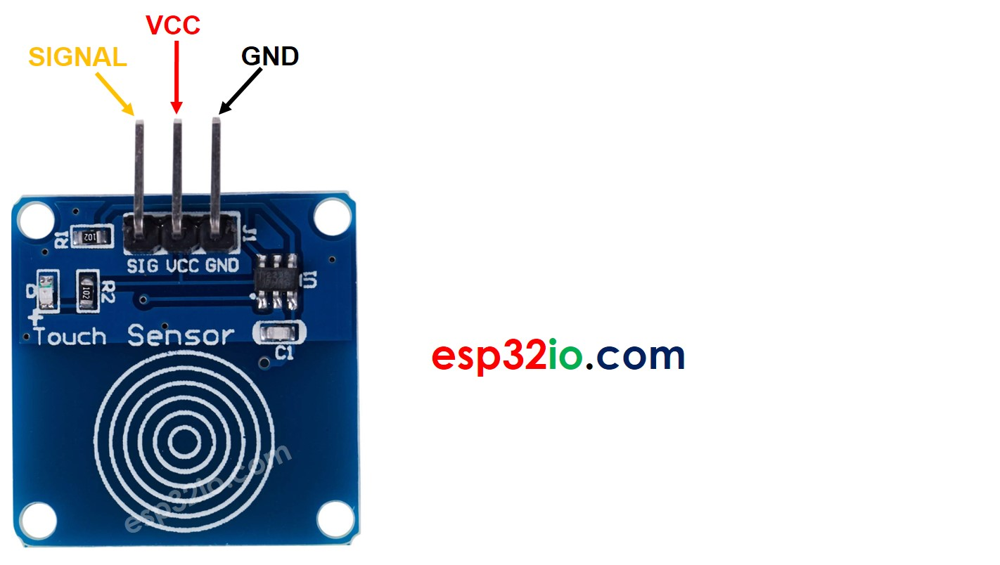
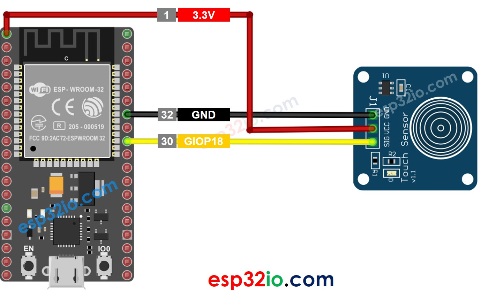
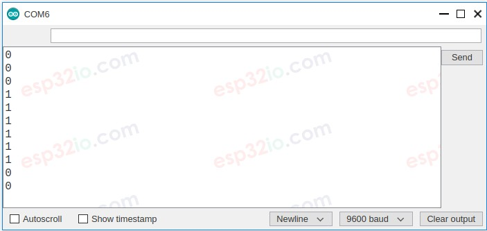

# ESP32 - Touch Sensor

This tutorial instructs you how to use ESP32 with the touch sensor (also known as touch switch, or touch button).

## Hardware Used In This Tutorial

  * 1	×	ESP-WROOM-32 Dev Module	
  * 1	×	Micro USB Cable	
  * 1	×	Touch Sensor	
  * 3	×	Jumper Wires

---

## Introduction to Touch Sensor

### Touch Sensor Pinout

Touch sensor has 3 pins:

  * **GND pin**: connect this pin to GND (0V)
  * **VCC pin**: connect this pin to VCC (5V or 3.3v)
  * **SIGNAL pin**: is an output pin: LOW when NOT touched, HIGH when touched. This pin needs to be connected to ESP32's input pin.



---

## How Touch Sensor Works

  * The state of the SIGNAL pin is LOW when the touch sensor is NOT touched
  * The state of the SIGNAL pin is HIGH when the touch sensor is touched

## ESP32 - Touch Sensor

We can connect the touch sensor's SIGNAL pin to an ESP32's input pin and use the ESP32 code to read the state of touch sensor.

---

## Wiring Diagram between Touch Sensor and ESP32



## How To Program Touch Sensor

Initializes the ESP32 pin to the digital input mode by using pinMode() function. For example, pin GIOP18

```c++
pinMode(18, INPUT_PULLUP);
```

Reads the state of the ESP32 pin by using digitalRead() function.

```c++
int inputState = digitalRead(18);
```

## Touch Sensor - ESP32 Code

The below code reads the state of the touch sensor and print it to the Serial Monitor.

```c++
#define SENSOR_PIN  18 // ESP32 pin GIOP18 connected to the sensor's SIGNAL pin of touch sensor

void setup() {
  // initialize serial communication at 9600 bits per second:
  Serial.begin(9600);
  // initialize the ESP32's pin as aninput
  pinMode(SENSOR_PIN, INPUT);
}

void loop() {
  // read the state of the the input pin:
  int state = digitalRead(SENSOR_PIN);

  // print state to Serial Monitor
  Serial.println(state);
}

```

### Quick Instructions

  * If this is the first time you use ESP32, see how to setup environment for ESP32 on Arduino IDE.
  * Copy the above code and paste it to Arduino IDE.
  * Compile and upload code to ESP32 board by clicking Upload button on Arduino IDE
  * Touch your finger to the sensor and release.
  * See the result on Serial Monitor. It looks like the below:



---

## How to detect the state change from LOW to HIGH

```c++
#define SENSOR_PIN  18 // ESP32 pin GIOP18 connected to the sensor's SIGNAL pin of touch sensor

// Variables will change:
int lastState = LOW;      // the previous state from the input pin
int currentState;         // the current reading from the input pin

void setup() {
  // initialize serial communication at 9600 bits per second:
  Serial.begin(9600);
  // initialize the ESP32's pin as aninput
  pinMode(SENSOR_PIN, INPUT);
}

void loop() {
  // read the state of the the input pin:
  currentState = digitalRead(SENSOR_PIN);

  if (lastState == LOW && currentState == HIGH)
    Serial.println("The sensor is touched");

  // save the the last state
  lastState = currentState;
}

```

