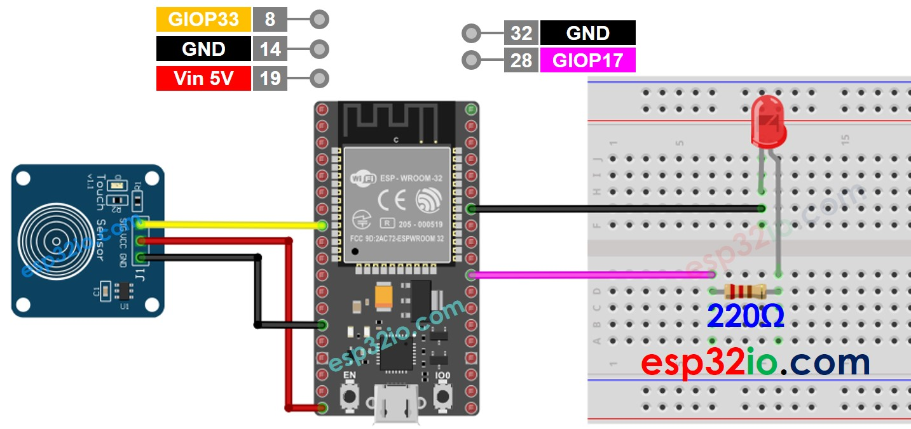
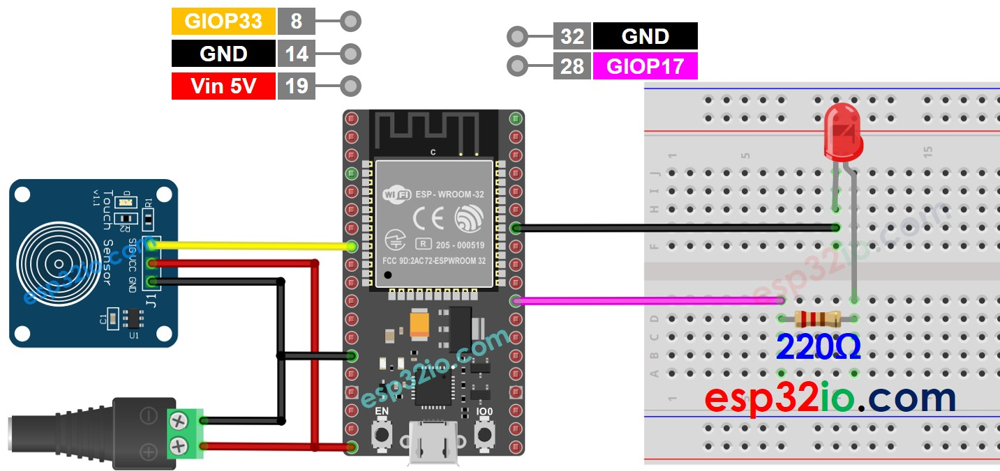

# ESP32 - Touch Sensor - LED

This tutorial instructs you how to use ESP32 to control LED based on the state of the touch sensor. In detail:

  * If a touch sensor is being touched, ESP32 turns LED on
  * If a touch sensor is NOT being touched, ESP32 turns LED off

## Hardware Used In This Tutorial

  * 1	×	ESP-WROOM-32 Dev Module	
  * 1	×	Micro USB Cable	
  * 1	×	Touch Sensor	
  * 1	×	LED	
  * 1	×	220 ohm resistor	
  * 1	×	Breadboard	
  * 4	×	Jumper Wires

---

## Wiring Diagram

The wiring diagram with power supply from USB cable



The wiring diagram with power supply from 5v adapter



## ESP32 Code

```c++
#define TOUCH_SENSOR_PIN 33 // ESP32 pin GIOP33 connected to the OUTPUT pin of touch sensor
#define LED_PIN          17 // ESP32 pin GIOP17 connected to LED's pin

void setup() {
  Serial.begin(9600);               // initialize serial
  pinMode(TOUCH_SENSOR_PIN, INPUT); // set ESP32 pin to input mode
  pinMode(LED_PIN, OUTPUT);         // set ESP32 pin to output mode
}

void loop() {
  int touchState = digitalRead(TOUCH_SENSOR_PIN); // read new state

  if (touchState == HIGH) {
    Serial.println("The sensor is being touched");;
    digitalWrite(LED_PIN, HIGH); // turn on
  } else if (touchState == LOW) {
    Serial.println("The sensor is untouched");
    digitalWrite(LED_PIN, LOW);  // turn off
  }
}

```

### Quick Instructions

  * If this is the first time you use ESP32, see how to setup environment for ESP32 on Arduino IDE.
  * Do the wiring as above image.
  * Connect the ESP32 board to your PC via a micro USB cable
  * Open Arduino IDE on your PC.
  * Select the right ESP32 board (e.g. ESP32 Dev Module) and COM port.
  * Copy the above code and paste it to Arduino IDE.
  * Compile and upload code to ESP32 board by clicking Upload button on Arduino IDE
  * ouch and keep touching the touch sensor several seconds
  * See the change of LED's state
