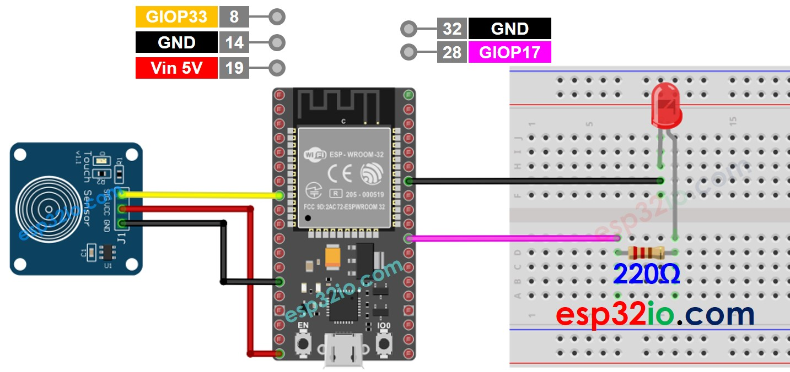

# ESP32 - Touch Sensor Toggle LED

This tutorial instructs you how to use ESP32 to toggle the state of an LED between ON and OFF when a touch sensor is touched. More specifically:

  * If the touch sensor is touched, turn the LED on
  * If the touch sensor is touched again, turn the LED off
  * The above process is repeated over and over again

## Hardware Used In This Tutorial

  * 1	×	ESP-WROOM-32 Dev Module	
  * 1	×	Micro USB Cable	
  * 1	×	Touch Sensor	
  * 1	×	LED	
  * 1	×	220 ohm resistor	
  * 1	×	Breadboard	
  * 4	×	Jumper Wires

---

## Wiring Diagram



```c++
#define TOUCH_SENSOR_PIN 33 // ESP32 pin GIOP33 connected to the OUTPUT pin of touch sensor
#define LED_PIN          17 // ESP32 pin GIOP17 connected to LED's pin

// The below are variables, which can be changed
int ledState = LOW;    // the current state of LED
int lastTouchState;    // the previous state of touch sensor
int currentTouchState; // the current state of touch sensor

void setup() {
  Serial.begin(9600);               // initialize serial
  pinMode(TOUCH_SENSOR_PIN, INPUT); // set ESP32 pin to input mode
  pinMode(LED_PIN, OUTPUT);         // set ESP32 pin to output mode

  currentTouchState = digitalRead(TOUCH_SENSOR_PIN);
}

void loop() {
  lastTouchState    = currentTouchState;             // save the last state
  currentTouchState = digitalRead(TOUCH_SENSOR_PIN); // read new state

  if (lastTouchState == LOW && currentTouchState == HIGH) {
    Serial.println("The sensor is touched");

    // toggle state of LED
    ledState = !ledState;

    // control LED arccoding to the toggled state
    digitalWrite(LED_PIN, ledState);
  }
}

```

### Quick Instructions

  * If this is the first time you use ESP32, see how to setup environment for ESP32 on Arduino IDE.
  * Do the wiring as above image.
  * Connect the ESP32 board to your PC via a micro USB cable
  * Open Arduino IDE on your PC.
  * Select the right ESP32 board (e.g. ESP32 Dev Module) and COM port.
  * Copy the above code and paste it to Arduino IDE.
  * Compile and upload code to ESP32 board by clicking Upload button on Arduino IDE
  * Keep touching the touch sensor several seconds and then release it.
  * See the change of LED's state


