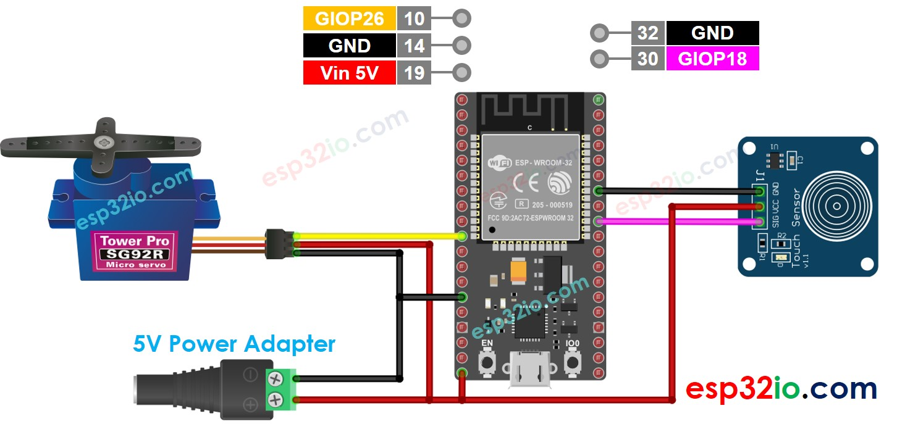

# ESP32 - Touch Sensor - Servo Motor

This tutorial instructs you how to use ESP32 to . In detail:

  * If touch sensor is touched, rotate servo motor to 90 degree
  * If touch sensor is touched again, rotate servo motor back to 0 degree.

That process is repeated.

## Hardware Used In This Tutorial

  * 1	×	ESP-WROOM-32 Dev Module	
  * 1	×	Micro USB Cable	
  * 1	×	Touch Sensor	
  * 1	×	Servo Motor	
  * n	×	Jumper Wires

---

## Wiring Diagram



## ESP32 Code - Touch Sensor Controls Servo Motor

```c++
#include <Servo.h>

#define TOUCH_SENSOR_PIN  18 // ESP32 pin GIOP18 connected to touch sensor's pin
#define SERVO_PIN         26 // ESP32 pin GIOP26 connected to servo motor's pin

Servo servo; // create servo object to control a servo

// The below are variables, which can be changed
int angle = 0;         // the current angle of servo motor
int lastTouchState;    // the previous state of touch sensor
int currentTouchState; // the current state of touch sensor

void setup() {
  Serial.begin(9600);               // initialize serial
  pinMode(TOUCH_SENSOR_PIN, INPUT); // set ESP32 pin to input mode
  servo.attach(SERVO_PIN);          // attaches the servo on pin 9 to the servo object

  servo.write(angle);
  currentTouchState = digitalRead(TOUCH_SENSOR_PIN);
}

void loop() {
  lastTouchState    = currentTouchState;             // save the last state
  currentTouchState = digitalRead(TOUCH_SENSOR_PIN); // read new state

  if(lastTouchState == LOW && currentTouchState == HIGH) {
    Serial.println("The sensor is touched");

    // change angle of servo motor
    if(angle == 0)
      angle = 90;
    else
    if(angle == 90)
      angle = 0;

    // control servo motor arccoding to the angle
    servo.write(angle);
  }
}

```

### Quick Instructions

  * If this is the first time you use ESP32, see how to setup environment for ESP32 on Arduino IDE.
  * Do the wiring as above image.
  * Connect the ESP32 board to your PC via a micro USB cable
  * Open Arduino IDE on your PC.
  * Select the right ESP32 board (e.g. ESP32 Dev Module) and COM port.
  * Copy the above code and paste it to Arduino IDE.
  * Compile and upload code to ESP32 board by clicking Upload button on Arduino IDE
  * Touch the touch sensor several times.
  * See the change of servo motor
