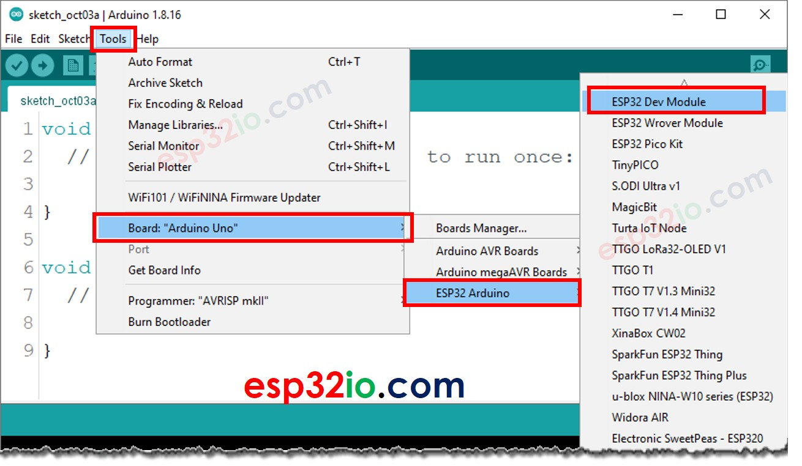
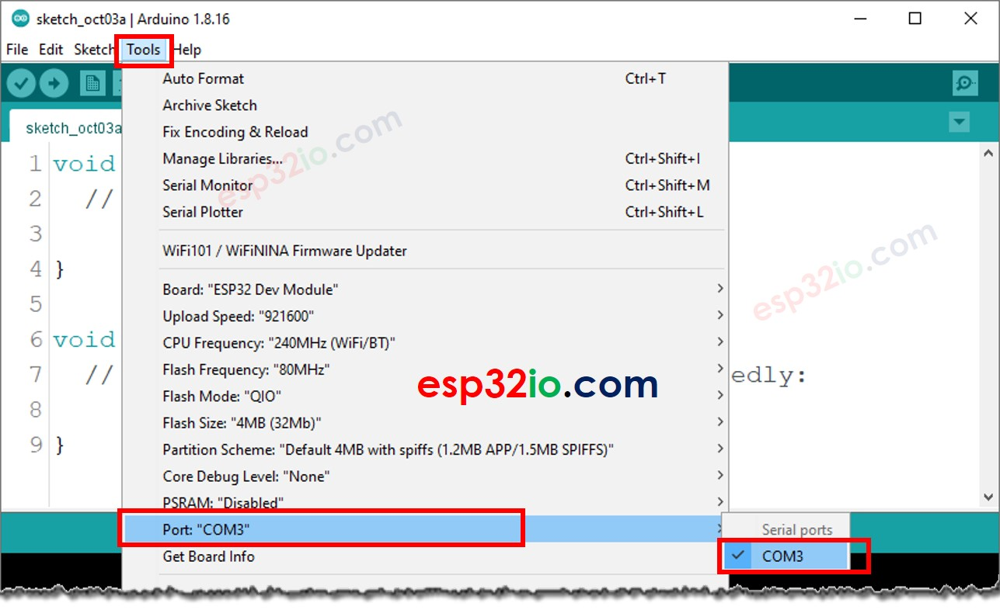
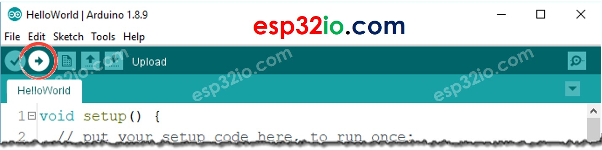
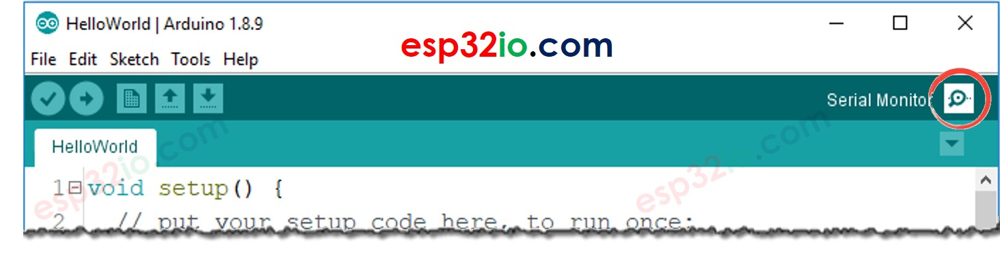

# ESP32 - Hello World

This tutorial instructs you how to write the first program on ESP32. You will learn how to make ESP32 print Hello World to Serial.

## Hardware Used In This Tutorial

  * 1 x ESP-WROOM-32 Dev Module	
  * 1 x Micro USB Cable

## Quick Instructions

  * If this is the first time you use ESP32, see how to setup environment for ESP32 on Arduino IDE.
  * Do the wiring as above image.
  * Connect the ESP32 board to your PC via a micro USB cable.
  * Open Arduino IDE.
  * Select ESP32 board



  * Select ESP32 serial port (number may be different)



  * Type the following code

```c++
void setup() {
  // put your setup code here, to run once:
  Serial.begin(9600);
  Serial.println("Hello World!");
}

void loop() {
  // put your main code here, to run repeatedly:
}
```

  * Compile and upload code to ESP32 board by clicking Upload button on Arduino IDE



  * Open Serial Monitor on Arduino IDE



  * See the result on Serial Monitor.