# ESP32 - Serial Monitor

This tutorial instructs you how to use Serial Monitor on Arduino IDE with ESP32.

## Hardware Used In This Tutorial

  * 1 × ESP-WROOM-32 Dev Module	
  * 1 × Micro USB Cable

## Introduction to Serial Monitor

When you program for ESP32, You need to have something to know how ESP32 code run => use Serial Monitor tool in Arduino IDE. It is designed for two purposes:

  * ESP32 → PC: Your code on ESP32 send data via Serial. Yhe Serial Monitor on PC receives the data and display it. This is very useful for debugging and monitoring
  * PC → ESP32: You type some data and send it from PC to ESP32. This is useful to send comamand from your PC to ESP32

You need an micro USB cable between PC and ESP32. This cable is also used to upload the code to ESP32.

## How To Use Serial Monitor

### Open Serial Monitor

You just need to click on an icon on Arduino IDE as below image:

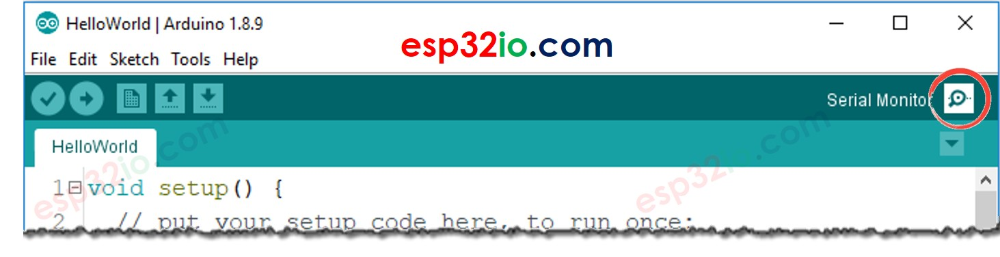

### Components on Serial Monitor

The Serial Momitor is composed of 8 components

1. Output console: this component displays data received from ESP32.


2. Autoscroll checkbox: this component offers options to enable/disable the automatic scroll on the output console


3. Show timestamp checkbox: this component offers options to add timestamp before data.

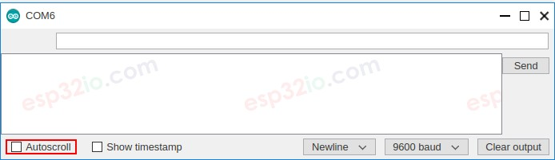

4. Clear output button: When this button is clicked, the text on the output console is cleared.
   
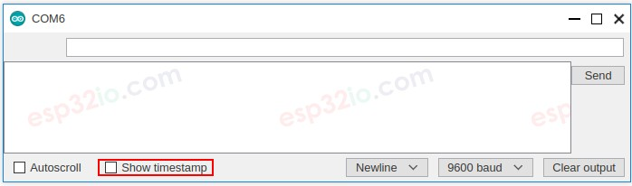

5. Baud rate selection: this component offers options to select communication speed (baud rate) between PC and ESP32. This value MUST be the same as the value used in ESP32 code (in Serial.begin() function).

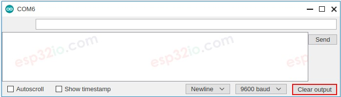

6. Textbox: this component allow you to type characters that will be sent to ESP32 board when you click Send button

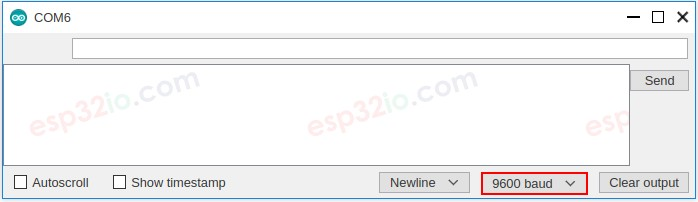

7. Ending selection: this component offers options to select the ending characters appended to data sent to ESP32. Available options include:

  * No line ending: adds nothing
  * Newline: adds newline (LF, or '\n') character
  * Carriage return: adds carriage return (CR, or '\r') character
  * Both NL and CR: adds both newline and carriage return characters

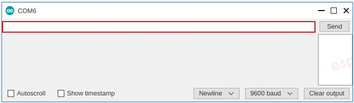

8. Send button: when this button is clicked, The Serial Monitor sends data in Textbox plus the ending characters to ESP32

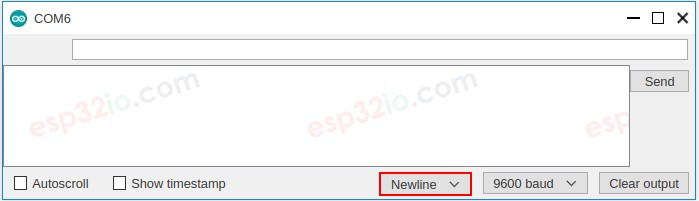
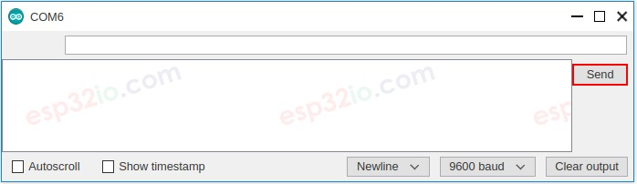

## ESP32 To PC

How to send data from ESP32 board to PC:

  * Set the baud rate and initialize Serial port by using `Serial.begin()` function

  > `Serial.begin(baudrate);`

  * Send data to Serial Monitor using one of the below functions:
    * Serial.print()
    * Serial.println()
    * Serial.write()

For example, send “Hello World!” to Serial Monitor
  > `Serial.println("Hello World!");`

### Example Use

The below example code sends the “esp32io.com” from ESP32 to Serial Monitor every second
```c++
/*
 * This ESP32 code is created by esp32io.com
 *
 * This ESP32 code is released in the public domain
 *
 * For more detail (instruction and wiring diagram), visit https://esp32io.com/tutorials/esp32-serial-monitor
 */

void setup() {
	Serial.begin(9600);
}

void loop() {
	Serial.println("esp32io.com");
	delay(1000);
}
```

### Quick Instructions

  * If this is the first time you use ESP32, see how to setup environment for ESP32 on Arduino IDE.
  * Copy the above code and paste it to Arduino IDE.
  * Compile and upload code to ESP32 board by clicking Upload button on Arduino IDE
  * Open Serial Monitor on Arduino IDE
  * Select baurate 9600
  * See the output on Serial Monitor

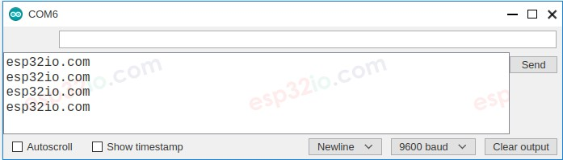

  * Try changing `Serial.println()` function to `Serial.print()` function

---

## PC To ESP32

### How to send data from PC to ESP32

On the PC:
  * Type text on Serial Monitor
  * Click Send button.

And then you write ESP32 code to read data and process it:

  * Set baud rate and begin Serial port

  > `Serial.begin(baudrate);`

  * Check if the incoming data is available

  > ```c++
  > if(Serial.available()) {
  >	// TODO
  > }
  >```

Read data from Serial port using one of the blow functions:

  * `Serial.read()`
  * `Serial.readBytes()`
  * `Serial.readBytesUntil()`
  * `Serial.readString()`
  * `Serial.readStringUntil()`

For example:

  > `String data = Serial.readStringUntil("\r\n");`

### Example Use

The below ESP32 example code reads commands from Serial to turn on/off a built-in LED.

  * If the received text (command) is “ON”, turn the LED on
  * If the received text (command) is “OFF”: turn the LED off

  > How ESP32 can recognize a command? For example, when we send “OFF” characters, how ESP32 can distinguish the command is “O”, “OF” or “OFF”?

We need to send a terminator along with a command => we can append a newline character ('\n'). To append newline character, select “newline” option on Serial Monitor before sending the data. ESP32 will read data until the newline character. In this case, the newline character is called terminator or delimiter.

```c++
void setup() {
  Serial.begin(9600);
  pinMode(LED_BUILTIN, OUTPUT); // set the digital pin as output:
}

void loop() {
  if (Serial.available()) { // if there is data comming
    String command = Serial.readStringUntil('\n'); // read string until newline character

    if (command == "ON") {
      digitalWrite(LED_BUILTIN, HIGH); // turn on LED
      Serial.println("Turn LED ON");
    } else if (command == "OFF") {
      digitalWrite(LED_BUILTIN, LOW);  // turn off LED
      Serial.println("Turn LED OFF");
    }
  }
}
```

### Quick Instructions

  * If this is the first time you use ESP32, see how to setup environment for ESP32 on Arduino IDE.
  * Copy the above code and paste it to Arduino IDE.
  * Compile and upload code to ESP32 board by clicking Upload button on Arduino IDE
  * Open Serial Monitor on Arduino IDE
  * Select baurate 9600 and newline option
  * Type “ON” or “OFF” and click Send button

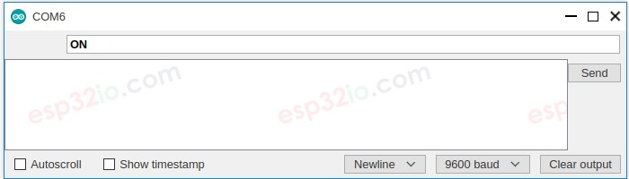

  * See the built-in LED's state on ESP32 board. We will see LED's state is ON or OFF, respectively.
  * We also see LED's state on Serial Monitor

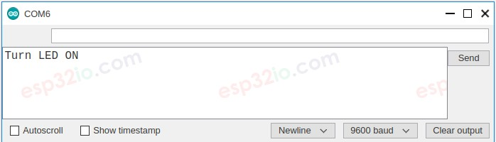

  * Type “ON” or “OFF” command several times.


