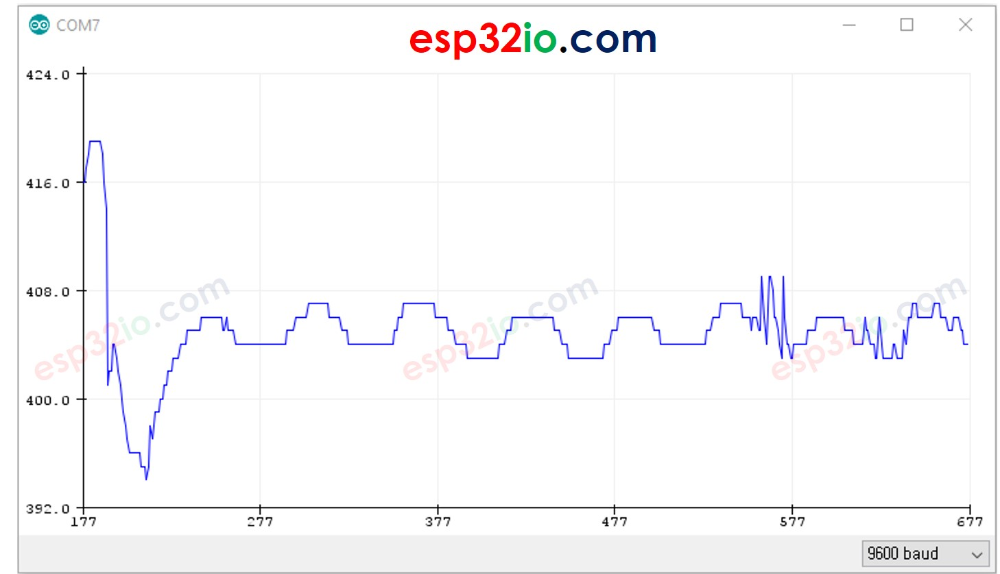

# ESP32 - Serial Plotter

This tutorial instructs you how to use Serial Plotter on Arduino IDE with ESP32

## Hardware Used In This Tutorial

  * 1 × ESP-WROOM-32 Dev Module	
  * 1 × Micro USB Cable

## Introduction to Serial Plotter

The Serial Plotter is a tool on Arduino IDE the can receive data from ESP32 via Serial and plot it on a graph. The Serial Plotter can plot multiple sensor's data in the same screen.

To receive the data from ESP32, It needs to use a micro USB cable between ESP32 and PC

Serial Plotter is composed of two components:

  * a selection box: used to select the serial baudrate
  * a graph:: a screen that shows the visualized data
    * X-axis: presents the time. It has 500 points. The time between each point is the time between two consecutive `Serial.println()` function calls.
    * Y-axis: presents the data values received from ESP32. The Y-axis automatically scales when the data's value increases or decreases.

## How To Open Serial Plotter

On Arduino IDE, Navigate to Tools Serial Plotter


## How to plot a Single Line on Graph

To plot a single line on graph, we just need to send the data terminated by “\r\n” character. We can use `Serial.println()` function

  > `Serial.println(variable);`

### Example Code

The below ESP32 example code reads the value of an analog input pin and send it to Serial Plotter

```c++
void setup() {
  Serial.begin(9600);
}

void loop() {
  int variable_1 = analogRead(A0);
  Serial.println(variable_1);

  delay(100);
}
```

### Quick Instructions

  * If this is the first time you use ESP32, see how to setup environment for ESP32 on Arduino IDE.
  * Copy the above code and paste it to Arduino IDE.
  * Compile and upload code to ESP32 board by clicking Upload button on Arduino IDE
  * Open Serial Plotter
  * Select baurate 9600
  * See graph on Serial Plotter



## How to plot multiple lines on Graph

To plot multiple variables, we need to separate variables from each other by “\t” or " " character. The last value MUST be terminated by “\r\n” characters.

In detail:

  * The first variable:
  > `Serial.print(variable_first);`
  * The middle variables
  > ```c++
  > Serial.print("\t"); // or Serial.print(" ")
  > Serial.print(variable_nth);
  > ```
  * The last variable
  > ```c++
  > Serial.print("\t"); // or Serial.print(" ")
  > Serial.println(variable_last);
  > ```

### Example Code

The below ESP32 example code reads the value from 4 analog input pins and sends them to Serial Plotter

```c++
void setup() {
  Serial.begin(9600);
}

void loop() {
  int variable_1 = analogRead(A0);
  int variable_2 = analogRead(A1);
  int variable_3 = analogRead(A2);
  int variable_4 = analogRead(A3);

  Serial.print(variable_1);
  Serial.print(" "); // a tab '\t' or space ' ' character is printed between the two values.
  Serial.print(variable_2);
  Serial.print(" "); // a tab '\t' or space ' ' character is printed between the two values.
  Serial.print(variable_3);
  Serial.print(" "); // a tab '\t' or space ' ' character is printed between the two values.
  Serial.println(variable_4); // the last value is terminated by a carriage return and a newline characters.

  delay(100);
}
```

The result on Serial Monitor:


### Example of 3 Sine Waveforms

The below ESP32 example code print three sine waveform's value to Serial Plotter

```c++
void setup() {
  Serial.begin(9600);
}

void loop() {
  for (int i = 0; i < 360; i += 5) {
    float sine_1 = 1 * sin(i * M_PI / 180);
    float sine_2 = 2 * sin((i + 90) * M_PI / 180);
    float sine_3 = 5 * sin((i + 180) * M_PI / 180);

    Serial.print(sine_1);
    Serial.print("\t"); // a tab '\t' or space ' ' character is printed between the two values.
    Serial.print(sine_2);
    Serial.print("\t"); // a tab '\t' or space ' ' character is printed between the two values.
    Serial.println(sine_3); // the last value is terminated by a carriage return and a newline characters.

    delay(100);
  }
}
```

The result on Serial Plotter:

