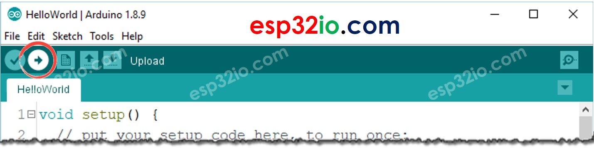

# ESP32 - Button

The button is a basic component and widely used in many ESP32 projects. It is not simple as it looks like (because of mechanical, physical characteristics). Beginners may have a lot of troubles with it. This tutorial makes it easy for the beginners. Let's start!

  > **Note That:**
  > Before presenting about the button, We would like to notice that there are two common mistakes that newbies usually meet:
  >  1. The floating input problem:
  >      * Symptom: When connecting a button to ESP32 input pin, the state of the input pin is random and not matched with the button's pressing state.
  >      * Cause: The button pin is NOT used a pull-down resistor or a pull-up resistor.
  >      * Solution: Use a pull-down resistor or a pull-up resistor on the input pin. The detail will be described later in this tutorial.
  >  1. The chattering phenomenon
  >      * Symptom: The code on ESP32 reads the state of the button and identifies the pressing event by detecting the state change (HIGH to LOW, or LOW to HIGH). When the button is actually pressed only one time, ESP32 code detects multiple presses rather than once.
  >      * Cause: Due to mechanical and physical characteristics, when you do a single press on a button, the state of the input pin is quickly toggled between LOW and HIGH several times rather than once
  >      * Xolution: Debounce. The detail will be described in ESP32 - Button - Debounce tutorial.

  > The chattering phenomenon causes the malfunction in only some kinds of application that needs to detect exactly number of the pressing. In some kind of application, it is harmless.

## Hardware Used In This Tutorial

  * 1 × ESP-WROOM-32 Dev Module	
  * 1 × Micro USB Cable	
  * 1 × Button	
  * 1 × Breadboard	
  * 2 × Jumper Wires

## Introduction to Button

A button usually has four pins that are internally connected in pairs.


We only need to use two of the four pins, which are NOT in the same connected pair. Accordingly, There are four ways to do wiring with the button (see bimage below)


Actually, because of symmetry, these four ways becomes two ways. The rest of this tutorial will use two pins: Pin A and Pin B that are not connected together.

  > Why does the button has four pins while we only need two pins?

The button receives the force from users. To make it stand stably and firmly in PCB (board), It has four pins to resist the pressing force.

### How Button Works

  * When the button is pressed, the pin A is connected to the pin B
  * When the button is NOT pressed, the pin A is NOT connected to the pin B


### ESP32 - Button

One button's pin is connected to a digital input pin of ESP32. The other pin is connected to VCC or GND. In ESP32 code, by reading the state of the input pin, we can infer the button is pressed or NOT.

### Input State and Pressing State

The relation between the state of the input pin and the button's pressing state depends on how we connect the button with ESP32 and the setting of the ESP32's pin. There are two ways to use a button with ESP32:

  1. One button's pin is connected to a digital input pin of ESP32, the other pin is connected to VCC:
    * A pull-down resistor MUST be used
    * If the button is pressed, the state of ESP32's pin is HIGH. Otherwise, the state of ESP32's pin is LOW
  1. One button's pin is connected to a digital input pin of ESP32, the other pin is connected to GND:
    * A pull-up resistor MUST be used
    * If the button is pressed, the state of ESP32's pin is LOW. Otherwise, the state of ESP32's pin is HIGH.

  > **Note That**
  >
  > If neither a pull-down resistor nor a pull-up resistor is used, the state of the input pin is random between HIGH or LOW (unstable, unfixed) when the button is NOT pressed. This is called The “floating input problem”. This results in the malfunction.

To make it simple for newbies, this tutorial highly recommens newbies using an internal pull-up resistor for ESP32 pin. No external resistor is required. This saves the hardware, simplifies the wiring diagram.

### Wiring Diagram between Button and ESP32


### How To Program Button

  * Initializes the ESP32 pin as an internal pull-up input by using `pinMode()` function. For example, pin GIOP21:

> ```c++
> pinMode(21, INPUT_PULLUP); // config GIOP21 as input pin and enable the internal pull-up resistor`
> ```

  * Reads the state of the input pin by using digitalRead() function.

> ```c++
> int buttonState = digitalRead(BUTTON_PIN);
> ```

> **Note That**
>
> There are two wide-used use cases:
>   * The first use case: If the input state is HIGH, do something. If the input state is LOW, do another thing.
>   * The second use case: If the input state is changed from LOW to HIGH, do something. If the input state is changed from HIGH to LOW, do another thing.
> 
> Depending on the application, one of them is used. For example, in case of using a button to control an LED:
>   * If we want to turn the LED ON when the button is pressed and turn it OFF when the button is NOT pressed, we SHOULD use the first case.
>   * If we want to toggle the LED between ON and OFF each time the button is pressed, we SHOULD use the second case.

The below example code show how to detect the state change from LOW to HIGH.

```c++
#define BUTTON_PIN 21 // GIOP21 pin connected to button

// Variables will change:
int lastState = HIGH; // the previous state from the input pin
int currentState;     // the current reading from the input pin

void setup() {
  Serial.begin(9600);
  // initialize the pushbutton pin as an pull-up input
  pinMode(BUTTON_PIN, INPUT_PULLUP);
}

void loop() {
  // read the state of the switch/button:
  currentState = digitalRead(BUTTON_PIN);

  if(lastState == LOW && currentState == HIGH)
    Serial.println("The state changed from LOW to HIGH");

  // save the last state
  lastState = currentState;
}
```

## ESP32 CODE

### Quick Instructions

  * If this is the first time you use ESP32, see how to setup environment for ESP32 on Arduino IDE.
  * Do the wiring as above image.
  * Connect the ESP32 board to your PC via a micro USB cable
  * Open Arduino IDE on your PC.
  * Select the right ESP32 board (e.g. ESP32 Dev Module) and COM port.
    Copy the below code and paste it to Arduino IDE.

```c++
#define BUTTON_PIN 21 // GIOP21 pin connected to button

void setup() {
  // initialize serial communication at 9600 bits per second:
  Serial.begin(9600);
  // initialize the pushbutton pin as an pull-up input
  // the pull-up input pin will be HIGH when the switch is open and LOW when the switch is closed.
  pinMode(BUTTON_PIN, INPUT_PULLUP);
}

void loop() {
  // read the state of the switch/button:
  int buttonState = digitalRead(BUTTON_PIN);

  // print out the button's state
  Serial.println(buttonState);
}
```

Compile and upload code to ESP32 board by clicking Upload button on Arduino IDE



Open Serial Monitor on Arduino IDE


Press and release the button several time

See the result on Serial Monitor. It looks like the below::


1 is **HIGH**, 0 is **LOW**.

## Line-by-line Code Explanation

The above ESP32 code contains line-by-line explanation. Please read the comments in the code!

## Modifying ESP32 Code

Let's modify the code to detect the press and release events

### Quick Instructions

  * If this is the first time you use ESP32, see how to setup environment for ESP32 on Arduino IDE.
  * Modify the code as below

```c++
#define BUTTON_PIN 21  // GIOP21 pin connected to button

// Variables will change:
int lastState = LOW;  // the previous state from the input pin
int currentState;     // the current reading from the input pin

void setup() {
  // initialize serial communication at 9600 bits per second:
  Serial.begin(9600);
  // initialize the pushbutton pin as an pull-up input
  // the pull-up input pin will be HIGH when the switch is open and LOW when the switch is closed.
  pinMode(BUTTON_PIN, INPUT_PULLUP);
}

void loop() {
  // read the state of the switch/button:
  currentState = digitalRead(BUTTON_PIN);

  if (lastState == HIGH && currentState == LOW)
    Serial.println("The button is pressed");
  else if (lastState == LOW && currentState == HIGH)
    Serial.println("The button is released");

  // save the the last state
  lastState = currentState;
}
```

  * Compile and upload code to ESP32 board by clicking Upload button on Arduino IDE
  * Open Serial Monitor on Arduino IDE
  * Press the button and then release
  * See the result on Serial Monitor. It looks like the below:


  > **Note That:**
  > The Serial Monitor may print several pressed and released events even though you did only one press and release. This is a normal behavior of the button. This behavior is called the “chattering phenomenon”. In some application, we need a method to eliminate it. 
