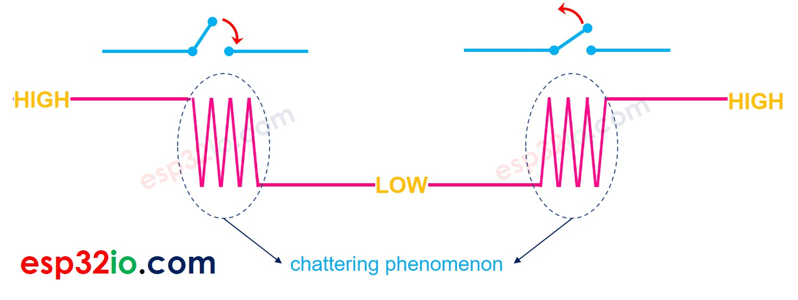
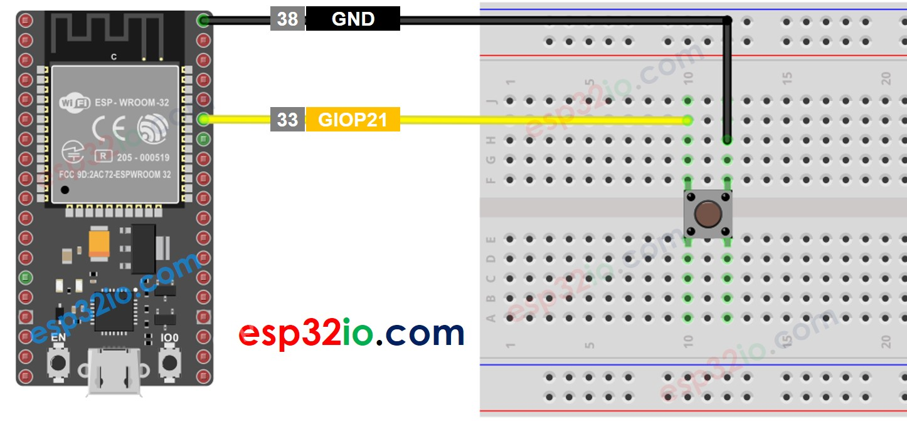
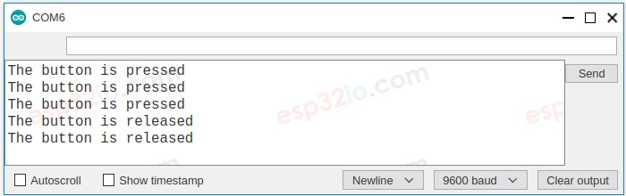
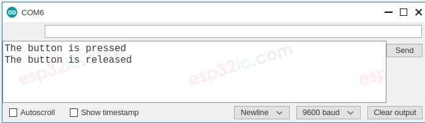
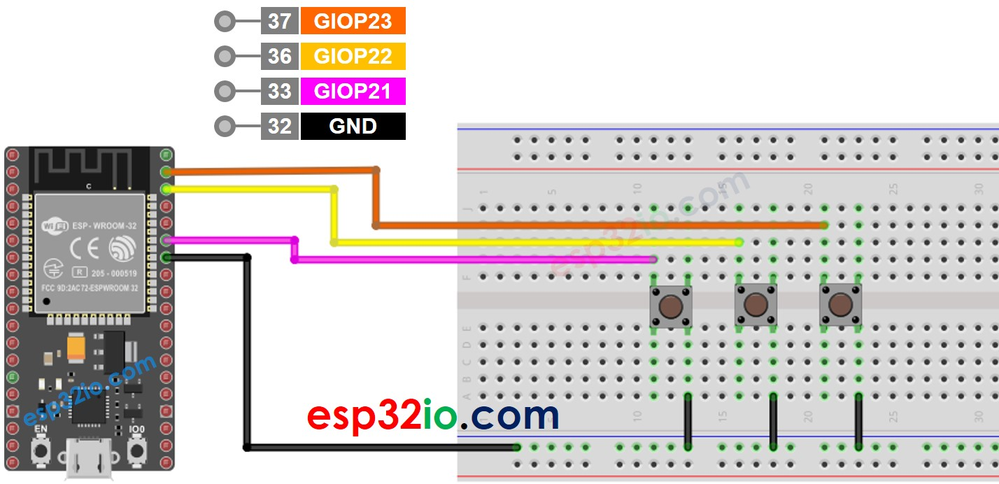

# ESP32 - Button - Debounce

When a button is pressed/released or when a switch is toggled between ON and OFF, its state is changed from LOW to HIGH ( or HIGH to LOW) once. Is this correct?

No, it is not. That is because in the physical world. when you do a single press on a button, the state of the button is quickly toggled between LOW and HIGH several times rather than once. This is the mechanical and physical characteristic. This phenomenon is known with a name: chattering. The chattering phenomenon makes MCU (e.g. ESP32) read multiple button presses in response to a single actual press. This results in a malfunction. The process to eliminate this phenomenon is called debounce. This tutorial shows how to do it.



This tutorial provides:

  * How to debounce for a button on ESP32 code
  * How to debounce for a button on ESP32 code using library
  * How to debounce for multiple buttons on ESP32 code using library

## Hardware Used In This Tutorial

  * 1 × ESP-WROOM-32 Dev Module	
  * 1 × Micro USB Cable	
  * 1 × Button	
  * 1 × Breadboard	
  * 2 × Jumper Wires

## Wiring Diagram



To make it clear, let's run ESP32 code WITHOUT and WITH debounce, and compare their results.

## Reading Button without Debounce

### Quick Instructions

  * If this is the first time you use ESP32, see how to setup environment for ESP32 on Arduino IDE.
  * Do the wiring as above image.
  * Connect the ESP32 board to your PC via a micro USB cable
  * Open Arduino IDE on your PC.
  * Select the right ESP32 board (e.g. ESP32 Dev Module) and COM port.
  * Copy the below code and paste it to Arduino IDE.

```c++
#define BUTTON_PIN 21  // GIOP21 pin connected to button

// Variables will change:
int lastState = LOW;  // the previous state from the input pin
int currentState;     // the current reading from the input pin

void setup() {
  // initialize serial communication at 9600 bits per second:
  Serial.begin(9600);
  // initialize the pushbutton pin as an pull-up input
  // the pull-up input pin will be HIGH when the switch is open and LOW when the switch is closed.
  pinMode(BUTTON_PIN, INPUT_PULLUP);
}

void loop() {
  // read the state of the switch/button:
  currentState = digitalRead(BUTTON_PIN);

  if (lastState == HIGH && currentState == LOW)
    Serial.println("The button is pressed");
  else if (lastState == LOW && currentState == HIGH)
    Serial.println("The button is released");

  // save the the last state
  lastState = currentState;
}
```

  * Compile and upload code to ESP32 board by clicking Upload button on Arduino IDE
  * Open Serial Monitor on Arduino IDE
  * Press the button once but keep it several seconds, and then release it.
  * See the result on Serial Monitor. It looks like the below:



As you can see, you did only a single press and release, but ESP32 read multiple presses and releases.

  > **Note that**
  >
  > The chattering phenomenon does not happen all times. If it does not happen, please try the above test several time.

## Reading Button with Debounce

### Quick Instructions

  * If this is the first time you use ESP32, see how to setup environment for ESP32 on Arduino IDE.
  * Copy the below code and paste it to Arduino IDE.

```c++
#define BUTTON_PIN     21 // GIOP21 pin connected to button
#define DEBOUNCE_TIME  50 // the debounce time in millisecond, increase this time if it still chatters

// Variables will change:
int lastSteadyState = LOW;       // the previous steady state from the input pin
int lastFlickerableState = LOW;  // the previous flickerable state from the input pin
int currentState;                // the current reading from the input pin

// the following variables are unsigned longs because the time, measured in
// milliseconds, will quickly become a bigger number than can be stored in an int.
unsigned long lastDebounceTime = 0;  // the last time the output pin was toggled

void setup() {
  // initialize serial communication at 9600 bits per second:
  Serial.begin(9600);
  // initialize the pushbutton pin as an pull-up input
  // the pull-up input pin will be HIGH when the switch is open and LOW when the switch is closed.
  pinMode(BUTTON_PIN, INPUT_PULLUP);
}

void loop() {
  // read the state of the switch/button:
  currentState = digitalRead(BUTTON_PIN);

  // check to see if you just pressed the button
  // (i.e. the input went from LOW to HIGH), and you've waited long enough
  // since the last press to ignore any noise:

  // If the switch/button changed, due to noise or pressing:
  if (currentState != lastFlickerableState) {
    // reset the debouncing timer
    lastDebounceTime = millis();
    // save the the last flickerable state
    lastFlickerableState = currentState;
  }

  if ((millis() - lastDebounceTime) > DEBOUNCE_TIME) {
    // whatever the reading is at, it's been there for longer than the debounce
    // delay, so take it as the actual current state:

    // if the button state has changed:
    if(lastSteadyState == HIGH && currentState == LOW)
      Serial.println("The button is pressed");
    else if(lastSteadyState == LOW && currentState == HIGH)
      Serial.println("The button is released");

    // save the the last steady state
    lastSteadyState = currentState;
  }
}
```

  * Compile and upload code to ESP32 board by clicking Upload button on Arduino IDE
  * Open Serial Monitor on Arduino IDE
  * Keep pressing the button several seconds and then release it.
  * See the result on Serial Monitor. It looks like the below:




As you can see, you did one press and release, and ESP32 read one press and release. The chattering is eliminated.

## We Made It Simple - ESP32 Button Debounce Code with Library

To make it easy for newbies, especially when deboucing for multiple buttons, we made a button library, called **ezButton**.

### ESP32 Button Debounce Code for A Single Button

```c++
#include <ezButton.h>

#define DEBOUNCE_TIME 50 // the debounce time in millisecond, increase this time if it still chatters

ezButton button(21); // create ezButton object that attach to pin GIOP21

void setup() {
  Serial.begin(9600);
  button.setDebounceTime(DEBOUNCE_TIME); // set debounce time to 50 milliseconds
}

void loop() {
  button.loop(); // MUST call the loop() function first

  if (button.isPressed())
    Serial.println("The button is pressed");

  if (button.isReleased())
    Serial.println("The button is released");
}
```

## ESP32 Button Debounce Code for A Multiple Buttons

Let's write debounce code for three buttons.

### The wiring diagram



```c++
#include <ezButton.h>

#define DEBOUNCE_TIME 50 // the debounce time in millisecond, increase this time if it still chatters

ezButton button1(21); // create ezButton object that attach to pin GIOP21;
ezButton button2(22); // create ezButton object that attach to pin GIOP22;
ezButton button3(23); // create ezButton object that attach to pin GIOP23;

void setup() {
  Serial.begin(9600);
  button1.setDebounceTime(DEBOUNCE_TIME); // set debounce time to 50 milliseconds
  button2.setDebounceTime(DEBOUNCE_TIME); // set debounce time to 50 milliseconds
  button3.setDebounceTime(DEBOUNCE_TIME); // set debounce time to 50 milliseconds
}

void loop() {
  button1.loop(); // MUST call the loop() function first
  button2.loop(); // MUST call the loop() function first
  button3.loop(); // MUST call the loop() function first

  if (button1.isPressed())
    Serial.println("The button 1 is pressed");

  if (button1.isReleased())
    Serial.println("The button 1 is released");

  if (button2.isPressed())
    Serial.println("The button 2 is pressed");

  if (button2.isReleased())
    Serial.println("The button 2 is released");

  if (button3.isPressed())
    Serial.println("The button 3 is pressed");

  if (button3.isReleased())
    Serial.println("The button 3 is released");
}

```

  * Compile and upload code to ESP32 board by clicking Upload button on Arduino IDE
  * Open Serial Monitor on Arduino IDE
  * Press the button once but keep it several seconds, and then release it.
  * See the result on Serial Monitor.