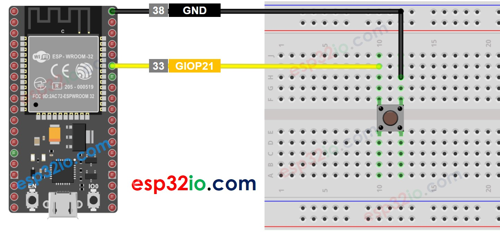

# ESP32 - Button - Long Press Short Press

This tutorial instructs you how to use ESP32 to detect the long press and short press, In detail, we will learn:

  * How to detect the short press on the button
  * How to detect the long press on the button
  * How to detect both the long press and short press

## Hardware Used In This Tutorial

  * 1 × ESP-WROOM-32 Dev Module	
  * 1 × Micro USB Cable
  * 1 × Button	
  * 1 × Breadboard	
  * n × Jumper Wires

## Wiring Diagram



This tutorial will use the internal pull-up resistor. The state of the button is HIGH when normal and LOW when pressed.

---

## How To Detect Short Press

  * Measure the time between the pressed and released events.
  * If the duration is shorter than a pre-defined time, the short press event is detected.

Let's see step by step:

  * Define how long the maximum of short press lasts
```c++
#define SHORT_PRESS_TIME 500 // 500 milliseconds
```

  * Detect the button is pressed and save the pressed time

```c++
if(lastState == HIGH && currentState == LOW) 
  pressedTime = millis();
```

  * Detect the button is released and save the released time

```c++
if(lastState == LOW && currentState == HIGH)
  releasedTime = millis();
```

  * Calculate press duration and

```c++
long pressDuration = releasedTime - pressedTime;
```

  * Determine the short press by comparing the press duration with the defined short press time.

```c++
if( pressDuration < SHORT_PRESS_TIME )
  Serial.println("A short press is detected");
```

## ESP32 Code for detecting the short press

```c++
#define BUTTON_PIN       21  // GIOP21 pin connected to button
#define SHORT_PRESS_TIME 500 // 500 milliseconds

// Variables will change:
int lastState = LOW;  // the previous state from the input pin
int currentState;     // the current reading from the input pin
unsigned long pressedTime  = 0;
unsigned long releasedTime = 0;

void setup() {
  Serial.begin(9600);
  pinMode(BUTTON_PIN, INPUT_PULLUP);
}

void loop() {
  // read the state of the switch/button:
  currentState = digitalRead(BUTTON_PIN);

  if (lastState == HIGH && currentState == LOW)       // button is pressed
    pressedTime = millis();
  else if (lastState == LOW && currentState == HIGH) { // button is released
    releasedTime = millis();

    long pressDuration = releasedTime - pressedTime;

    if ( pressDuration < SHORT_PRESS_TIME )
      Serial.println("A short press is detected");
  }

  // save the the last state
  lastState = currentState;
}
```

### Quick Instructions

  * If this is the first time you use ESP32, see how to setup environment for ESP32 on Arduino IDE.
  * Upload the above code to ESP32 via Arduino IDE
  * Press the button shortly several times.
  * See the result on Serial Monitor.


  > **Note**
  >
  > The Serial Monitor may print several short presses for a single press. This is a normal behavior of the button. This behavior is called the *“chattering phenomenon”*. We will learn how to eliminate this issue later in this tutorial.

---

## How To Detect Long Press

There are two use cases for detecting the long press.

  * The long-press event is detected right after the button is released
  * The long-press event is detected while the button is being pressed.

In the first case:

  * Measure the time duration between the pressed event and released event.
  * If the duration is longer than a pre-defined time, the long-press event is detected.

In the second case: during the time the button is being pressed, do the below process repteatedly:

  * Measure the pressing time.
  * If the duration is longer than the pre-defined time, the long-press event is detected
  * Otherwise, repeat the process until the button is released

### ESP32 Code for detecting long press when released

```c++
#define BUTTON_PIN       21   // GIOP21 pin connected to button
#define LONG_PRESS_TIME  1000 // 1000 milliseconds

// Variables will change:
int lastState = LOW;  // the previous state from the input pin
int currentState;     // the current reading from the input pin
unsigned long pressedTime  = 0;
unsigned long releasedTime = 0;

void setup() {
  Serial.begin(9600);
  pinMode(BUTTON_PIN, INPUT_PULLUP);
}

void loop() {
  // read the state of the switch/button:
  currentState = digitalRead(BUTTON_PIN);

  if(lastState == HIGH && currentState == LOW)        // button is pressed
    pressedTime = millis();
  else if(lastState == LOW && currentState == HIGH) { // button is released
    releasedTime = millis();

    long pressDuration = releasedTime - pressedTime;

    if( pressDuration > LONG_PRESS_TIME )
      Serial.println("A long press is detected");
  }

  // save the the last state
  lastState = currentState;
}
```

### Quick Instructions

  * If this is the first time you use ESP32, see how to setup environment for ESP32 on Arduino IDE.
  * Upload the above code to ESP32 via Arduino IDE
  * Press and release the button after one second.
  * See the result on Serial Monitor.

---

## ESP32 Code for detecting long press during pressing

```c++
#define BUTTON_PIN       21   // GIOP21 pin connected to button
#define LONG_PRESS_TIME  1000 // 1000 milliseconds

// Variables will change:
int lastState = LOW;  // the previous state from the input pin
int currentState;     // the current reading from the input pin
unsigned long pressedTime  = 0;
bool isPressing = false;
bool isLongDetected = false;

void setup() {
  Serial.begin(9600);
  pinMode(BUTTON_PIN, INPUT_PULLUP);
}

void loop() {
  // read the state of the switch/button:
  currentState = digitalRead(BUTTON_PIN);

  if(lastState == HIGH && currentState == LOW) {        // button is pressed
    pressedTime = millis();
    isPressing = true;
    isLongDetected = false;
  } else if(lastState == LOW && currentState == HIGH) { // button is released
    isPressing = false;
  }

  if(isPressing == true && isLongDetected == false) {
    long pressDuration = millis() - pressedTime;

    if( pressDuration > LONG_PRESS_TIME ) {
      Serial.println("A long press is detected");
      isLongDetected = true;
    }
  }

  // save the the last state
  lastState = currentState;
}
```

### Quick Instructions

  * If this is the first time you use ESP32, see how to setup environment for ESP32 on Arduino IDE.
  * Upload the above code to ESP32 via Arduino IDE
  * Press and release the button after one second.
  * See the result on Serial Monitor.

---

## How To Detect Both Long Press and Short Press

### Short Press and Long Press after released

```c++

#define BUTTON_PIN       21   // GIOP21 pin connected to button
#define SHORT_PRESS_TIME 1000 // 1000 milliseconds
#define LONG_PRESS_TIME  1000 // 1000 milliseconds

// Variables will change:
int lastState = LOW;  // the previous state from the input pin
int currentState;     // the current reading from the input pin
unsigned long pressedTime  = 0;
unsigned long releasedTime = 0;

void setup() {
  Serial.begin(9600);
  pinMode(BUTTON_PIN, INPUT_PULLUP);
}

void loop() {
  // read the state of the switch/button:
  currentState = digitalRead(BUTTON_PIN);

  if (lastState == HIGH && currentState == LOW)       // button is pressed
    pressedTime = millis();
  else if (lastState == LOW && currentState == HIGH) { // button is released
    releasedTime = millis();

    long pressDuration = releasedTime - pressedTime;

    if ( pressDuration < SHORT_PRESS_TIME )
      Serial.println("A short press is detected");

    if ( pressDuration > LONG_PRESS_TIME )
      Serial.println("A long press is detected");
  }

  // save the the last state
  lastState = currentState;
}

```

### Quick Instructions

  * If this is the first time you use ESP32, see how to setup environment for ESP32 on Arduino IDE.
  * Upload the above code to ESP32 via Arduino IDE
  * Press and release the button after one second.
  * See the result on Serial Monitor.

  > **Note**
  >
  > The Serial Monitor may show several short press detection when long press. This is the  normal behavior of the button. This behavior is called the *“chattering phenomenon”*. The issue will be solved in the last part of this tutorial.

---

## Short Press and Long Press During pressing

```c++
#define BUTTON_PIN       21 // GIOP21 pin connected to button
#define SHORT_PRESS_TIME 1000 // 1000 milliseconds
#define LONG_PRESS_TIME  1000 // 1000 milliseconds

// Variables will change:
int lastState = LOW;  // the previous state from the input pin
int currentState;     // the current reading from the input pin
unsigned long pressedTime  = 0;
unsigned long releasedTime = 0;
bool isPressing = false;
bool isLongDetected = false;

void setup() {
  Serial.begin(9600);
  pinMode(BUTTON_PIN, INPUT_PULLUP);
}

void loop() {
  // read the state of the switch/button:
  currentState = digitalRead(BUTTON_PIN);

  if (lastState == HIGH && currentState == LOW) {       // button is pressed
    pressedTime = millis();
    isPressing = true;
    isLongDetected = false;
  } else if (lastState == LOW && currentState == HIGH) { // button is released
    isPressing = false;
    releasedTime = millis();

    long pressDuration = releasedTime - pressedTime;

    if ( pressDuration < SHORT_PRESS_TIME )
      Serial.println("A short press is detected");
  }

  if (isPressing == true && isLongDetected == false) {
    long pressDuration = millis() - pressedTime;

    if ( pressDuration > LONG_PRESS_TIME ) {
      Serial.println("A long press is detected");
      isLongDetected = true;
    }
  }

  // save the the last state
  lastState = currentState;
}

```

### Quick Instructions

  * If this is the first time you use ESP32, see how to setup environment for ESP32 on Arduino IDE.
  * Upload the above code to ESP32 via Arduino IDE
  * Press and release the button after one second.
  * See the result on Serial Monitor.

---


## Long Press and Short Press with Debouncing

It is very important to debounce the button in many applications.

Debouncing is a little complicated, especially when using multiple buttons. To make it simple for newbies, using a library, called ezButton.

We will use this library in below codes


### Short Press and Long Press with debouncing after released

```c++
#include <ezButton.h>

#define SHORT_PRESS_TIME 1000 // 1000 milliseconds
#define LONG_PRESS_TIME  1000 // 1000 milliseconds

ezButton button(21); // create ezButton object that attach to pin GIOP21

unsigned long pressedTime  = 0;
unsigned long releasedTime = 0;

void setup() {
  Serial.begin(9600);
  button.setDebounceTime(50); // set debounce time to 50 milliseconds
}

void loop() {
  button.loop(); // MUST call the loop() function first

  if (button.isPressed())
    pressedTime = millis();

  if (button.isReleased()) {
    releasedTime = millis();

    long pressDuration = releasedTime - pressedTime;

    if ( pressDuration < SHORT_PRESS_TIME )
      Serial.println("A short press is detected");

    if ( pressDuration > LONG_PRESS_TIME )
      Serial.println("A long press is detected");
  }
}

```

### Quick Instructions

  * If this is the first time you use ESP32, see how to setup environment for ESP32 on Arduino IDE.
  * Upload the above code to ESP32 via Arduino IDE
  * Press and release the button after one second.
  * See the result on Serial Monitor.

---

### Short Press and Long Press with debouncing During Pressing

```c++
#include <ezButton.h>

#define SHORT_PRESS_TIME 1000 // 1000 milliseconds
#define LONG_PRESS_TIME  1000 // 1000 milliseconds

ezButton button(21); // create ezButton object that attach to pin GIOP21

unsigned long pressedTime  = 0;
unsigned long releasedTime = 0;
bool isPressing = false;
bool isLongDetected = false;

void setup() {
  Serial.begin(9600);
  button.setDebounceTime(50); // set debounce time to 50 milliseconds
}

void loop() {
  button.loop(); // MUST call the loop() function first

  if (button.isPressed()) {
    pressedTime = millis();
    isPressing = true;
    isLongDetected = false;
  }

  if (button.isReleased()) {
    isPressing = false;
    releasedTime = millis();

    long pressDuration = releasedTime - pressedTime;

    if ( pressDuration < SHORT_PRESS_TIME )
      Serial.println("A short press is detected");
  }

  if (isPressing == true && isLongDetected == false) {
    long pressDuration = millis() - pressedTime;

    if ( pressDuration > LONG_PRESS_TIME ) {
      Serial.println("A long press is detected");
      isLongDetected = true;
    }
  }
}

```

### Quick Instructions

  * If this is the first time you use ESP32, see how to setup environment for ESP32 on Arduino IDE.
  * Upload the above code to ESP32 via Arduino IDE
  * Press and release the button after one second.
  * See the result on Serial Monitor.