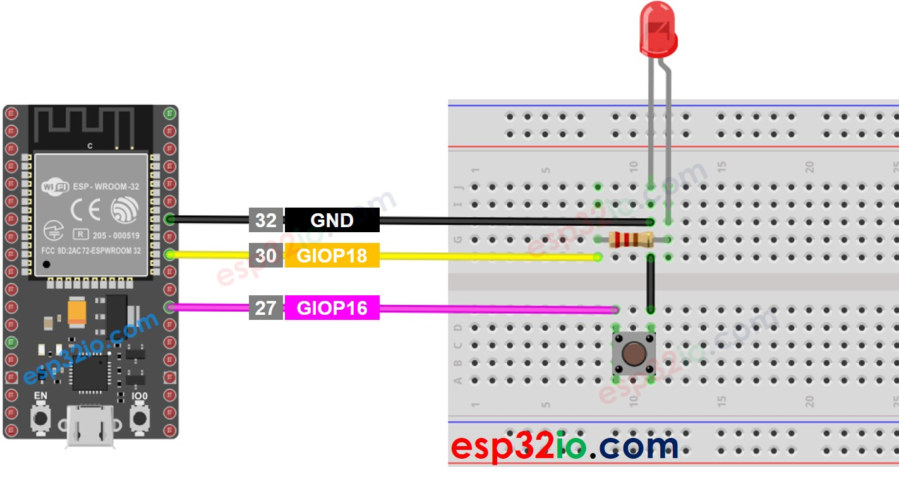

# ESP32 - Button - LED

This tutorial instructs you how to use ESP32 to control LED based on the pressing state of button. In detail:

  * If a button is being pressed, ESP32 turns LED on
  * If a button is NOT being pressed, ESP32 turns LED off

We also have another tutorial: ESP32 - Button Toggles LED, which toggle LED state between **ON** and **OFF** when the button is pressed.

## Hardware Used In This Tutorial

  * 1 × ESP-WROOM-32 Dev Module	
  * 1 × Micro USB Cable	
  * 1 × Button	
  * 1 × LED	
  * 1 × 220 ohm resistor	
  * 1 × Breadboard	
  * 4 × Jumper Wires

## Wiring Diagram between ESP32, LED and Button



---

## ESP32 Code

```c++
#define BUTTON_PIN 16  // ESP32 pin GIOP16, which connected to button
#define LED_PIN    18  // ESP32 pin GIOP18, which connected to led

// The below are variables, which can be changed
int button_state = 0;   // variable for reading the button status

void setup() {
  // initialize the LED pin as an output:
  pinMode(LED_PIN, OUTPUT);
  // initialize the button pin as an pull-up input:
  // the pull-up input pin will be HIGH when the button is open and LOW when the button is pressed.
  pinMode(BUTTON_PIN, INPUT_PULLUP);
}

void loop() {
  // read the state of the button value:
  button_state = digitalRead(BUTTON_PIN);

  // control LED according to the state of button
  if (button_state == LOW)       // if button is pressed
    digitalWrite(LED_PIN, HIGH); // turn on LED
  else                           // otherwise, button is not pressing
    digitalWrite(LED_PIN, LOW);  // turn off LED
}

```

### Quick Instructions
  
  * If this is the first time you use ESP32, see how to setup environment for ESP32 on Arduino IDE.
  * Do the wiring as above image.
  * Connect the ESP32 board to your PC via a micro USB cable
  * Open Arduino IDE on your PC.
  * Select the right ESP32 board (e.g. ESP32 Dev Module) and COM port.
  * Copy the above code and paste it to Arduino IDE.
  * Compile and upload code to ESP32 board by clicking Upload button on Arduino IDE.
  * Press and keep pressing the button several seconds
  * See the change on LED's state.

