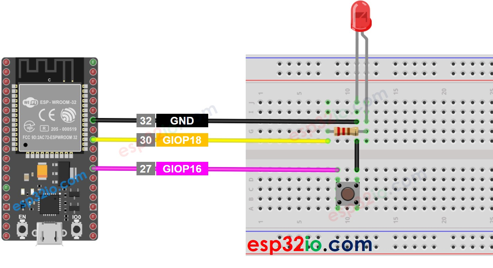

# ESP32 - Button Toggle LED

This tutorial instructs you how to use ESP32 to toggle the state of an LED between **ON** and **OF**F when a button is pressed. More specifically:

  * If the button is pressed, turn the LED on
  * If the button is pressed again, turn the LED off
  * The above process is repeated over and over again

The ESP32 codes contains code for a button toggles an LED without and with debouncing.

## Hardware Used In This Tutorial

  * 1 × ESP-WROOM-32 Dev Module	
  * 1 × Micro USB Cable	
  * 1 × Button	
  * 1 × LED	
  * 1 × 220 ohm resistor	
  * 1 × Breadboard	
  * 4 × Jumper Wires

## Wiring Diagram



## ESP32 Code - Button Toggles LED Without Debouncing

```c++
#define BUTTON_PIN 16  // ESP32 pin GIOP16, which connected to button
#define LED_PIN    18  // ESP32 pin GIOP18, which connected to led

// The below are variables, which can be changed
int led_state = LOW;    // the current state of LED
int button_state;       // the current state of button
int last_button_state;  // the previous state of button

void setup() {
  Serial.begin(9600);                // initialize serial
  pinMode(BUTTON_PIN, INPUT_PULLUP); // set ESP32 pin to input pull-up mode
  pinMode(LED_PIN, OUTPUT);          // set ESP32 pin to output mode

  button_state = digitalRead(BUTTON_PIN);
}

void loop() {
  last_button_state = button_state;      // save the last state
  button_state = digitalRead(BUTTON_PIN); // read new state

  if (last_button_state == HIGH && button_state == LOW) {
    Serial.println("The button is pressed");

    // toggle state of LED
    led_state = !led_state;

    // control LED arccoding to the toggled state
    digitalWrite(LED_PIN, led_state);
  }
}

```

In the code, led_state = !led_state is equivalent to the following code:

```c++
if(led_state == LOW)
  led_state = HIGH;
else
  led_state = LOW;
```


### Quick Instructions

  * If this is the first time you use ESP32, see how to setup environment for ESP32 on Arduino IDE.
  * Do the wiring as above image.
  * Connect the ESP32 board to your PC via a micro USB cable
  * Open Arduino IDE on your PC.
  * Select the right ESP32 board (e.g. ESP32 Dev Module) and COM port.
  * Copy the above code and paste it to Arduino IDE.
  * Compile and upload code to ESP32 board by clicking Upload button on Arduino IDE
  * Keep pressing the button several seconds and then release it.
  * See the change on LED's state

  > **Note:**
  >
  > The above code does not have the debounce code for button. Without debouncing for button, the unexpected behaviours can occur. See Why need debounce for button. Debouncing for the button is complicated for beginners. Fortunately, the ezButton library does the button debounce for us.

---

## ESP32 Code - Button Toggles LED With Debouncing

```c++
#include <ezButton.h>

#define BUTTON_PIN 16  // ESP32 pin GIOP16, which connected to button
#define LED_PIN    18  // ESP32 pin GIOP18, which connected to led

ezButton button(BUTTON_PIN);  // create ezButton object that attach to pin 7;

// The below are variables, which can be changed
int led_state = LOW;   // the current state of LED

void setup() {
  Serial.begin(9600);         // initialize serial
  pinMode(LED_PIN, OUTPUT);   // set ESP32 pin to output mode
  button.setDebounceTime(50); // set debounce time to 50 milliseconds
}

void loop() {
  button.loop(); // MUST call the loop() function first

  if (button.isPressed()) {
    Serial.println("The button is pressed");

    // toggle state of LED
    led_state = !led_state;

    // control LED arccoding to the toggleed sate
    digitalWrite(LED_PIN, led_state);
  }
}

```

### Quick Instructions

  * If this is the first time you use ESP32, see how to setup environment for ESP32 on Arduino IDE.
  * Do the wiring as above image.
  * Connect the ESP32 board to your PC via a micro USB cable
  * Open Arduino IDE on your PC.
  * Select the right ESP32 board (e.g. ESP32 Dev Module) and COM port.
  * Copy the above code and paste it to Arduino IDE.
  * Compile and upload code to ESP32 board by clicking Upload button on Arduino IDE
  * Keep pressing the button several seconds and then release it.
  * See the change on LED's state
