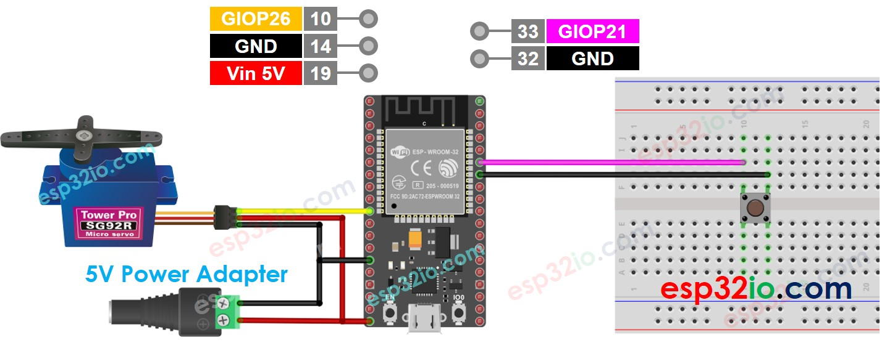

# ESP32 - Button - Servo Motor

This tutorial instructs you how to use ESP32 with button and servo motor. In detail, we will learn how to do:

  * ESP32 automatically rotates servo motor to 90° if the button is pressed.
  * ESP32 automatically rotates servo motor to 0° if the button is pressed again

That process is repeated.

## Hardware Used In This Tutorial

  * 1 × ESP-WROOM-32 Dev Module	
  * 1 × Micro USB Cable	
  * 1 × Button	
  * 1 × Servo Motor	
  * 1 × Breadboard	
  * n × Jumper Wires

---

## Wiring Diagram



## ESP32 Code - Button Controls Servo Motor

```c++
#include <Servo.h>
#include <ezButton.h>

#define BUTTON_PIN 21 // ESP32 pin GIOP21 connected to button's pin
#define SERVO_PIN  26 // ESP32 pin GIOP26 connected to servo motor's pin

ezButton button(BUTTON_PIN); // create ezButton object that attach to pin 7;
Servo servo;                 // create servo object to control a servo

// The below are variables, which can be changed
int angle = 0; // the current angle of servo motor

void setup() {
  Serial.begin(9600);         // initialize serial
  button.setDebounceTime(50); // set debounce time to 50 milliseconds
  servo.attach(SERVO_PIN);    // attaches the servo on pin 9 to the servo object

  servo.write(angle);
}

void loop() {
  button.loop(); // MUST call the loop() function first

  if (button.isPressed()) {
    // change angle of servo motor
    if (angle == 0)
      angle = 90;
    else if (angle == 90)
      angle = 0;

    // control servo motor arccoding to the angle
    Serial.print("The button is pressed => rotate servo to ");
    Serial.print(angle);
    Serial.println("°");
    servo.write(angle);
  }
}
```

### Quick Instructions

  * If this is the first time you use ESP32, see how to setup environment for ESP32 on Arduino IDE.
  * Install ezButton library. See How To
  * Copy the above code and paste it to Arduino IDE.
  * Compile and upload code to ESP32 board by clicking Upload button on Arduino IDE
  * Press the button several times
  * See the servo motor's rotation
