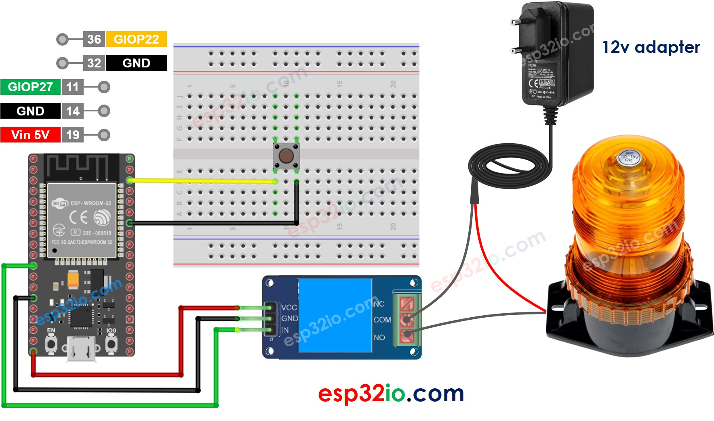

# ESP32 - Button - Relay

This tutorial instructs you how to use ESP32 to control LED based on the pressing state of button. In detail:

  * If a button is being pressed, ESP32 activates a relay
  * If a button is NOT being pressed, ESP32 deactivates a relay

We can extend this tutorial to use button to control a led strip, siren, light bulb, or motor... by connnecting them to the relay.

## Hardware Used In This Tutorial

  * 1 × ESP-WROOM-32 Dev Module	
  * 1 × Micro USB Cable	
  * 1 × Button	
  * 1 × Relay	
  * 1 × Warning Light Bright Waterproof	
  * 1 × 12V Power Adapter	
  * 1 × Breadboard	
  * n × Jumper Wires

---

## Wiring Diagram between ESP32, Relay and Button



## ESP32 Code

```c++
#define BUTTON_PIN 22  // ESP32 pin GIOP22 connected to button's pin
#define RELAY_PIN  27  // ESP32 pin GIOP27 connected to relay's pin

void setup() {
  Serial.begin(9600);                // initialize serial
  pinMode(BUTTON_PIN, INPUT_PULLUP); // set ESP32 pin to input pull-up mode
  pinMode(RELAY_PIN, OUTPUT);        // set ESP32 pin to output mode
}

void loop() {
  int buttonState = digitalRead(BUTTON_PIN); // read new state

  if (buttonState == LOW) {
    Serial.println("The button is being pressed");
    digitalWrite(RELAY_PIN, HIGH); // turn on
  }
  else if (buttonState == HIGH) {
    Serial.println("The button is unpressed");
    digitalWrite(RELAY_PIN, LOW);  // turn off
  }
}
```

### Quick Instructions

   * If this is the first time you use ESP32, see how to setup environment for ESP32 on Arduino IDE.
   * Do the wiring as above image.
   * Connect the ESP32 board to your PC via a micro USB cable
   * Open Arduino IDE on your PC.
   * Select the right ESP32 board (e.g. ESP32 Dev Module) and COM port.
   * Copy the above code and paste it to Arduino IDE.
   * Compile and upload code to ESP32 board by clicking Upload button on Arduino IDE
   * Press and keep pressing the button several seconds
   * See the change on the relay's state