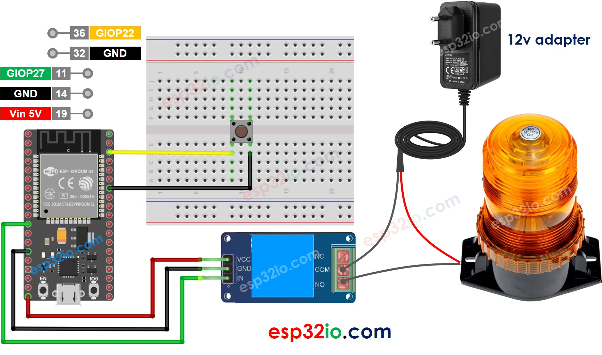

# ESP32 - Button Toggle Relay

This tutorial instructs you how to use ESP32 to toggle the a relay's state between **ON** and **OFF** when a button is pressed. More specifically:

  * If the button is pressed, turn on the relay
  * If the button is pressed again, turn off the relay
  * The above process is repeated over and over again

The ESP32 codes contains code for a button toggles a relay without and with debouncing

We can extend this tutorial to use button to toggle the state of a solenoid, fan, light bulb, or actuator... by connnecting them to the relay.

## Hardware Used In This Tutorial

  * 1 × ESP-WROOM-32 Dev Module	
  * 1 × Micro USB Cable	
  * 1 × Button	
  * 1 × Relay	
  * 1 × Warning Light Bright Waterproof	
  * 1 × 12V Power Adapter	
  * 1 × Breadboard	
  * n × Jumper Wires

---

## Wiring Diagram



## ESP32 Code - Button Toggles Relay Without Debouncing

```c++
#define BUTTON_PIN 22  // ESP32 pin GIOP22 connected to button's pin
#define RELAY_PIN  27  // ESP32 pin GIOP27 connected to relay's pin

// The below are variables, which can be changed
int relay_state = LOW;  // the current state of relay
int button_state;       // the current state of button
int last_button_state;  // the previous state of button

void setup() {
  Serial.begin(9600);                // initialize serial
  pinMode(BUTTON_PIN, INPUT_PULLUP); // set ESP32 pin to input pull-up mode
  pinMode(RELAY_PIN, OUTPUT);        // set ESP32 pin to output mode

  button_state = digitalRead(BUTTON_PIN);
}

void loop() {
  last_button_state = button_state;      // save the last state
  button_state = digitalRead(BUTTON_PIN);   // read new state

  if (last_button_state == HIGH && button_state == LOW) {
    Serial.println("The button is pressed");

    // toggle state of relay
    relay_state = !relay_state;

    // control relay arccoding to the toggled state
    digitalWrite(RELAY_PIN, relay_state);
  }
}
```

### Quick Instructions

  * If this is the first time you use ESP32, see how to setup environment for ESP32 on Arduino IDE.
  * Do the wiring as above image.
  * Connect the ESP32 board to your PC via a micro USB cable
  * Open Arduino IDE on your PC.
  * Select the right ESP32 board (e.g. ESP32 Dev Module) and COM port.
  * Copy the above code and paste it to Arduino IDE.
  * Compile and upload code to ESP32 board by clicking Upload button on Arduino IDE
  * Keep pressing the button several seconds and then release it.
  * See the change of relay's state

In the code, `relay_state = !relay_state` is equivalent to the following code:

```c++
if(relay_state == LOW)
  relay_state = HIGH;
else
  relay_state = LOW;
```

  > **Note**
  >
  > The above code does not have the debounce code for button. Without debouncing for button, the unexpected behaviours can occur. See Why need debounce for button. Debouncing for the button is complicated for beginners. Fortunately, the ezButton library does the button debounce for us.


