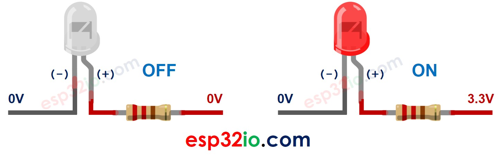
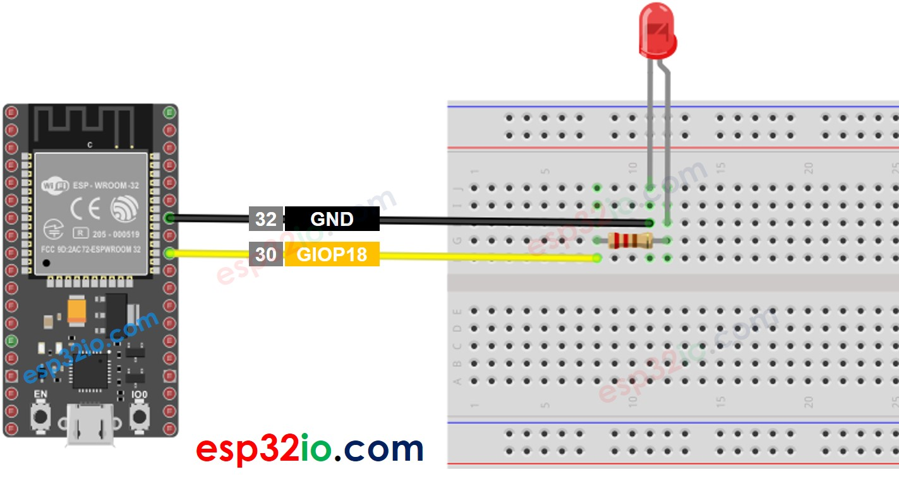

# ESP32 - LED - Blink

This tutorial instructs you how to use esp32 to blink an LED. This is one of the first tutorials that beginers learn.


## Hardware Used In This Tutorial

  * 1 × ESP-WROOM-32 Dev Module	
  * 1 × Micro USB Cable	
  * 1 × LED	
  * 1 × 220 ohm resistor	
  * 1 × Breadboard	
  * 2 × Jumper Wires

## Introduction to LED

### LED Pinout

LED includes two pins:

  * **Cathode(-) pin**: connect this pin to GND (0V)
  * **Anode(+) pin**: is used to control LED's state


After connecting the cathode(-) to GND:

  * If we connect *VCC* to the anode(+), LED is ON.
    If we connect *GND* to the anode(+), LED is OFF.



In addition, if a PWM signal is generated to the anode(+), the LED's brightness is changed in proportion to the PWM duty cycle.

  > **Note:**
  >  * Usually, A resistor is required to protect LED from burning. The resistor can be placed between the anode(+) and *VCC* or between the cathode(-) and *GND*. The resistance value depends on the LED's specification.
  >  * Some LEDs have a built-in resistor, so there is no need to use a resistor for them.

--- 

## ESP32 - LED

The ESP32's digital output pin's voltage can be programmed to VCC or GND. By connecting the digital output pin to LED, we can programmatically control the LED's state.

## Wiring Diagram between LED and ESP32



## How To Program

Configure an ESP32's pin to the digital output mode by using pinMode() function. For example, pin GIOP18:

```c++
pinMode(18, OUTPUT);
```

  * Program the pin to GND to turn OFF led by using digitalWrite() function:

```c++
digitalWrite(18, LOW);
```

  * Program the pin to VCC to turn ON led by using digitalWrite() function:

```c++
digitalWrite(18, HIGH);
```

---

## ESP32 Code

### Quick Instructions

  * If this is the first time you use ESP32, see how to setup environment for ESP32 on Arduino IDE.
  * Do the wiring as above image.
  * Connect the ESP32 board to your PC via a micro USB cable
  * Open Arduino IDE on your PC.
  * Select the right ESP32 board (e.g. ESP32 Dev Module) and COM port.
  * Copy the below code and paste it to Arduino IDE.

```c++
// the code in setup function runs only one time when ESP32 starts
void setup() {
  // initialize digital pin GIOP18 as an output.
  pinMode(18, OUTPUT);
}

// the code in loop function is executed repeatedly infinitely
void loop() {
  digitalWrite(18, HIGH); // turn the LED on
  delay(500);             // wait for 500 milliseconds
  digitalWrite(18, LOW);  // turn the LED off
  delay(500);             // wait for 500 milliseconds
}
```
   * Compile and upload code to ESP32 board by clicking Upload button on Arduino IDE
   * See the result: The LED blinks one time per second.


