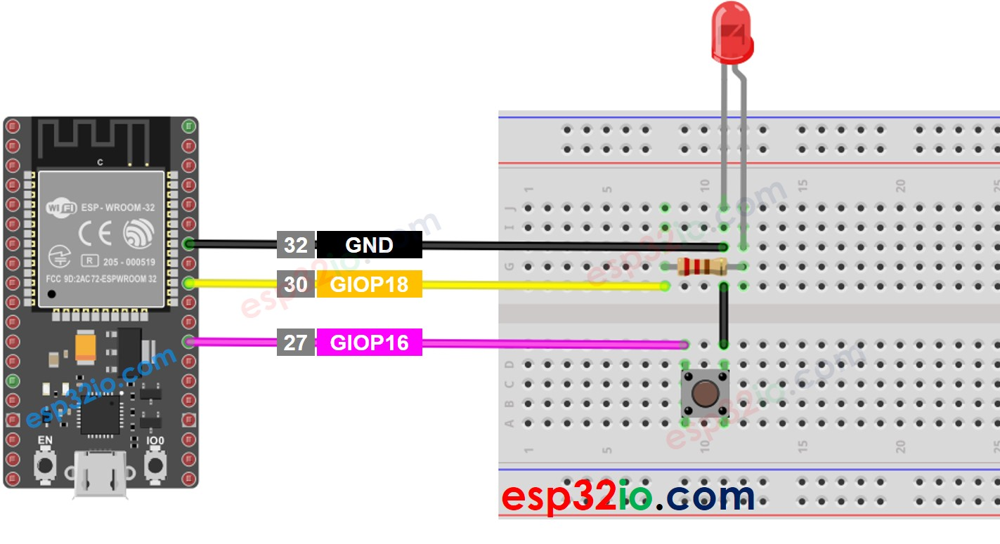
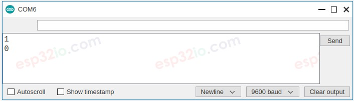
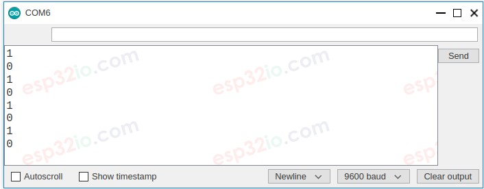
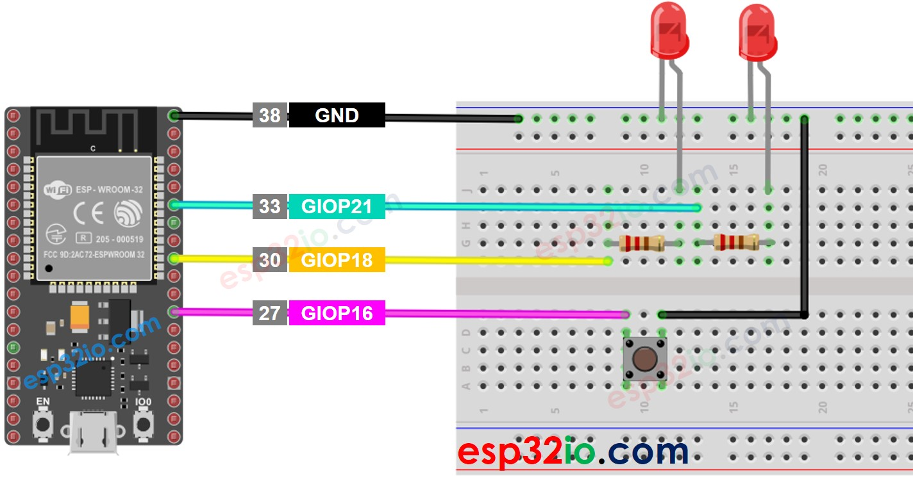

# ESP32 - LED - Blink Without Delay

One of the first program that beginners run is to blink an LED. The simplest way to blink an LED is to use the delay() function. This function blocks ESP32 from doing other things. It will be ok if you just want to blink only a single LED. However, If you want to blink more LED or do other works in parallel, you cannot use the delay() function. We need another solution. This tutorial instructs you how to do multiple task without using delay function. More specifically, We will learn how to blink an LED and checks the button's state.

This method can be applied to let ESP32 do several tasks at the same time. Blinking LED is just an example.

## Hardware Used In This Tutorial

  * 1 × ESP-WROOM-32 Dev Module	
  * 1 × Micro USB Cable	
  * 1 × LED	
  * 1 × 220 ohm resistor	
  * 1 × Button	
  * 1 × Breadboard	
  * 4 × Jumper Wires

---

## Wiring Diagram



**Let's compare the ESP32 code that blinks LED with and without using delay() function**

## **ESP32 Code - With Delay**

```c++
#define LED_PIN     18 // ESP32 pin GIOP18 connected to LED
#define BUTTON_PIN  16 // ESP32 pin GIOP16 connected to button
#define BLINK_INTERVAL  1000  // interval at which to blink LED (milliseconds)

// Variables will change:
int ledState = LOW;   // ledState used to set the LED
int previousButtonState = LOW; // will store last time button was updated

void setup() {
  Serial.begin(9600);

  // set the digital pin as output:
  pinMode(LED_PIN, OUTPUT);

  // set the digital pin as an input:
  pinMode(BUTTON_PIN, INPUT_PULLUP);
}

void loop() {
  // if the LED is off turn it on and vice-versa:
  ledState = (ledState == LOW) ? HIGH : LOW;

  // set the LED with the ledState of the variable:
  digitalWrite(LED_PIN, ledState);

  delay(BLINK_INTERVAL); // If button is pressed during this time, Arduino CANNOT detect

  int currentButtonState = digitalRead(BUTTON_PIN);

  if (currentButtonState != previousButtonState) {
    // print out the state of the button:
    Serial.println(currentButtonState);

    // save the last state of button
    previousButtonState = currentButtonState;
  }

  // DO OTHER WORKS HERE
}
```

### Quick Instructions

  * If this is the first time you use ESP32, see how to setup environment for ESP32 on Arduino IDE.
  * Do the wiring as above image.
  * Connect the ESP32 board to your PC via a micro USB cable
  * Open Arduino IDE on your PC.
  * Select the right ESP32 board (e.g. ESP32 Dev Module) and COM port.
  * Copy the above code and paste it to Arduino IDE.
  * Compile and upload code to ESP32 board by clicking Upload button on Arduino IDE
  * Open Serial Monitor on Arduino IDE
  * Press the button 4 times
  * See the LED: The LED toggles between *ON/OFF* periodically every second
  * See the output in Serial Monitor



  * On Serial Monitor, you will not see enough four times that the state changes to 0 (4 presses). That is because, during delay time, ESP32 CANNOT detect the changing.

---

## ESP32 Code - Without Delay

```c++
#define LED_PIN     18 // ESP32 pin GIOP18 connected to LED
#define BUTTON_PIN  16 // ESP32 pin GIOP16 connected to button

#define BLINK_INTERVAL 1000  // interval at which to blink LED (milliseconds)

// Variables will change:
int ledState = LOW;   // ledState used to set the LED

int previousButtonState = LOW; // will store last time button was updated

unsigned long previousMillis = 0;   // will store last time LED was updated

void setup() {
  Serial.begin(9600);

  // set the digital pin as output:
  pinMode(LED_PIN, OUTPUT);

  // set the digital pin as an input:
  pinMode(BUTTON_PIN, INPUT_PULLUP);
}

void loop() {
  // check to see if it's time to blink the LED; that is, if the difference
  // between the current time and last time you blinked the LED is bigger than
  // the interval at which you want to blink the LED.
  unsigned long currentMillis = millis();

  if (currentMillis - previousMillis >= BLINK_INTERVAL) {
    // if the LED is off turn it on and vice-versa:
    ledState = (ledState == LOW) ? HIGH : LOW;

    // set the LED with the ledState of the variable:
    digitalWrite(LED_PIN, ledState);

    // save the last time you blinked the LED
    previousMillis = currentMillis;
  }

  // check button state's change
  int currentButtonState = digitalRead(BUTTON_PIN);

  if (currentButtonState != previousButtonState) {
    // print out the state of the button:
    Serial.println(currentButtonState);

    // save the last state of button
    previousButtonState = currentButtonState;
  }

  // DO OTHER WORKS HERE
}
```

### Quick Instructions

  * If this is the first time you use ESP32, see how to setup environment for ESP32 on Arduino IDE.
  * Run the above code and press the button 4 times
  * See the LED: The LED toggles between ON/OFF periodically every second
  * See the output in Serial Monitor




  * All pressing events were detected.

---

## Adding More Tasks

The below code blinks two LEDs with different intervals and checks the state of the button.



```c++
#define LED_PIN_1   18 // ESP32 pin GIOP18 connected to LED
#define LED_PIN_2   21 // ESP32 pin GIOP21 connected to LED
#define BUTTON_PIN  16 // ESP32 pin GIOP16 connected to button

#define BLINK_INTERVAL_1  1000  // interval at which to blink LED 1 (milliseconds)
#define BLINK_INTERVAL_2  500   // interval at which to blink LED 2 (milliseconds)

// Variables will change:
int ledState_1 = LOW;   // ledState used to set the LED 1
int ledState_2 = LOW;   // ledState used to set the LED 2

int previousButtonState = LOW; // will store last time button was updated

unsigned long previousMillis_1 = 0;   // will store last time LED 1 was updated
unsigned long previousMillis_2 = 0;   // will store last time LED 2 was updated

void setup() {
  Serial.begin(9600);

  // set the digital pin as output:
  pinMode(LED_PIN_1, OUTPUT);
  pinMode(LED_PIN_2, OUTPUT);

  // set the digital pin as an input:
  pinMode(BUTTON_PIN, INPUT_PULLUP);
}

void loop() {
  unsigned long currentMillis = millis();

  // check to see if it's time to blink the LED 1
  if (currentMillis - previousMillis_1 >= BLINK_INTERVAL_1) {
    // if the LED is off turn it on and vice-versa:
    ledState_1 = (ledState_1 == LOW) ? HIGH : LOW;

    // set the LED with the ledState of the variable:
    digitalWrite(LED_PIN_1, ledState_1);

    // save the last time you blinked the LED
    previousMillis_1 = currentMillis;
  }

  // check to see if it's time to blink the LED 2
  if (currentMillis - previousMillis_2 >= BLINK_INTERVAL_2) {
    // if the LED is off turn it on and vice-versa:
    ledState_2 = (ledState_2 == LOW) ? HIGH : LOW;

    // set the LED with the ledState of the variable:
    digitalWrite(LED_PIN_2, ledState_2);

    // save the last time you blinked the LED
    previousMillis_1 = currentMillis;
  }

  // check button state's change
  int currentButtonState = digitalRead(BUTTON_PIN);

  if (currentButtonState != previousButtonState) {
    // print out the state of the button:
    Serial.println(currentButtonState);

    // save the last state of button
    previousButtonState = currentButtonState;
  }

  // DO OTHER WORKS HERE
}

```
