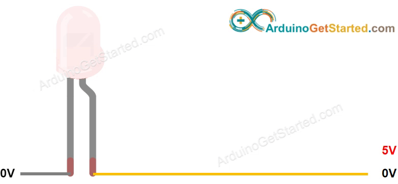
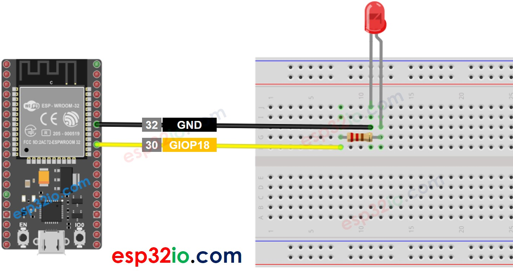

# ESP32 - LED - Fade

his tutorial instructs you how to use ESP32 to fade a LED. We also learn how to fade-in/fade-out LED without using delay() function

## Hardware Used In This Tutorial

  * 1 × ESP-WROOM-32 Dev Module	
  * 1 × Micro USB Cable	
  * 1 × LED	
  * 1 × 220 ohm resistor
  * 1 × Breadboard	
  * 2 × Jumper Wires

---

## Introduction to LED

### LED Pinout

LED includes two pins:

  * **Cathode(-) pin**: connect this pin to GND (0V)
  * **Anode(+) pin**: is used to control LED's state


## How LED Works

After connecting the cathode(-) to **GND**:

  * If We connect **GND** to the anode(+), LED is OFF.
  * If We connect **VCC** to the anode(+), LED is ON.
  * If We generate a PWM signal to the anode(+) pin, the LED's brightness is in proportion to PWM duty cycle. PWM duty cycle varies from 0 to 255. The bigger the PWM duty cycle is, the brighter the LED is.
      * If PWM value is 0, it is equivalent to GND ⇒ LED is OFF
      * If PWM value is 255, it is equivalent to VCC ⇒ LED is ON at the highest brightness.



  > **Note**
  >
  > Usually, it requires a resistor to protect LED from burning. The resistance's value depends on the LED's specification.

### ESP32 - fade LED

The ESP32's digital output pins can be programmed to generate PWM signal. By connecting LED's anode(+) pin to an ESP32's pin, LED's cathode(-) to GND, and then programming ESP32 to change the duty cytle of PWM, we We can fade LED.

## Wiring Diagram between LED and ESP32



## How To Program

Configure an ESP32's pin as a digital output pin by using `pinMode()` function. For example, pin GIOP18:

```c++
pinMode(18, OUTPUT);
```

Set brightness of LED by generating PWM signal with corresponding duty cycle by using `analogWrite()` function:

```c++
analogWrite(18, brightness);
```

Where brightness is a value from 0 to 255.

---

## ESP32 Code - Simple Fade Example


Quick Instructions

  * If this is the first time you use ESP32, see how to setup environment for ESP32 on Arduino IDE.
  * Do the wiring as above image.
  * Connect the ESP32 board to your PC via a micro USB cable
  * Open Arduino IDE on your PC.
  * Select the right ESP32 board (e.g. ESP32 Dev Module) and COM port.
  * Copy the below code and paste it to Arduino IDE.

```c++
#define LED_PIN  18 // ESP32 pin GIOP18 connected to LED

int brightness = 0;  // how bright the LED is
int fadeAmount = 5;  // how many points to fade the LED by

// the setup routine runs once when you press reset:
void setup() {
  // declare pin GIOP18 to be an output:
  pinMode(LED_PIN, OUTPUT);
}

// the loop routine runs over and over again forever:
void loop() {
  // set the brightness of pin GIOP18:
  analogWrite(LED_PIN, brightness);

  // change the brightness for next time through the loop:
  brightness = brightness + fadeAmount;

  // reverse the direction of the fading at the ends of the fade:
  if (brightness <= 0 || brightness >= 255) {
    fadeAmount = -fadeAmount;
  }
  // wait for 30 milliseconds to see the dimming effect
  delay(30);
}
```

  * Compile and upload code to ESP32 board by clicking Upload button on Arduino IDE
  * See the brightness of LED

  > **Note**
  >
  > The above example uses the `delay()` function to fade-in and fade-out. The `delay()` function makes the LED fade unsmoothly and blocks other code. In the next parts, we will learn how to fade-in and fade-out smoothly without blocking other code by using `millis()` function

---

## How to fade-in LED in a period without using `delay()`

```c++
#define LED_PIN  18 // ESP32 pin GIOP18 connected to LED

#define FADE_PEDIOD  3000 // fade time is 3 seconds

unsigned long fadeStartTime;

// the setup routine runs once when you press reset
void setup() {
  pinMode(LED_PIN, OUTPUT); // declare pin GIOP18 to be an output
  fadeStartTime = millis();
}

// fade-in in loop, and restart after finishing
void loop() {
  unsigned long progress = millis() - fadeStartTime;

  if (progress <= FADE_PEDIOD) {
    long brightness = map(progress, 0, FADE_PEDIOD, 0, 255);
    analogWrite(LED_PIN, brightness);
  } else {
    fadeStartTime = millis(); // restart fade again
  }
}
```

## How to fade-out LED in a period without using `delay()`

```c++
#define LED_PIN  18 // ESP32 pin GIOP18 connected to LED
#define FADE_PEDIOD  3000 // fade time is 3 seconds

unsigned long fadeStartTime;

// the setup routine runs once when you press reset
void setup() {
  pinMode(LED_PIN, OUTPUT); // declare pin GIOP18 to be an output
  fadeStartTime = millis();
}

// fade-out in loop, and restart after finishing
void loop() {
  unsigned long progress = millis() - fadeStartTime;

  if (progress <= FADE_PEDIOD) {
    long brightness = 255 - map(progress, 0, FADE_PEDIOD, 0, 255);
    analogWrite(LED_PIN, brightness);
  } else {
    fadeStartTime = millis(); // restart fade again
  }
}

```

