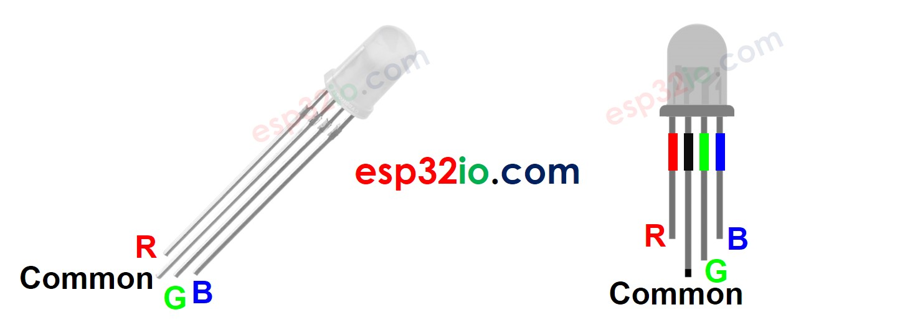
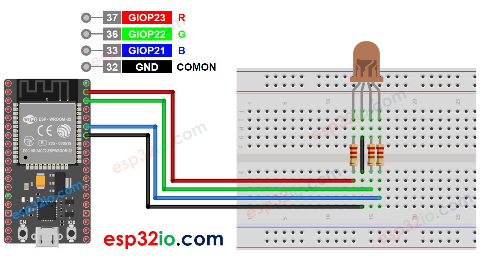
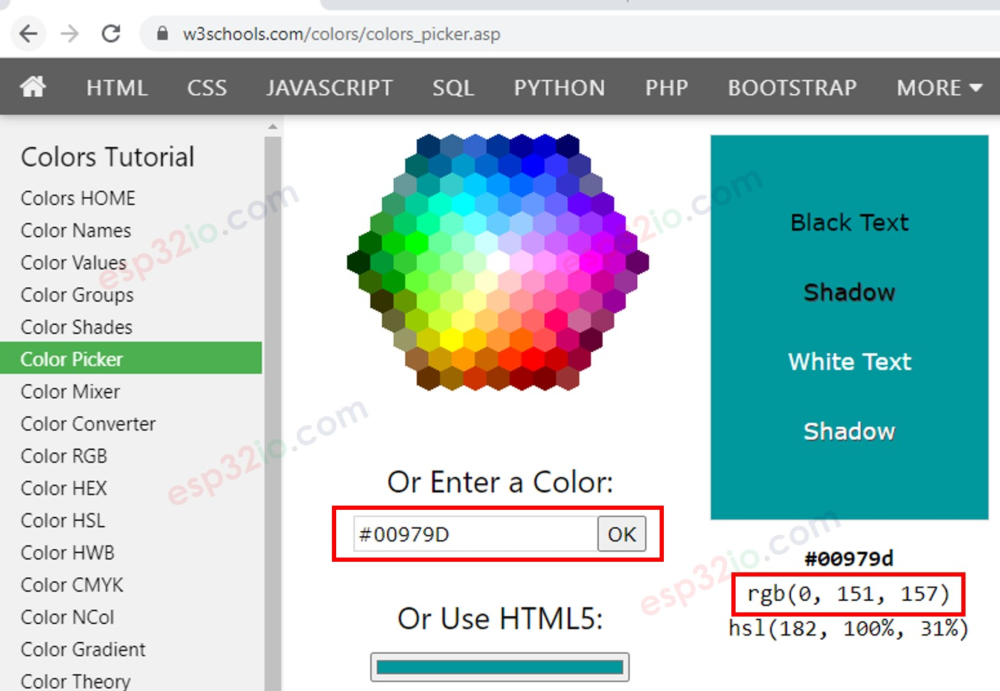

# ESP32 - RGB LED

This tutorial instructs you how to control RGB LED to emit any color using ESP32.

## Hardware Used In This Tutorial

  * 1 × ESP-WROOM-32 Dev Module	
  * 1 × Micro USB Cable	
  * 1 × RGB LED	
  * 3 × 220 ohm resistor	
  * 1 × Breadboard	
  * 4 × Jumper Wires

---

## Introduction to RGB LED

The RGB LED can emit any colors by mixing the 3 basic colors red, green and blue. A single RGB LED is composed of 3 LEDs: red, green and blue. These three LEDs are packed into a single case so that it looks like a single LED.

## RGB LED Pinout

RGB LED includes four pins:

  * R (red) pin: is to control the red color element
  * G (green) pin: is to control the green color element
  * B (blue) pin: is to control the blue color element
  * Common (Cathode-) pin: connect this pin to GND (0V)



  > **Note**
  >
  > According to the common pin, there are two types of LED: common anode and common cathode. This tutorial uses a common cathode LED.

---

## How RGB LED works

In term of physics, a color is a combination of three color elements: Red (R), Green (G) and Blue (B). Each color element's value range is from 0 to 255. The combination of values of three color elements create 256 x 256 x 256 colors in total.

If we generate PWM signals to R, G, B pins, the RGB LED diplays a color corresponding to the PWM duty cycle values. By changing the duty cycle of PWM signals (from 0 to 255), the RGB LED can display any color. The color values of Red (R), Grean (G) and Blue (B) correspond to PWM duty cycle on R, G and B pins , respectively.

## Wiring Diagram between RGB LED and ESP32



## How To Control RGB LED

Let's assume that we want to display #00979D color on RGB LED, we can do the following step:

  * Find the color code. Tips:
     * You can pick up color code you want from the color picker
     * If you want to use color in an image, use online Colors From Image tool
  * Convert color code to R, G, B values using the tool from w3school. Take note these values. in this case: R = 0, G = 151, B = 157



  * Define ESP32 pins that connects to R, G, and B pins. For example:

```c++
#define PIN_RED    23 // GIOP23
#define PIN_GREEN  22 // GIOP22
#define PIN_BLUE   21 // GIOP21
```

  * Configure these ESP32 pins to the output mode

```c++
pinMode(PIN_RED,   OUTPUT);
pinMode(PIN_GREEN, OUTPUT);
pinMode(PIN_BLUE,  OUTPUT);
```

  * Control LED to emit that color (#00979D → R = 0, G = 151, B = 157)

```c++
analogWrite(PIN_RED,   0);
analogWrite(PIN_GREEN, 151);
analogWrite(PIN_BLUE,  157);
```

---

## ESP32 - RGB LED Example Code

The below code changes color of LED among following colors in sequence:

  * #00C9CC (R = 0, G = 201, B = 204)
  * #F7788A (R = 247, G = 120, B = 138)
  * #34A853 (R = 52, G = 168, B = 83)

```c++
#define PIN_RED    23 // GIOP23
#define PIN_GREEN  22 // GIOP22
#define PIN_BLUE   21 // GIOP21

void setup() {
  pinMode(PIN_RED,   OUTPUT);
  pinMode(PIN_GREEN, OUTPUT);
  pinMode(PIN_BLUE,  OUTPUT);
}

void loop() {
  // color code #00C9CC (R = 0,   G = 201, B = 204)
  analogWrite(PIN_RED,   0);
  analogWrite(PIN_GREEN, 201);
  analogWrite(PIN_BLUE,  204);

  delay(1000); // keep the color 1 second

  // color code #F7788A (R = 247, G = 120, B = 138)
  analogWrite(PIN_RED,   247);
  analogWrite(PIN_GREEN, 120);
  analogWrite(PIN_BLUE,  138);

  delay(1000); // keep the color 1 second

  // color code #34A853 (R = 52,  G = 168, B = 83)
  analogWrite(PIN_RED,   52);
  analogWrite(PIN_GREEN, 168);
  analogWrite(PIN_BLUE,  83);

  delay(1000); // keep the color 1 second
}

```

---

**When using many colors, we could shorten the code by creating a function:**

```c++
#define PIN_RED    23 // GIOP23
#define PIN_GREEN  22 // GIOP22
#define PIN_BLUE   21 // GIOP21

void setup() {
  pinMode(PIN_RED,   OUTPUT);
  pinMode(PIN_GREEN, OUTPUT);
  pinMode(PIN_BLUE,  OUTPUT);
}

void loop() {
  // color code #00C9CC (R = 0,   G = 201, B = 204)
  setColor(0, 201, 204);

  delay(1000); // keep the color 1 second

  // color code #F7788A (R = 247, G = 120, B = 138)
  setColor(247, 120, 138);

  delay(1000); // keep the color 1 second

  // color code #34A853 (R = 52,  G = 168, B = 83)
  setColor(52, 168, 83);

  delay(1000); // keep the color 1 second
}

void setColor(int R, int G, int B) {
  analogWrite(PIN_RED,   R);
  analogWrite(PIN_GREEN, G);
  analogWrite(PIN_BLUE,  B);
}

```

