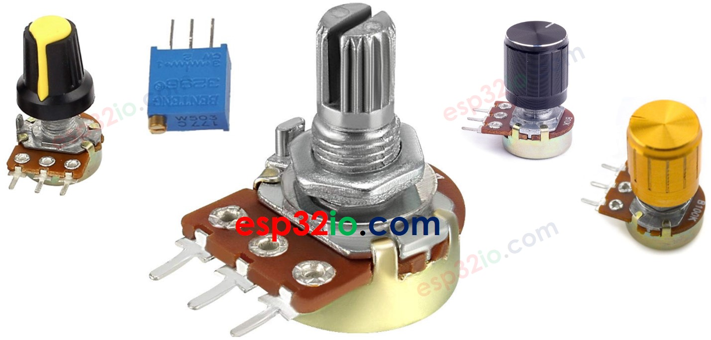
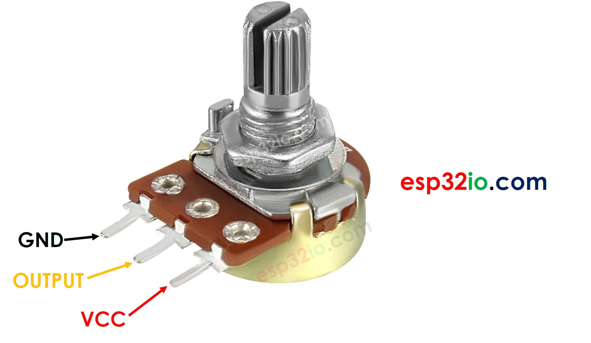
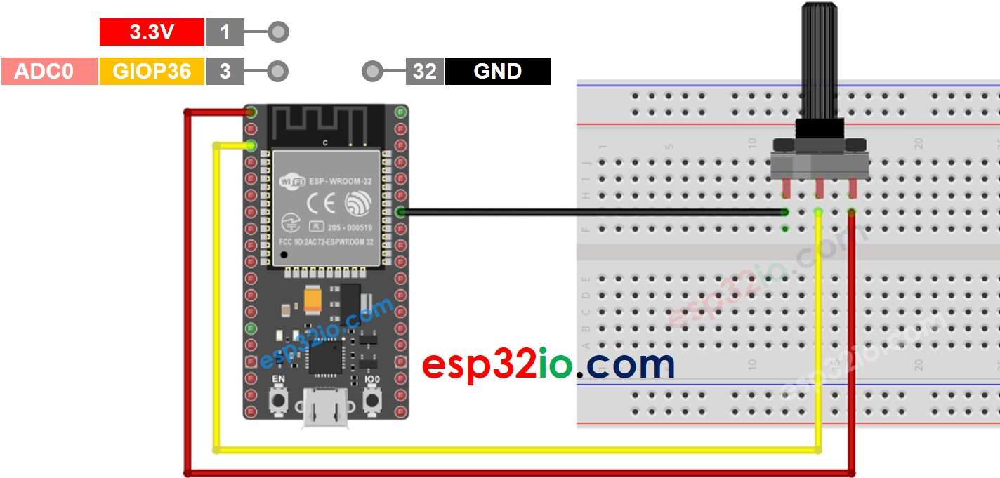
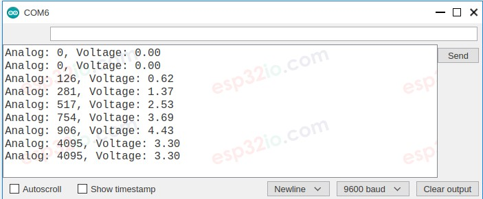

# ESP32 - Potentiometer

This tutorial instructs you how to use ESP32 with the potentiometer. In detail, we will learn:

  * How the potentiometer works
  * How to interface ESP32 with a potentiometer
  * How to program ESP32 to read the value from a potentiometer
  * How to convert the value read from a potentiometer to the useful value

## Hardware Used In This Tutorial

  * 1 × ESP-WROOM-32 Dev Module	
  * 1 × Micro USB Cable	
  * 1 × Potentiometer	
  * 1 × Breadboard	
  * 3 × Jumper Wires

---

## Introduction to Potentiometer

The potentiometer (also known as rotary angle sensor) is used to change the settings (e.g. the speaker's volume, room's temperature, lamp's brightness...)



## Potentiometer Pinout

A potentiometer usually has 3 pins:

  * **VCC pin**: connect this pin to VCC (5V or 3.3v)
  * **GND pin**: connect this pin to GND (0V)
  * **Output pin**: outputs the voltage to ESP32's input pin.



  > **Note**
  >
  > The GND pin and VCC pin are interchangeable

## How Potentiometer Works

The potentiometer's shaft can be rotated from 0° (closest to GND pin) to an angle (closest to VCC pin), called *ANGLE_MAX*.

The voltage in the output pin is in direct proportion to the angle position of the shaft, varing from 0 to VCC. The below table shows the relation between the angle and the voltage on the output pin:

| Angle | Voltage |
|---|---|
| 0°   | 0v   |
| Angle_MAX°| VCC   |
| angle° | angle° x VCC / ANGLE_MAX° |

  > **Note**
  >
  > The **ANGLE_MAX** value is depended on manufacturers.


---

## ESP32 - Rotary Potentiometer

The ESP32's analog input pin converts the voltage (between 0v and 3.3V) into integer values (between 0 and 4095), called ADC value or analog value.

We can connect the potentiometer's output pin to an ESP32's analog input pin, and then read the analog value from the pin.

The analog value from input pin can be rescaled into another value. Let's see the use cases:

  * Rescale the analog value to the potentiometer's angle.
  * Rescale the analog value to the potentiometer's voltage.
  * Rescale the analog value to the the setting value (e.g. the speaker's volume, room's temperature, lamp's brightness...)

### Rescale Range

|               |                          | FROM      | TO         |
|---------------|--------------------------|-----------|------------|
| Angle         | rotated by user          | 0°        | ANGLE_MAX° |
| Voltage       | from potentiometer's pin | 0V        | 3.3V       |
| ADC value     | read by ESP32            | 0         |  4095      |
| Setting value | converted by ESP32       | VALUE_MIN | VALUE_MAX  |


## Wiring Diagram between Potentiometer and ESP32



## How To Program Potentiometer

Read the value from an input pin, which connected to the output pin of the potentiometer by using `analogRead()` function.

```c++
analogValue = analogRead(36); // GIOP36
```

Rescale to the potentiometer's angle by using `map()` function.

```c++
angle = map(analogValue, 0, 4095, 0, ANGLE_MAX);
```

Rescale to the potentiometer's voltage:

```c++
voltage = map(analogValue, 0, 4095, 0, 3.3);
```

Rescale to the controllable value (e.g volume of stereo, brightness, speed of DC motor... )

```c++
value = map(analogValue, 0, 4095, VALUE_MIN, VALUE_MAX);
```

For example, rescaling to the brightness of LED. As mentioned in this tutorial, the brightness of LED can be controlled by using PWM value from 0 (always OFF) to 255 (always ON). Therefore, we can map the analog value to the brightness of LED (from OFF to the brightest) as follows:

```c++
brightness = map(analogValue, 0, 4095, 0, 255);
```

If you want to dim LED from the nightlight to the brightest,

```c++
nightlight = 100; // depending on your desired brightness
brightness = map(analogValue, 0, 4095, nightlight, 255);
```

  > **Note**
  >
  > The `map()` function can only be used to rescale the analog value to the int or long type value. If the controllable value is float type, you need to use the `floatMap()` function instead of the `map()` function.

`floatMap()` function:

```c++
float floatMap(float x, float in_min, float in_max, float out_min, float out_max) {
  return (x - in_min) * (out_max - out_min) / (in_max - in_min) + out_min;
}
```

---

## ESP32 Code

```c++
float floatMap(float x, float in_min, float in_max, float out_min, float out_max) {
  return (x - in_min) * (out_max - out_min) / (in_max - in_min) + out_min;
}

// the setup routine runs once when you press reset:
void setup() {
  // initialize serial communication at 9600 bits per second:
  Serial.begin(9600);
}

// the loop routine runs over and over again forever:
void loop() {
  // read the input on analog pin GIOP36:
  int analogValue = analogRead(36);
  // Rescale to potentiometer's voltage (from 0V to 3.3V):
  float voltage = floatMap(analogValue, 0, 4095, 0, 3.3);

  // print out the value you read:
  Serial.print("Analog: ");
  Serial.print(analogValue);
  Serial.print(", Voltage: ");
  Serial.println(voltage);
  delay(1000);
}

```

### Quick Instructions

  * If this is the first time you use ESP32, see how to setup environment for ESP32 on Arduino IDE.
  * Copy the above code and paste it to Arduino IDE.
  * Compile and upload code to ESP32 board by clicking Upload button on Arduino IDE
  * Open Serial Monitor on Arduino IDE
  * otate the potentiometer
  * See the result on Serial Monitor. It looks like the below:


