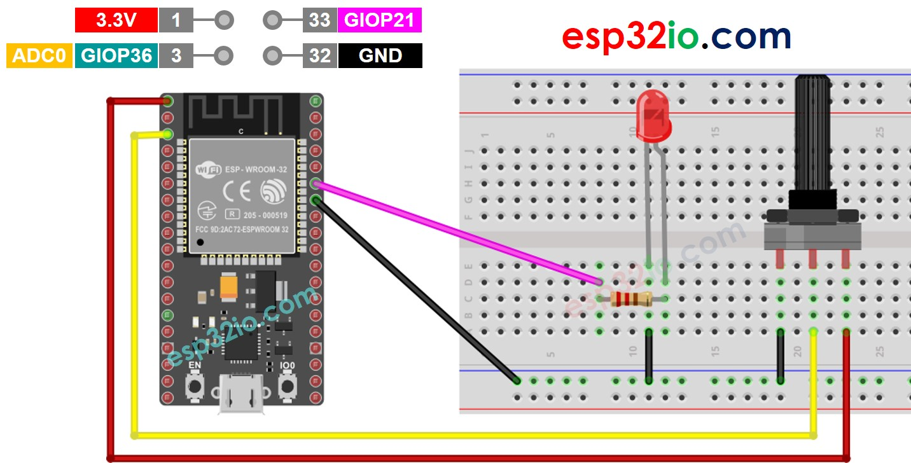
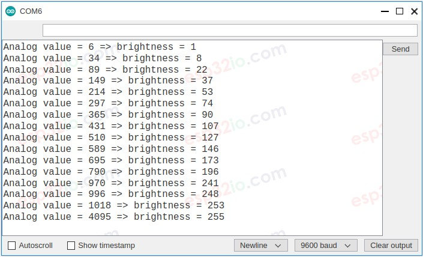

# ESP32 - Potentiometer fade LED

This tutorial instructs you how to use ESP32 with the potentiometer to change the brightness of LED.

## Hardware Used In This Tutorial

  * 1 × ESP-WROOM-32 Dev Module	
  * 1 × Micro USB Cable	
  * 1 × Potentiometer	
  * 1 × LED	
  * 1 × 220 ohm resistor	
  * 1 × Breadboard	
  * 5 × Jumper Wires

---

## Wiring Diagram



## How To Program

  Reads the input on analog pin (value between 0 and 4095)

```c++
int analogValue = analogRead(36); // GIOP36 (ADC0)
```

  * Scales it to brightness (value between 0 and 255)

```c++
int brightness = map(analogValue, 0, 4095, 0, 255);
```

  * Sets the brightness LED

```c++
analogWrite(LED_PIN, brightness);
```

## ESP32 CODE

```c++
#define POTENTIOMETER_PIN  36  // ESP32 pin GIOP36 (ADC0) connected to Potentiometer pin
#define LED_PIN            21  // ESP32 pin GIOP21 connected to LED's pin

// the setup routine runs once when you press reset:
void setup() {
  // initialize serial communication at 9600 bits per second:
  Serial.begin(9600);

  // declare LED pin to be an output:
  pinMode(LED_PIN, OUTPUT);
}

// the loop routine runs over and over again forever:
void loop() {
  // reads the input on analog pin A0 (value between 0 and 4095)
  int analogValue = analogRead(POTENTIOMETER_PIN);

  // scales it to brightness (value between 0 and 255)
  int brightness = map(analogValue, 0, 4095, 0, 255);

  // sets the brightness LED that connects to  pin 3
  analogWrite(LED_PIN, brightness);

  // print out the value
  Serial.print("Analog value = ");
  Serial.print(analogValue);
  Serial.print(" => brightness = ");
  Serial.println(brightness);
  delay(100);
}
```

### Quick Instructions

  * If this is the first time you use ESP32, see how to setup environment for ESP32 on Arduino IDE.
  * Copy the above code and paste it to Arduino IDE.
  * Compile and upload code to ESP32 board by clicking Upload button on Arduino IDE
  * Open Serial Monitor on Arduino IDE
  * Rotate the potentiometer
  * See the LED fading
  * See the result on Serial Monitor. It looks like the below




