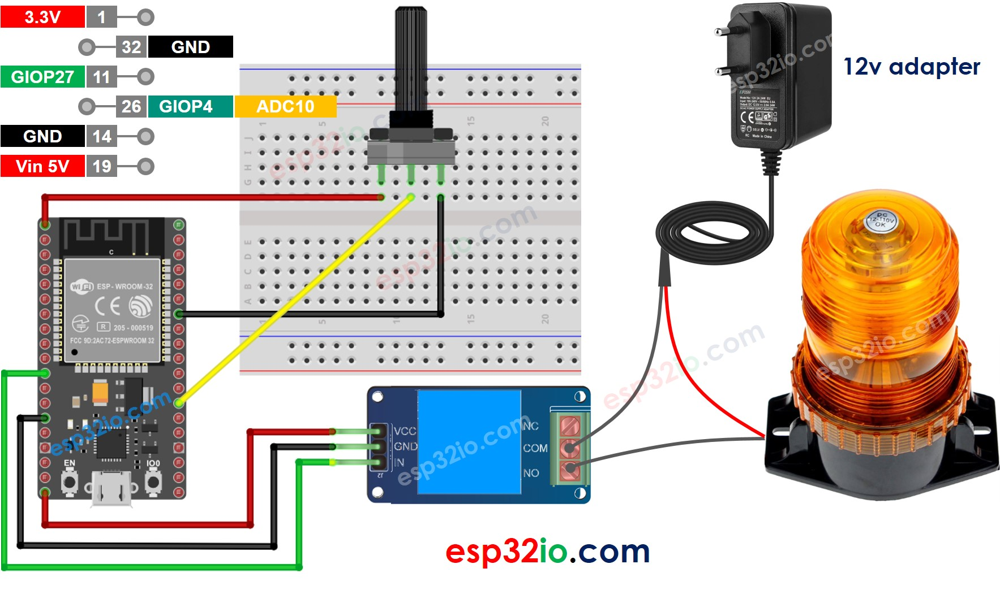

# ESP32 - Potentiometer Triggers Relay

This tutorial instructs you how to use ESP32 with the potentiometer to control relay. In detail:

  * The ESP32 automatically turns relay on if the potentiometer's analog value is above a threshold
  * The ESP32 automatically turns relay off if the potentiometer's analog value is under a threshold

We also learn how to convert the analog value to voltage and then use the voltage threshold to control relay:

  * The ESP32 automatically turns relay on if the potentiometer's voltage is above a threshold.
  * The ESP32 automatically turns relay off if the potentiometer's voltage is under a threshold.

We can extend this tutorial to use button to control a led strip, siren, light bulb, or motor... by connnecting them to the relay.

## Hardware Used In This Tutorial

  * 1	×	ESP-WROOM-32 Dev Module	
  * 1	×	Micro USB Cable	
  * 1	×	Potentiometer	
  * 1	×	Relay	
  * 1	×	Warning Light Bright Waterproof	
  * 1	×	12V Power Adapter	
  * n	×	Jumper Wires

---



## ESP32 Code - Analog Threshold

```c++
#define POTENTIOMETER_PIN  4   // ESP32 pin GIOP4 (ADC10) connected to Potentiometer pin
#define RELAY_PIN          27  // ESP32 pin GIOP27 connected to Relay's pin
#define ANALOG_THRESHOLD   1000

void setup() {
  pinMode(RELAY_PIN, OUTPUT); // set ESP32 pin to output mode
}

void loop() {
  int analogValue = analogRead(POTENTIOMETER_PIN); // read the input on analog pin

  if (analogValue > ANALOG_THRESHOLD)
    digitalWrite(RELAY_PIN, HIGH); // turn on Relay
  else
    digitalWrite(RELAY_PIN, LOW);  // turn off Relay
}

```

### Quick Instructions

  * If this is the first time you use ESP32, see how to setup environment for ESP32 on Arduino IDE.
  * Do the wiring as above image.
  * Connect the ESP32 board to your PC via a micro USB cable
  * Open Arduino IDE on your PC.
  * Select the right ESP32 board (e.g. ESP32 Dev Module) and COM port.
  * Copy the above code and paste it to Arduino IDE.
  * Compile and upload code to ESP32 board by clicking Upload button on Arduino IDE
  * Rotate the potentiometer
  * See the change of relay's state

---

## ESP32 Code - Voltage Threshold

The analog value read from the potentiometer is converted to voltage, and then the voltage is compared to a voltage threshold. If it exceeds the threshold, it triggers relay.

```c++
#define POTENTIOMETER_PIN  4   // ESP32 pin GIOP4 (ADC10) connected to Potentiometer pin
#define RELAY_PIN          27  // ESP32 pin GIOP27 connected to Relay's pin
#define VOLTAGE_THRESHOLD  2.5 // Voltages

void setup() {
  pinMode(RELAY_PIN, OUTPUT); // set ESP32 pin to output mode
}

void loop() {
  int analogValue = analogRead(POTENTIOMETER_PIN);      // read the input on analog pin
  float voltage = floatMap(analogValue, 0, 1023, 0, 5); // Rescale to potentiometer's voltage

  if(voltage > VOLTAGE_THRESHOLD)
    digitalWrite(RELAY_PIN, HIGH); // turn on Relay
  else
    digitalWrite(RELAY_PIN, LOW);  // turn off Relay
}

float floatMap(float x, float in_min, float in_max, float out_min, float out_max) {
  return (x - in_min) * (out_max - out_min) / (in_max - in_min) + out_min;
}

```

### Quick Instructions

  * If this is the first time you use ESP32, see how to setup environment for ESP32 on Arduino IDE.
  * Do the wiring as above image.
  * Connect the ESP32 board to your PC via a micro USB cable
  * Open Arduino IDE on your PC.
  * Select the right ESP32 board (e.g. ESP32 Dev Module) and COM port.
  * Copy the above code and paste it to Arduino IDE.
  * Compile and upload code to ESP32 board by clicking Upload button on Arduino IDE
  * Rotate the potentiometer
  * See the change of relay's state
