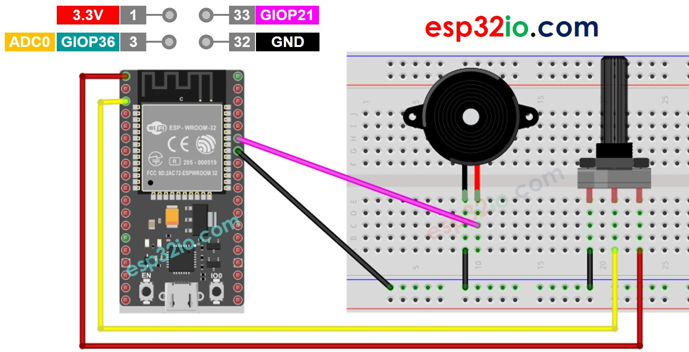

# ESP32 - Potentiometer Triggers Piezo Buzzer

This tutorial instructs you how to use ESP32 and the potentiometer to control the piezo buzzer. In detail:

  * The ESP32 automatically turns the piezo buzzer on if the potentiometer's analog value is above a threshold
  * The ESP32 automatically turns the piezo buzzer off if the potentiometer's analog value is under a threshold

We also learn how to convert the analog value to voltage and then use the voltage threshold to control the piezo buzzer:

  * The ESP32 automatically turns the piezo buzzer on if the potentiometer's voltage is above a threshold.
  * The ESP32 automatically turns the piezo buzzer off if the potentiometer's voltage is under a threshold.

We will use piezo buzzer to make sound and melody of song.

## Hardware Used In This Tutorial

  * 1	×	ESP-WROOM-32 Dev Module	
  * 1	×	Micro USB Cable	
  * 1	×	Potentiometer	
  * 1	×	Piezo Buzzer	
  * 1	×	Breadboard	
  * n	×	Jumper Wires

---

## Wiring Diagram



## ESP32 Code - Simple Sound - Analog Threshold

```c++
#define POTENTIOMETER_PIN  36 // ESP32 pin GIOP36 (ADC0) connected to Potentiometer pin
#define BUZZER_PIN         21 // ESP32 pin GIOP21 connected to Buzzer's pin
#define ANALOG_THRESHOLD   1000

void setup() {
  pinMode(BUZZER_PIN, OUTPUT); // set ESP32 pin to output mode
}

void loop() {
  int analogValue = analogRead(POTENTIOMETER_PIN); // read the input on analog pin

  if (analogValue > ANALOG_THRESHOLD)
    digitalWrite(BUZZER_PIN, HIGH); // turn on Piezo Buzzer
  else
    digitalWrite(BUZZER_PIN, LOW);  // turn off Piezo Buzzer
}

```

### Quick Instructions

  * If this is the first time you use ESP32, see how to setup environment for ESP32 on Arduino IDE.
  * Do the wiring as above image.
  * Connect the ESP32 board to your PC via a micro USB cable
  * Open Arduino IDE on your PC.
  * Select the right ESP32 board (e.g. ESP32 Dev Module) and COM port.
  * Copy the above code and paste it to Arduino IDE.
  * Compile and upload code to ESP32 board by clicking Upload button on Arduino IDE
  * Rotate the potentiometer
  * Listen to piezo buzzer's sound

---

## ESP32 Code - Simple Sound - Voltage Threshold

The analog value read from the potentiometer is converted to voltage, and then the voltage is compared to a voltage threshold. If it exceeds the threshold, it triggers Piezo Buzzer

```c++
#define POTENTIOMETER_PIN  36  // ESP32 pin connected to Potentiometer pin
#define BUZZER_PIN         21  // ESP32 pin GIOP21 connected to Buzzer's pin
#define VOLTAGE_THRESHOLD  2.5 // Voltages

void setup() {
  pinMode(BUZZER_PIN, OUTPUT); // set ESP32 pin to output mode
}

void loop() {
  int analogValue = analogRead(POTENTIOMETER_PIN);      // read the input on analog pin
  float voltage = floatMap(analogValue, 0, 1023, 0, 5); // Rescale to potentiometer's voltage

  if (voltage > VOLTAGE_THRESHOLD)
    digitalWrite(BUZZER_PIN, HIGH); // turn on Piezo Buzzer
  else
    digitalWrite(BUZZER_PIN, LOW);  // turn off Piezo Buzzer
}

float floatMap(float x, float in_min, float in_max, float out_min, float out_max) {
  return (x - in_min) * (out_max - out_min) / (in_max - in_min) + out_min;
}

```

### Quick Instructions

  * If this is the first time you use ESP32, see how to setup environment for ESP32 on Arduino IDE.
  * Do the wiring as above image.
  * Connect the ESP32 board to your PC via a micro USB cable
  * Open Arduino IDE on your PC.
  * Select the right ESP32 board (e.g. ESP32 Dev Module) and COM port.
  * Copy the above code and paste it to Arduino IDE.
  * Compile and upload code to ESP32 board by clicking Upload button on Arduino IDE
  * Rotate the potentiometer
  * Listen to piezo buzzer's sound

---

## ESP32 Code - Melody - Voltage Threshold

```c++
#include "pitches.h"

#define POTENTIOMETER_PIN  36  // ESP32 pin GIOP36 (ADC0) connected to Potentiometer pin
#define BUZZER_PIN         21  // ESP32 pin GIOP21 connected to Buzzer's pin
#define VOLTAGE_THRESHOLD  2.5 // Voltages

// notes in the melody:
int melody[] = {
  NOTE_E5, NOTE_E5, NOTE_E5,
  NOTE_E5, NOTE_E5, NOTE_E5,
  NOTE_E5, NOTE_G5, NOTE_C5, NOTE_D5,
  NOTE_E5,
  NOTE_F5, NOTE_F5, NOTE_F5, NOTE_F5,
  NOTE_F5, NOTE_E5, NOTE_E5, NOTE_E5, NOTE_E5,
  NOTE_E5, NOTE_D5, NOTE_D5, NOTE_E5,
  NOTE_D5, NOTE_G5
};

// note durations: 4 = quarter note, 8 = eighth note, etc, also called tempo:
int noteDurations[] = {
  8, 8, 4,
  8, 8, 4,
  8, 8, 8, 8,
  2,
  8, 8, 8, 8,
  8, 8, 8, 16, 16,
  8, 8, 8, 8,
  4, 4
};

void setup() {

}

void loop() {
  int analogValue = analogRead(POTENTIOMETER_PIN);      // read the input on analog pin
  float voltage = floatMap(analogValue, 0, 1023, 0, 5); // Rescale to potentiometer's voltage

  if (voltage > VOLTAGE_THRESHOLD)
    playMelody(); // play a song
}

float floatMap(float x, float in_min, float in_max, float out_min, float out_max) {
  return (x - in_min) * (out_max - out_min) / (in_max - in_min) + out_min;
}

void playMelody() {
  // iterate over the notes of the melody:
  int size = sizeof(noteDurations) / sizeof(int);

  for (int thisNote = 0; thisNote < size; thisNote++) {
    // to calculate the note duration, take one second divided by the note type.
    //e.g. quarter note = 1000 / 4, eighth note = 1000/8, etc.
    int noteDuration = 1000 / noteDurations[thisNote];
    tone(BUZZER_PIN, melody[thisNote], noteDuration);

    // to distinguish the notes, set a minimum time between them.
    // the note's duration + 30% seems to work well:
    int pauseBetweenNotes = noteDuration * 1.30;
    delay(pauseBetweenNotes);
    // stop the tone playing:
    noTone(BUZZER_PIN);
  }
}

```

### Quick Instructions

  * If this is the first time you use ESP32, see how to setup environment for ESP32 on Arduino IDE.
  * Copy the above code and paste it to Arduino IDE.
  * Create the `pitches.h` file On Arduino IDE.
  * Either click on the button just below the serial monitor icon and choose "New Tab", or use Ctrl+Shift+N.
  * Give file's name `pitches.h` and click OK button
  * Copy the below code and paste it to that file.
  * Compile and upload code to ESP32 board by clicking Upload button on Arduino IDE
  * Rotate the potentiometer
  * Listen to piezo buzzer's melody

