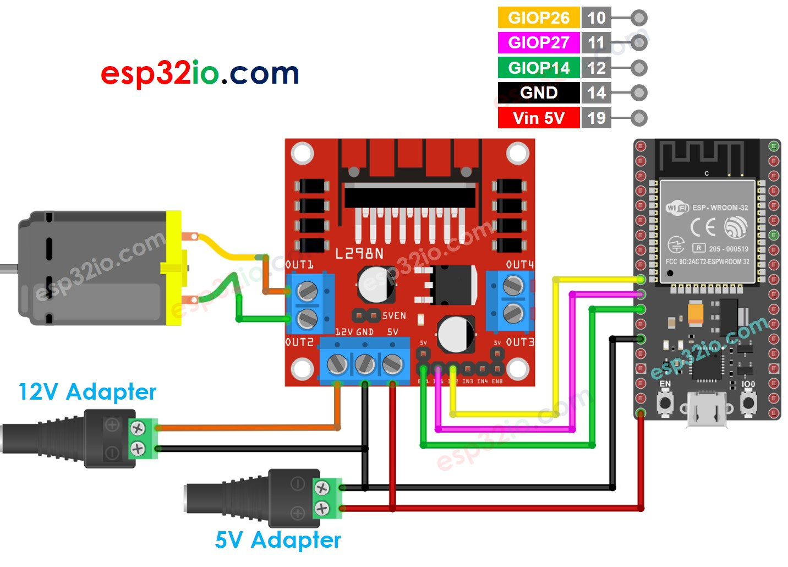

# ESP32 - DC Motor

This tutorial instructs you how to use ESP32 to control DC motor using L298N Motor Driver. In detail, We will learn how to control the speed and direction of DC motor. We will learn how to control a single DC motor, and then two DC motors using a single L298N motor driver.

## Hardware Used In This Tutorial

  * 1	×	ESP-WROOM-32 Dev Module	
  * 1	×	Micro USB Cable	
  * 1	×	L298N Motor Driver Module	
  * 1	×	DC Motor	
  * 1	×	12V Power Adapter	
  * n	×	Jumper Wires

---

## Introduction to DC Motor

A DC Motor includes two wires: **Negative(black)**, and **Positive(red)**.


## How DC Motor Works

The direction and speed of DC motor will be determined by how we provide power to it. The below images how the detaied relation between power and speed/direction


In the case of using PWM, there bigger duty cycle The PWM is, the bigger speed the montor spins.

## How to control speed and direction of DC motor using ESP32

Firstly, **The DC motor works with high voltage that can burn ESP32**. We cannot connects DC motor directly to ESP32. We need a hardware driver between DC motor and ESP32. The driver takes three responsibilities:

  * Protecting ESP32 from the high voltage
  * Receiving the signal from ESP32 to change the pole of power supply to control the motor's direction.
  * Amplifying the PWM signal from ESP32 (current and voltage) to control the motor's speed


There are a lot of DC motor drivers. This tutorial will use the L298N driver.

---

## Introduction to L298N Driver

A single L298N driver can control two DC motors or a stepper motor. This tutorial uses this driver to control the DC motor.


### L298N Driver Pinout

The below image shows the L298N driver's pinout.


The detailed explanation for each pin is avaialble in this Arduino - DC motor tutorial

A single L298N driver can control two DC motor independently:

  * The first motor (called motor A) is controlled by IN1, IN2, ENA, OUT1, OUT2 pins.
  * The second motor (called motor B) is controlled by IN3, IN4, ENB, OUT3, OUT4 pins.

### How To Control the Speed of DC Motor via L298N Driver

It is simple to control the speed of the DC motor by generating a PWM signal to the ENA/ENB pin of L298N. We can do this by:

  * Connecting an ESP32's digital output pin to L298N's ENA/ENB pin
  * Creating a PWM signal to the ENA/ENB pin by using analogWrite() function. This PWM signal goes though L298N Driver and amplified current and voltage before going to to the DC motor

```c++
analogWrite(PIN_ENA, speed);  // control motor A
analogWrite(PIN_ENB, speed);  // control motor B
```

The `speed` is a value between 0 and 255. If it is 255, the motor runs at maximum speed. If it is 0, the motor stops.

### How To Control the Direction of DC Motor via L298N Driver

The DC motor A's direction can be controlled by IN1 and IN2 pins. The following table shows the rekation between the motor's direction and signal on IN1 and IN2 pins.

| IN1 pin | IN2 pin | Direction                                     |
|---------|---------|-----------------------------------------------|
| HIGH    | LOW     | DC Motor A rotates in clockwise direction     |
| LOW     | HIGH    | DC Motor A rotates in anticlockwise direction |
| HIGH    | HIGH    | DC Motor A stops                              |
| LOW     | LOW     | DC Motor A stops                              |

Similarly, The below table is for DC motor B

| IN3 pin | IN4 pin | Direction                                     |
|---------|---------|-----------------------------------------------|
| HIGH    | LOW     | DC Motor B rotates in clockwise direction     |
| LOW     | HIGH    | DC Motor B rotates in anticlockwise direction |
| HIGH    | HIGH    | DC Motor B stops                              |
| LOW     | LOW     | DC Motor B stops                              |

Let's learn how to program to control it. Let's take the motor A for example. The motor B is similar.

  * Controling the motor A dirrection to clockwise

```c++
digitalWrite(PIN_IN1, HIGH); 
digitalWrite(PIN_IN2, LOW); 
```

Controlingthe motor A dirrection to anti-clockwise

```c++
digitalWrite(PIN_IN1, LOW); 
digitalWrite(PIN_IN2, HIGH); 
```

  > **NOTE**:
  >
  > The DC motor's direction is opposite if the wiring between DC motor and L298N driver is in reverse order. In that case, swap OUT1 and OUT2 pins.

### How To Stop DC Motor

There are two ways to stop a DC motor

  * Controlling the speed to 0

```c++
analogWrite(PIN_ENA, 0);
```

Controlling IN1 IN2 pins to the same LOW or HIGH

```c++
digitalWrite(PIN_IN1, HIGH); 
digitalWrite(PIN_IN2, HIGH); 
```

Or

```c++
digitalWrite(PIN_IN1, LOW); 
digitalWrite(PIN_IN2, LOW); 
```

## How to control a DC motor using L298N driver.

## Wiring Diagram

There are three jumpers on the L298N module. Remove all of them before doing the wiring.



## ESP32 Code

Let's see the below code that does the foloowing thing one by one:

  * ESP32 controls the DC motor's speed increasingly.
  * ESP32 inverts the DC motor's direction
  * ESP32 controls the DC motor's speed decreasingly.
  * ESP32 stops the DC motor

```c++
#define PIN_IN1  27 // ESP32 pin GIOP27 connected to the IN1 pin L298N
#define PIN_IN2  26 // ESP32 pin GIOP26 connected to the IN2 pin L298N
#define PIN_ENA  14 // ESP32 pin GIOP14 connected to the EN1 pin L298N

// the code in setup function runs only one time when ESP32 starts
void setup() {
  // initialize digital pins as outputs.
  pinMode(PIN_IN1, OUTPUT);
  pinMode(PIN_IN2, OUTPUT);
  pinMode(PIN_ENA, OUTPUT);
}

// the code in loop function is executed repeatedly infinitely
void loop() {
  digitalWrite(PIN_IN1, HIGH); // control the motor's direction in clockwise
  digitalWrite(PIN_IN2, LOW);  // control the motor's direction in clockwise

  for (int speed = 0; speed <= 255; speed++) {
    analogWrite(PIN_ENA, speed); // speed up
    delay(10);
  }

  delay(2000); // rotate at maximum speed 2 seconds in clockwise direction

  // change direction
  digitalWrite(PIN_IN1, LOW);   // control the motor's direction in anti-clockwise
  digitalWrite(PIN_IN2, HIGH);  // control the motor's direction in anti-clockwise

  delay(2000); // rotate at maximum speed for 2 seconds in anti-clockwise direction

  for (int speed = 255; speed >= 0; speed--) {
    analogWrite(PIN_ENA, speed); // speed down
    delay(10);
  }

  delay(2000); // stop motor 2 second
}

```

### Quick Instructions

If this is the first time you use ESP32, see how to setup environment for ESP32 on Arduino IDE.

  * Remove all three jumpers on the L298N module.
  * Copy the above code and paste it to Arduino IDE.
  * Compile and upload code to ESP32 board by clicking Upload button on Arduino IDE
  * Watch the DC motor, You will see:
      * DC motor is accelerated and spins at the maximum speed during 2 second
      * DC motor's direction is reversed
      * DC motor spins in the reverse direction at the maximum speed during 2 seconds
      * DC motor is decelerated
      * DC motor stop 2 second

The above process is repeated infinitely.

  > **NOTE**:
  >
  > This tutorial instructs you how to control the DC motor speed relatively. To control the absolute speed (round per second), it needs to use a PID controller and the feedback from an encoder.

