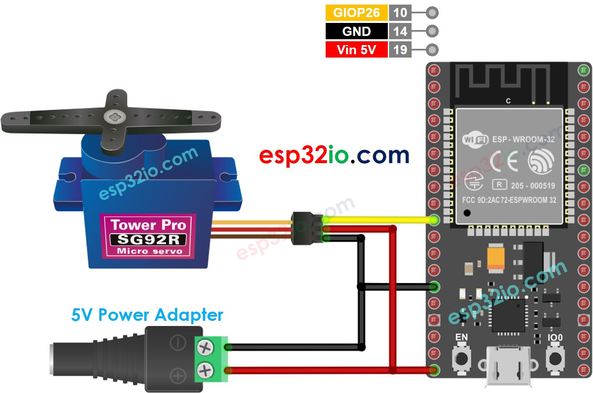

# ESP32 - Servo Motor

This tutorial instructs you how to use ESP32 to control a servo motor.

## Hardware Used In This Tutorial

  * 1	×	ESP-WROOM-32 Dev Module	
  * 1	×	Micro USB Cable	
  * 1	×	Servo Motor	
  * 3	×	Jumper Wires

---

## Introduction to Servo Motor

The standard servo motor is a motor that can rotate between 0° and 180°.
Servo Motor Pinout

The servo motor has three pins:

  * **GND pin**: (brown or black) connects this pin to GND (0V)
  * **VCC pin**: (red) connects this pin to VCC (5V)
  * **Signal pin**: (yellow or orange) receives the PWM control signal from an ESP32's pin.

## How Servo Motor Works

After connecting VCC pin and GND pin to 5V and 0V, respectively, we can control the servo motor by generating proper PWM signal to signal pin.

The angle is determined by the width of PWM signal.

Datasheet of the servo motor provides us the following parameters:

  * Period of PWM (`PERIOD`)
  * Minimum width of PWM (`WIDTH_MAX`)
  * Maximum width of PWM (`WIDTH_MIN`)

These parameters are fixed in Arduino Servo library. We do NOT need to know the value of parameters.

The angle is determined as follows:

  * If PWM's width = `WIDTH_MIN`, the servo motor rotates to 0°.
If PWM's width = `WIDTH_MAX`, the servo motor rotates to 180°.
If PWM's width is between `WIDTH_MIN` and `WIDTH_MAX`, the servo motor rotates to angle between 0° and 180° in proportion.


## Wiring Diagram between Servo Motor and ESP32



## ESP32 Code

```c++
#include <Servo.h>

#define SERVO_PIN 26 // ESP32 pin GIOP26 connected to servo motor

Servo servoMotor;

void setup() {
  servoMotor.attach(SERVO_PIN);  // attaches the servo on ESP32 pin
}

void loop() {
  // rotates from 0 degrees to 180 degrees
  for (int pos = 0; pos <= 180; pos += 1) {
    // in steps of 1 degree
    servoMotor.write(pos);
    delay(15); // waits 15ms to reach the position
  }

  // rotates from 180 degrees to 0 degrees
  for (int pos = 180; pos >= 0; pos -= 1) {
    servoMotor.write(pos);
    delay(15); // waits 15ms to reach the position
  }
}

```

### Quick Instructions

  * If this is the first time you use ESP32, see how to setup environment for ESP32 on Arduino IDE.
  * Do the wiring as above image.
  * Connect the ESP32 board to your PC via a micro USB cable
  * Open Arduino IDE on your PC.
  * Select the right ESP32 board (e.g. ESP32 Dev Module) and COM port.
  * Copy the above code and paste it to Arduino IDE.
  * Compile and upload code to ESP32 board by clicking Upload button on Arduino IDE
  * See the result: Servo motor rotates slowly about 180° in clockwise and counter-clockwise direction.